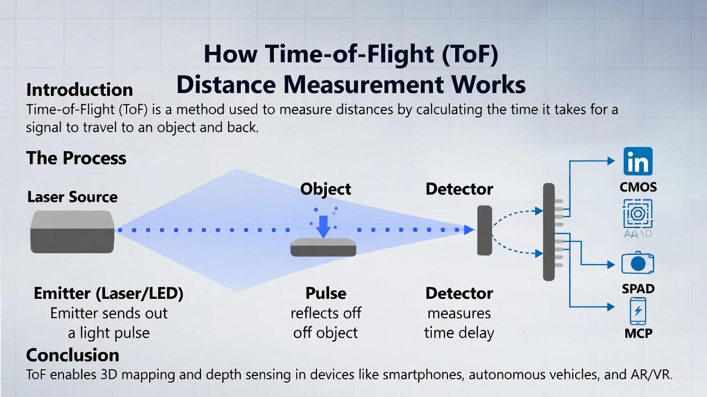

# How Time-of-Flight (ToF) Distance Measurement Works: A Friendly Guide for Curious Engineers

Ever wonder how cars, phones, or drones "see" the world in 3D? How your phone can measure distances or map a room? This short post will give you a **friendly guide to Time-of-Flight (ToF) measurement,** one of the key technologies behind 3D imaging, LiDAR, and depth sensing. If you stick with me for the next 5–10 minutes, you'll understand the main concepts, the different sensor types, and why some clever engineering tricks are needed.

*Image credit: Richard Lourette and Grok*

## 1. What is Time-of-Flight?

At its core, **Time-of-Flight (ToF)** is a simple idea: measure how long it takes light to travel from a source to an object and back. Then, because we know the speed of light, we can calculate the distance:

$$d = \frac{c \cdot t}{2}$$

Where:

- $d$ = distance to the object	​

- $c \approx 3 \times 10^8$ m/s = speed of light in vacuum

- $t$ = round-trip time of the light pulse

The factor of 2 comes from the round trip: light has to go to the target and back.

## 2. How ToF Sensors "See" in 3D

There are **two main ways ToF sensors measure distance**:

### 2.1 Pulsed (Direct) ToF

- The sensor emits a very **short light pulse** (nanoseconds or less).

- It then measures how long it takes for the pulse to return.

- Pulsed ToF can work with **single-photon detection**, allowing very sensitive and long-range measurements.

**Example:** A LiDAR on a self-driving car fires millions of laser pulses per second and measures the return time to create a 3D map of its environment.

### 2.2 Continuous-Wave / Modulated (Indirect) ToF

- Here, the light source is **modulated** (amplitude or phase).

- The sensor measures the phase shift between emitted and received light.

- Distance is calculated using:

$$d = \frac{c \cdot \phi}{4\pi f}$$

Where:

- $\phi$ = measured phase shift

- $f$ = modulation frequency of the light

**Pros:** Can use less power and lower-cost electronics than pulsed ToF.

**Cons:** Ambiguities appear for very long distances because phase repeats.

## 3. Sensors Used in ToF Systems

Different detectors are used depending on application, range, and cost.

### 3.1 CMOS / CCD Pixels

- Common in **consumer phones and cameras**.

- Each pixel can measure the **phase shift** of the reflected light.

- Can build full 3D images quickly.

### 3.2 Single-Photon Avalanche Diodes (SPADs)

- Detect individual photons and are extremely sensitive.

- Often combined with **timing electronics** for pulsed ToF.

- Excellent for **low-light or long-range applications**.

### 3.3 Microchannel Plates (MCPs)

- Vacuum tube devices that amplify single photons.

- Can be **gated**, i.e., turned on only for a short time to detect the light pulse.

- Used in **scientific ToF systems** (mass spectrometry, time-resolved imaging, PET) due to **picosecond timing accuracy**

**Example:** A gated MCP can allow only photons arriving in a certain time window to be counted, filtering out background light or unwanted signals.

## 4. Challenges in ToF Measurement

Even though the principle is simple, practical ToF sensors have to handle:

- **Timing precision:** Light travels 30 cm in 1 ns! So even a tiny timing error leads to a large distance error.

- **Ambient light:** Sunlight or bright indoor lighting adds noise.Common in consumer phones and cameras.

- **Multiple reflections / scattering:** Light bouncing off multiple surfaces can confuse the sensor.

- **Range vs. resolution tradeoff:** Higher resolution often requires shorter pulses or higher modulation frequencies.

Engineers solve these challenges using **modulation, gating, averaging, and clever optics**.

## 5. Where ToF is Used

- **Autonomous vehicles:** LiDAR systems map the environment.

- **Smartphones:** Depth sensing for AR, photography, or gesture recognition.

- **Robotics & drones:** Collision avoidance and 3D mapping.

- **Scientific research:** MCP-based systems for ultrafast timing and mass spectrometry.

## 6. References & Further Reading

1. Robert Lange, “3D Time-of-Flight Distance Measurement (PhD Thesis)” — [Link](https://dspace-backend.ub.uni-siegen.de/server/api/core/bitstreams/06a6c5f5-cafd-488c-b413-9bec32ddf5d7/content)

2. Joseph L. Wiza, “Microchannel Plate Detectors” — [PDF](https://psec.uchicago.edu/Papers/mcpwiza.PDF?utm_source=chatgpt.com)

3. Wikipedia: Microchannel plate detector — [Link](https://en.wikipedia.org/wiki/Microchannel_plate_detector?utm_source=chatgpt.com)

4. Wikipedia: Single-photon avalanche diode (SPAD) — [Link](https://en.wikipedia.org/wiki/Single-photon_avalanche_diode?utm_source=chatgpt.com)

5. Choong et al., “Investigation of a Multi-Anode MCP-PMT for TOF PET” — [PMC](https://www.ncbi.nlm.nih.gov/pmc/articles/PMC2997706/?utm_source=chatgpt.com)

6. Shagam et al., “Continuous temporal ion detection + time-gated imaging” — [PDF](https://jila.colorado.edu/sites/default/files/2020-08/1-s2.0-S0022285220300254-main.pdf?utm_source=chatgpt.com)

7. Photonis MCP-PMT product page — [Link](https://ldar.exosens.com/products/mcp-pmt?utm_source=chatgpt.com)

## Summary

Time-of-Flight measurement is elegantly simple in principle but relies on precise timing, sensitive detectors, and clever electronics. From CMOS cameras in phones to SPAD arrays and MCPs in scientific instruments, ToF allows engineers and scientists to “see” the world in 3D, measure distances, and explore phenomena in ways that were impossible just a few decades ago.

## About the Author

Richard Lourette provides **embedded systems architecture** and **advanced imaging solutions for mission-critical technology projects**. He specializes in **modern C++ development for embedded systems**, **GNSS**, and **real-time imaging capture systems** spanning applications from **consumer electronics to aerospace**.

With **30+ years of experience**, Richard has extensive expertise in **high-performance embedded programming**, **signal/image processing**, with **experience in safety-critical systems**. He is an author on over 20 US patents.

Through **RL Tech Solutions LLC**, he consults on **real-time vision**, **autonomous systems**, and **resource-constrained architectures**, helping teams accelerate innovation while mitigating risk.

📧 Contact: rlourette_at_gmail.com
🌐 Location: Fairport, New York, USA