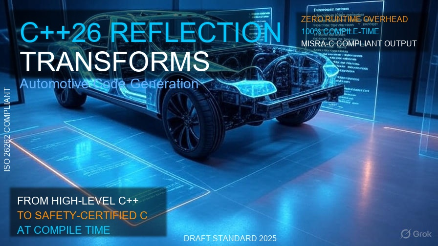

# C++26 Reflection: Transforming Automotive Virtualization Through Compile-Time Code Generation

**By Richard Lourette** | Originally published August 27, 2025, revised August 28, 2025

<center>


*Image credit: Richard Lourette and Grok*

</center>

*C++26 reflection enables automatic generation of safety-critical C code from high-level automotive system definitions, revolutionizing vehicle software development and testing workflows.*

Testing modern vehicles has become a nightmare. Each car contains dozens of computer systems that need validation, but getting them all together in one place for testing? That usually means waiting for actual hardware. Meanwhile, your competitors are shipping updates while you're still waiting for parts.

Here's the breakthrough: C++26's new reflection features (officially added to the draft standard at the June 16–21, 2025 ISO C++ standards meeting in Sofia, Bulgaria) let us virtualize entire vehicle systems AND automatically generate the safety-certified C code that actually runs in the car.

## Why Automotive Testing Is Broken

Today's vehicles are rolling data centers. Every function from engine timing to seat adjustment runs on an ECU (Electronic Control Unit), and these systems must meet strict safety standards like ISO 26262. The painful reality:

- Production code must be pure C for safety certification (C++ is often banned)
- Testing requires expensive hardware setups that take weeks to configure
- Different suppliers use incompatible interfaces
- A single interface change can break dozens of systems

Traditional testing means booking time on a hardware bench, shipping ECUs from multiple suppliers, wiring everything up, and praying nothing breaks. One bad connector and you've lost a day.

## Reflection Changes the Game

Herb Sutter's presentation last week at C++ on Sea revealed just how revolutionary C++26 reflection really is. This isn't your grandfather's reflection from Java or C#. **We can now write C++ programs that read their own structure at compile time and generate whatever code we need, including pure, certified C code.**

Think about that for a second. Your high-level system design becomes your low-level implementation automatically. No translation errors. No manual copying. No version skew.

### Step 1: Define Your System in Modern C++

First, you describe your ECU interfaces using clean, annotated C++26:

```cpp
class [[ecu_model, platform("stm32f429")]] BrakeController {
    [[memory_mapped(0x40006400)]] can_controller<1> can1;
    
    [[can_id(0x100), cycle_time_ms(10)]] 
    void send_wheel_speed(uint16_t fl, uint16_t fr, uint16_t rl, uint16_t rr);
    
    [[can_id(0x101), safety_level("ASIL_D")]]
    void send_brake_pressure(float pressure_bar);
    
    [[diagnostic_id(0x7E0)]]
    uint32_t read_fault_codes();
};
```

Notice how the interface captures everything: CAN IDs, timing requirements, safety levels, even hardware addresses. This isn't documentation that gets out of sync. This IS the implementation.

### Step 2: Let the Compiler Generate Everything

Using reflection, we write compile-time functions that examine this class and generate not just C code, but complete virtualization infrastructure:

```cpp
consteval void generate_automotive_system(std::meta::info ecu_type) {
    // Generate embedded C code
    emit_to_file("gen/ecu.c", generate_c_implementation(ecu_type));
    
    // Generate QEMU device models for CPU-accurate emulation
    emit_to_file("qemu/devices.c", generate_qemu_peripherals(ecu_type));
    
    // Generate Renode platform descriptions for multi-ECU simulation
    emit_to_file("renode/platform.repl", generate_renode_config(ecu_type));
    
    // Generate Kata container configs for isolated testing
    emit_to_file("kata/deployment.yaml", generate_kata_manifest(ecu_type));
}
```

This runs during compilation. Zero overhead in production code.

## The Three-Layer Virtualization Architecture

What makes this approach revolutionary is how reflection enables seamless integration across multiple virtualization tools:

### Layer 1: Pure Software Simulation (Milliseconds)
The C++ model itself runs as a simulation for rapid development feedback. Change code, see results instantly.

### Layer 2: Renode System Simulation (Seconds)
Renode simulates multiple ECUs with cycle-accurate timing. The reflection system generates Renode platform descriptions directly from your C++ annotations:

```python
# Automatically generated from C++ model
can1: Network.CAN @ sysbus 0x40006400  # Address from annotation
    frequency: 500000  # From model requirements
    
timer2: Timers.STM32_Timer @ sysbus 0x40000000
    frequency: 10000000  # From timing annotations
```

### Layer 3: QEMU in Kata Containers (Minutes)
For final validation, run actual ARM binaries in QEMU with full hardware emulation, isolated in Kata containers. Each ECU gets its own lightweight VM with guaranteed resource isolation:

```yaml
# Generated from C++ model annotations
containers:
  brake_controller:
    image: qemu/stm32f429:brake_controller
    memory: 256Mi  # From @memory_requirement annotation
    cpu: 100m      # From WCET analysis
    devices:
      - /dev/vcan0  # Virtual CAN bus
```

## The Magic: Everything Stays Synchronized

Here's what makes this approach transformative: **change a CAN ID in your C++ model, and it automatically updates everywhere**. The C code changes. The QEMU peripheral configuration changes. The Renode scripts change. The Kata network topology changes.

This isn't just convenience. It eliminates entire categories of integration bugs. When your brake controller expects message 0x100 and your engine controller sends 0x100, they match because they were generated from the same source.

Consider testing a timing requirement:

```cpp
[[periodic(10ms), wcet(100us)]] void control_loop();
```

This single annotation generates:
- Timer initialization in the C code
- CPU quantum settings in Renode
- Resource limits in Kata containers
- Watchdog configuration in QEMU

Change it from 10ms to 20ms, and everything updates. Automatically. Correctly.

## Real-World Development Pipeline

Picture this workflow:

**Morning**: Developer modifies the brake controller interface, adding traction control messages.

**Seconds later**: C++ simulation validates the logic.

**Minutes later**: Renode confirms multi-ECU timing with 20 ECUs running together.

**Hour later**: QEMU/Kata tests run the actual ARM binaries with memory protection and peripheral emulation.

**Afternoon**: Same binaries deploy to HIL (Hardware-in-the-Loop) testing.

**Evening**: 10,000 test scenarios run overnight across virtual vehicle fleet.

All from one source. One model. One truth.

## Why Should You Care?

**Development Speed**: Test changes in milliseconds (simulation), seconds (Renode), or minutes (QEMU) instead of hours waiting for hardware.

**Bug Prevention**: When QEMU device addresses, Renode configurations, and C code all generate from the same model, mismatches become impossible.

**Scalability**: Run a thousand virtual vehicles in the cloud. Each Kata container provides guaranteed isolation, preventing test interference.

**Certification**: Auditors love traceable, generated code. Every line of C traces back to a model requirement.

**Progressive Validation**: Start with fast simulation, progressively move toward hardware fidelity as confidence grows.

## Available Today

The core pieces work now:
- Reflection entered draft standard in June
- GCC and Clang already support most C++26 features
- QEMU, Kata, and Renode are mature, production-ready tools
- You can generate all configuration files today

Start with one ECU. Define it in C++26. Generate its C code, QEMU config, and Renode platform. Watch them all stay synchronized as you iterate.

## The Revolution Is Integration

Virtualization tools have existed for years. What's new is using C++26 reflection to tie them together into a coherent system where:

- Every level of simulation shares the same source of truth
- Changes propagate automatically across all tools
- You can seamlessly move from simulation to silicon
- The virtual and physical worlds finally converge

This isn't just about writing less boilerplate or catching more bugs. It's about fundamentally changing how we develop and validate complex embedded systems. 

Cars are becoming too complex to develop the old way. When a modern vehicle has more code than a fighter jet, you need every level of virtualization working in harmony. C++26 reflection is the conductor that makes this orchestration possible.

The question isn't whether to adopt this approach. The question is whether you'll lead the transformation or follow it.

## About the Author

Richard W. Lourette is the founder and principal consultant at RL Tech Solutions LLC, specializing in high-impact engineering leadership for aerospace and embedded systems programs.

With decades of experience delivering mission-critical systems for organizations including Topcon Positioning Systems, L3Harris, and Panasonic Industrial IoT, Richard brings deep expertise in:

- Advanced spacecraft payload design and integration
- Embedded C++/Python software architecture for GNSS and navigation systems
- AI-powered test frameworks and systems validation
- High-reliability electronics and FPGA-based payloads aligned with NASA's Core Flight System (cFS)
- Safety-critical automotive systems and code generation techniques

Richard's track record includes authoring technical volumes that secured eight-figure aerospace contracts, leading development teams through the full lifecycle of embedded and payload hardware/software, and contributing to groundbreaking positioning, navigation, and sensing technologies. He holds 20 U.S. patents and has been trusted with DoD Secret and SCI clearances.

For consulting on lunar navigation, GNSS systems, embedded avionics, aerospace payloads, or automotive virtualization systems leveraging modern C++ techniques, Richard offers proven expertise and hands-on implementation experience.

📧 Contact: rlourette\[at]gmail\[dot]com
🌐 Location: Fairport, New York, USA

---
Copyright © 2025 Richard W. Lourette. All rights reserved.  
This work may be reproduced, distributed, or transmitted in any form or by any means with proper attribution to the author.

---
