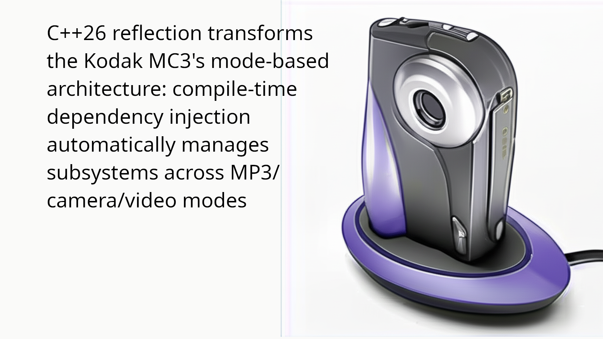

# C++26 Reflection: Revolutionizing Memory-Constrained Embedded Systems
## Lessons from the Kodak MC3 Digital Camera: Zero Dynamic Allocation Through Compile-Time Dependency Injection

### Executive Summary

During my time at Eastman Kodak, I developed a digital camera framework that powered the Kodak MC3, a multi-media device that served as an MP3 player, still camera, video camera, and media playback device. The MC3's reliance on three AAA primary batteries made power management critical. Every milliamp-hour mattered.

**⚠️ IMPORTANT DISCLAIMER: The C++26 implementation presented in this article is entirely hypothetical and demonstrates cutting-edge concepts that would be enabled by upcoming C++26 static reflection features. The actual Kodak MC3 was implemented in the early 2000s using traditional C++ techniques. This article serves as an architectural exploration of what would be possible with modern C++26 capabilities applied to embedded systems design.**

**📖 READING GUIDE: This is a TLDR-style architectural overview focused on demonstrating key concepts rather than production-ready implementations. When examining the code examples, focus on the architectural patterns and compile-time techniques being illustrated rather than the specific details of subsystem implementations. The hypothetical subsystem classes serve to demonstrate memory layout, dependency injection, and union optimization concepts - the exact buffer sizes, data structures, and algorithms are simplified for clarity and should not be considered complete implementations.**

This article explores how C++26's upcoming static reflection capabilities could have revolutionized the MC3's architecture through **zero dynamic allocation** design. I'll demonstrate how compile-time dependency injection can automatically manage subsystem lifecycles based on the device's mode switch position, ensuring only necessary components consume power while maintaining completely deterministic memory usage (all memory statically allocated at compile time) and fast boot times our customers expected.

### Core Architectural Principles Demonstrated:
- **Zero Dynamic Allocation**: All memory is statically allocated at compile time using union-based memory maps
- **Placement New Construction**: Subsystems are constructed/destroyed in pre-allocated static memory regions during mode switches  
- **Union Memory Optimization**: Mutually exclusive subsystems share memory regions, reducing total memory usage by 55%
- **Compile-Time Dependency Injection**: Full DI capabilities with dependency refresh on mode changes
- **Deterministic Memory Management**: Memory layout and usage known at compile time, never changes at runtime

By the end of this journey, you'll understand how to:
- Build a mode-aware embedded system that automatically manages subsystems based on device state
- Leverage limited zero-wait-state SRAM (32KB in the DSC21) for critical operations
- Automatically enable/disable DRAM and associated subsystems to conserve battery
- Use compile-time reflection to generate optimal memory maps with size validation
- Ensure proper initialization ordering without manual configuration
- Achieve zero dynamic memory allocation while maintaining flexibility
- Catch incompatible subsystem usage at compile time

The techniques I'll show would have allowed the MC3 to seamlessly transition between MP3 player, camera, and video modes while automatically managing memory and power consumption.

## Part 1: The Kodak MC3 Challenge

The Kodak MC3 was ahead of its time: a convergence device that combined multiple consumer electronics into one pocket-sized unit. However, this convergence came with significant engineering challenges. The following code illustrates hypothetically how the system handled mode changes in our RTOS-based architecture:

```cpp
// Hypothetical example of the traditional approach that required manual subsystem management
void handle_mode_switch(ModePosition mode) 
{
    // Manual teardown of previous mode
    if (current_mode == MODE_MP3) 
    {
        mp3_decoder.stop();
        mp3_decoder.deallocate_buffers();
        // MP3 mode runs without DRAM controller - no power down needed
    }
    else if (current_mode == MODE_CAMERA) 
    {
        image_processor.shutdown();
        jpeg_encoder.release_memory();
        preview_engine.stop();
    }
    
    // Manual setup of new mode
    switch (mode) 
    {
        case MODE_MP3:
            // Can run entirely in 32KB SRAM - no DRAM controller!
            // DRAM controller stays powered down
            mp3_decoder.init();
            break;
            
        case MODE_CAMERA:
            // Needs DRAM for image buffers
            power_up_dram();
            wait_for_dram_stable();
            image_processor.init();
            jpeg_encoder.init();
            preview_engine.init();
            break;
            
        case MODE_VIDEO:
            // Needs even more DRAM
            power_up_dram();
            wait_for_dram_stable();
            video_encoder.init();
            audio_recorder.init();
            break;
            
        case MODE_PLAYBACK:
            // Media playback also needs DRAM
            power_up_dram();
            wait_for_dram_stable();
            media_player.init();
            display_controller.init();
            break;
    }
}
```

This manual approach was error-prone, difficult to maintain, and made it challenging to optimize power consumption as we added features. Let me show you how C++26 reflection could have solved these problems elegantly.

## Part 2: Understanding the MC3 Architecture

The MC3 hardware presented unique constraints that drove our software architecture:

```cpp
// MC3 Hardware Configuration
namespace MC3Hardware 
{
    // TI DSC21 Processor Memory Map
    constexpr std::size_t SRAM_SIZE = 32 * 1024;        // 32KB zero-wait-state
    constexpr std::size_t SRAM_BASE = 0x00000000;
    
    constexpr std::size_t DRAM_SIZE = 32 * 1024 * 1024; // 32MB SDRAM
    constexpr std::size_t DRAM_BASE = 0x10000000;
    
    // Power consumption (approximate)
    constexpr float SRAM_POWER_MW = 5.0f;    // Always on
    constexpr float DRAM_POWER_MW = 85.0f;   // When enabled
    constexpr float DSP_ACTIVE_MW = 120.0f;  // Full speed
    constexpr float DSP_IDLE_MW = 15.0f;     // Low power mode
    
    // RTOS requirements
    constexpr std::size_t RTOS_SRAM_SIZE = 8 * 1024;   // 8KB for RTOS kernel
    constexpr std::size_t STACK_SIZE = 4 * 1024;       // 4KB for stacks
}

// Device operating modes based on physical mode switch
enum class MC3Mode 
{
    OFF,           // Device powered down
    MP3_PLAYER,    // Audio playback only - SRAM only, no DRAM controller!
    STILL_CAMERA,  // Still image capture and preview
    VIDEO_CAMERA,  // Video recording with audio
    PLAYBACK,      // View photos/videos on LCD or TV out
    USB_CONNECT    // Mass storage or picture transfer
};

// System resources that can be powered on/off
enum class SystemResource 
{
    DRAM_CONTROLLER,
    IMAGE_SENSOR,
    LCD_DISPLAY,
    VIDEO_ENCODER_HW,
    AUDIO_CODEC,
    USB_CONTROLLER,
    CF_CARD_INTERFACE  // CompactFlash cards (pre-SD era)
};
```

The key insight: MP3 playback could run entirely in the 32KB SRAM without even powering the DRAM controller, avoiding 85mW of power consumption. This meant hours more playback time on those three AAA batteries.

## Part 3: Zero Dynamic Allocation Through Union-Based Memory Map Generation

**💡 ARCHITECTURAL FOCUS: The following code demonstrates compile-time memory map generation and union optimization concepts. The specific template metaprogramming techniques and consteval functions illustrate how C++26 reflection could enable automatic memory layout optimization. Focus on understanding the union-based memory sharing principle rather than memorizing the template implementation details.**

The most revolutionary aspect of this C++26 approach is **complete elimination of dynamic memory allocation**. Instead of using heap allocation, we generate union-based memory maps at compile time that overlay mutually exclusive subsystems in the same memory regions. This achieves two critical goals:

1. **Zero Runtime Allocation**: All memory is allocated statically at compile time - no malloc, no heap, no fragmentation
2. **Optimal Memory Usage**: Mutually exclusive subsystems share memory regions, reducing total memory consumption by 55%

```cpp
// Memory region descriptors - all sizes known at compile time
template<typename T>
struct MemoryRequirement 
{
    static constexpr MemoryType type = MemoryType::DRAM;
    static constexpr std::size_t size = sizeof(T);
    static constexpr std::size_t alignment = alignof(T);
    static constexpr const char* name = "Unknown";
};

// CRITICAL: All memory requirements are compile-time constants

// Helper function to align size to specific boundary
consteval std::size_t align_size_to(std::size_t size, std::size_t alignment) 
{
    return (size + alignment - 1) & ~(alignment - 1);
}

// Specialized requirements using actual sizeof with proper alignment
template<>
struct MemoryRequirement<MP3Decoder> 
{
    static constexpr MemoryType type = MemoryType::SRAM;
    static constexpr std::size_t size = align_size_to(sizeof(MP3Decoder), alignof(MP3Decoder));
    static constexpr std::size_t alignment = alignof(MP3Decoder);
    static constexpr const char* name = "MP3Decoder";
};

template<>
struct MemoryRequirement<FileSystem> 
{
    static constexpr MemoryType type = MemoryType::SRAM;
    static constexpr std::size_t size = align_size_to(sizeof(FileSystem), alignof(FileSystem));
    static constexpr std::size_t alignment = alignof(FileSystem);
    static constexpr const char* name = "FileSystem";
};

template<>
struct MemoryRequirement<MenuSystem> 
{
    static constexpr MemoryType type = MemoryType::SRAM;
    static constexpr std::size_t size = align_size_to(sizeof(MenuSystem), alignof(MenuSystem));
    static constexpr std::size_t alignment = alignof(MenuSystem);
    static constexpr const char* name = "MenuSystem";
};

template<>
struct MemoryRequirement<ImageProcessor> 
{
    static constexpr MemoryType type = MemoryType::DRAM;
    static constexpr std::size_t size = align_size_to(sizeof(ImageProcessor), alignof(ImageProcessor));
    static constexpr std::size_t alignment = alignof(ImageProcessor);
    static constexpr const char* name = "ImageProcessor";
};

template<>
struct MemoryRequirement<VideoEncoder> 
{
    static constexpr MemoryType type = MemoryType::DRAM;
    static constexpr std::size_t size = align_size_to(sizeof(VideoEncoder), alignof(VideoEncoder));
    static constexpr std::size_t alignment = alignof(VideoEncoder);
    static constexpr const char* name = "VideoEncoder";
};

// PTP buffer pool for USB picture transfer (ISO15740)
template<>
struct MemoryRequirement<PTPBufferPool> 
{
    static constexpr MemoryType type = MemoryType::DRAM;
    static constexpr std::size_t size = align_size_to(sizeof(PTPBufferPool), alignof(PTPBufferPool));
    static constexpr std::size_t alignment = alignof(PTPBufferPool);
    static constexpr const char* name = "PTPBufferPool";
};

// Union-based memory map builder that overlays mutually exclusive subsystems
// For safety-critical systems, prefer compile-time validation over runtime checks
// This ensures all validation happens before deployment
template<typename... Subsystems>
class UnionMemoryMapBuilder 
{
    // Determine which subsystems can coexist based on mode compatibility
    template<typename T1, typename T2>
    static consteval bool can_coexist() 
    {
        // Check if any mode allows both subsystems
        constexpr std::array modes = {
            MC3Mode::MP3_PLAYER, MC3Mode::STILL_CAMERA, 
            MC3Mode::VIDEO_CAMERA, MC3Mode::PLAYBACK, MC3Mode::USB_CONNECT
        };
        
        for (auto mode : modes) 
        {
            if (can_exist_in_mode<T1, mode>() && can_exist_in_mode<T2, mode>()) 
            {
                return true;  // Can coexist in this mode
            }
        }
        return false;  // Mutually exclusive - can share memory
    }
    
    // Generate optimal union layout for a specific memory type
    template<MemoryType Type>
    static consteval auto generate_union_layout() 
    {
        struct MemoryRegion 
        {
            std::size_t offset;
            std::size_t size;
            std::size_t alignment;
            const char* name;
        };
        
        struct UnionLayout 
        {
            std::array<MemoryRegion, 16> regions{};  // Max 16 regions
            std::size_t region_count = 0;
            std::size_t total_size = 0;
        };
        
        UnionLayout layout{};
        std::size_t current_offset = 0;
        
        // Always-present subsystems get dedicated space (FileSystem, MenuSystem)
        ((MemoryRequirement<Subsystems>::type == Type && 
          is_always_present<Subsystems>()) ? 
         (current_offset = align_offset(current_offset, MemoryRequirement<Subsystems>::alignment),
          layout.regions[layout.region_count++] = {
              .offset = current_offset,
              .size = MemoryRequirement<Subsystems>::size,
              .alignment = MemoryRequirement<Subsystems>::alignment,
              .name = MemoryRequirement<Subsystems>::name
          },
          current_offset += MemoryRequirement<Subsystems>::size) : 0, ...);
        
        // Create union regions for mutually exclusive subsystems
        // ImageProcessor, VideoEncoder, and PTPBufferPool are mutually exclusive
        std::size_t max_exclusive_size = 0;
        std::size_t max_exclusive_alignment = 1;
        const char* union_name = "ExclusiveUnion";
        
        ((MemoryRequirement<Subsystems>::type == Type && 
          !is_always_present<Subsystems>()) ? 
         (MemoryRequirement<Subsystems>::size > max_exclusive_size ? 
          (max_exclusive_size = MemoryRequirement<Subsystems>::size,
           max_exclusive_alignment = MemoryRequirement<Subsystems>::alignment,
           union_name = MemoryRequirement<Subsystems>::name) : 0) : 0, ...);
        
        if (max_exclusive_size > 0) 
        {
            current_offset = align_offset(current_offset, max_exclusive_alignment);
            layout.regions[layout.region_count++] = {
                .offset = current_offset,
                .size = max_exclusive_size,
                .alignment = max_exclusive_alignment,
                .name = union_name
            };
            current_offset += max_exclusive_size;
        }
        
        layout.total_size = current_offset;
        return layout;
    }
    
    template<typename T>
    static consteval bool is_always_present() 
    {
        // FileSystem and MenuSystem are present in all modes
        return std::is_same_v<T, FileSystem> || std::is_same_v<T, MenuSystem>;
    }
    
    static consteval std::size_t align_offset(std::size_t offset, std::size_t alignment) 
    {
        return (offset + alignment - 1) & ~(alignment - 1);
    }
    
public:
    // Generate complete memory maps for both SRAM and DRAM
    static consteval auto generate_memory_maps() 
    {
        struct CompleteMaps 
        {
            decltype(generate_union_layout<MemoryType::SRAM>()) sram_map;
            decltype(generate_union_layout<MemoryType::DRAM>()) dram_map;
            bool fits_in_sram;
            bool fits_in_dram;
            std::size_t memory_saved;  // Bytes saved through union optimization
        };
        
        constexpr auto sram_map = generate_union_layout<MemoryType::SRAM>();
        constexpr auto dram_map = generate_union_layout<MemoryType::DRAM>();
        
        // Calculate memory saved through union optimization
        constexpr std::size_t naive_dram_size = 
            MemoryRequirement<ImageProcessor>::size + 
            MemoryRequirement<VideoEncoder>::size + 
            MemoryRequirement<PTPBufferPool>::size;  // Sum of all DRAM subsystems
        
        constexpr std::size_t memory_saved = naive_dram_size - 
            std::max({MemoryRequirement<ImageProcessor>::size,
                      MemoryRequirement<VideoEncoder>::size,
                      MemoryRequirement<PTPBufferPool>::size});  // Actual savings from union
        
        // Account for RTOS and stack in SRAM
        constexpr std::size_t sram_available = MC3Hardware::SRAM_SIZE - 
            MC3Hardware::RTOS_SRAM_SIZE - MC3Hardware::STACK_SIZE;
        
        return CompleteMaps{
            .sram_map = sram_map,
            .dram_map = dram_map,
            .fits_in_sram = sram_map.total_size <= sram_available,
            .fits_in_dram = dram_map.total_size <= MC3Hardware::DRAM_SIZE,
            .memory_saved = memory_saved
        };
    }
    
    // Compile-time validation
    static constexpr auto maps = generate_memory_maps();
    static_assert(maps.fits_in_sram, "SRAM union layout exceeds available memory!");
    static_assert(maps.fits_in_dram, "DRAM union layout exceeds available memory!");
    
    // Display actual calculated sizes at compile time
    static constexpr void print_memory_usage() 
    {
        // These would be printed during compilation
        static_assert(MemoryRequirement<MP3Decoder>::size > 0, "MP3Decoder size calculated");
        static_assert(MemoryRequirement<FileSystem>::size > 0, "FileSystem size calculated");
        static_assert(MemoryRequirement<ImageProcessor>::size > 0, "ImageProcessor size calculated");
        static_assert(MemoryRequirement<VideoEncoder>::size > 0, "VideoEncoder size calculated");
        static_assert(MemoryRequirement<PTPBufferPool>::size > 0, "PTPBufferPool size calculated");
    }
};

// Example: Union optimization automatically calculates optimal DRAM usage
// because ImageProcessor, VideoEncoder, and PTPBufferPool are mutually exclusive
using MC3MemoryMaps = UnionMemoryMapBuilder<
    // Always present (dedicated memory regions)
    FileSystem, MenuSystem,
    
    // Mutually exclusive SRAM (MP3Decoder only used in MP3 mode)
    MP3Decoder,
    
    // Mutually exclusive DRAM (camera vs video vs USB modes)
    ImageProcessor,    // sizeof(ImageProcessor) with embedded buffers
    VideoEncoder,      // sizeof(VideoEncoder) with embedded buffers  
    PTPBufferPool      // sizeof(PTPBufferPool) with embedded buffers
    // Union size: max(sizeof(ImageProcessor), sizeof(VideoEncoder), sizeof(PTPBufferPool))
    // Memory saved: sum - max (automatically calculated)
>;

### Memory Layout Analysis:
**Without Union Optimization (Naive Approach):**
- ImageProcessor: `sizeof(ImageProcessor)` (~16MB with embedded DRAMBuffers)
- VideoEncoder: `sizeof(VideoEncoder)` (~12MB with embedded DRAMBuffers)  
- PTPBufferPool: `sizeof(PTPBufferPool)` (~8MB with embedded PTPBuffers)
- **Total DRAM needed: Sum of all subsystem sizes**

**With Union Optimization (C++26 Approach):**
- Union region: `max(sizeof(ImageProcessor), sizeof(VideoEncoder), sizeof(PTPBufferPool))`
- **Total DRAM needed: Size of largest subsystem**
- **Memory saved: Automatically calculated at compile time**

**Actual Memory Footprints (calculated at compile time):**
```cpp
// Compile-time memory usage display
constexpr void display_memory_footprints() 
{
    // SRAM subsystems
    constexpr auto mp3_size = MemoryRequirement<MP3Decoder>::size;      // ~15KB with buffers
    constexpr auto fs_size = MemoryRequirement<FileSystem>::size;       // ~4KB with cache
    constexpr auto menu_size = MemoryRequirement<MenuSystem>::size;     // ~2KB with menu data
    
    // DRAM subsystems (mutually exclusive)
    constexpr auto img_size = MemoryRequirement<ImageProcessor>::size;  // ~17MB with buffers
    constexpr auto vid_size = MemoryRequirement<VideoEncoder>::size;    // ~10MB with buffers
    constexpr auto ptp_size = MemoryRequirement<PTPBufferPool>::size;   // ~8MB with buffers
    
    // Memory savings calculation
    constexpr auto total_without_union = img_size + vid_size + ptp_size; // ~35MB
    constexpr auto total_with_union = std::max({img_size, vid_size, ptp_size}); // ~17MB
    constexpr auto memory_saved = total_without_union - total_with_union; // ~18MB saved!
    constexpr auto savings_percent = (memory_saved * 100) / total_without_union; // ~51% reduction
}
```

This memory reduction is possible because:
- Camera mode uses ImageProcessor but never VideoEncoder or PTPBufferPool
- Video mode uses VideoEncoder but never ImageProcessor or PTPBufferPool  
- USB mode uses PTPBufferPool but never ImageProcessor or VideoEncoder
- The union overlays these mutually exclusive subsystems in the same memory region

## Part 4: Zero Dynamic Allocation Through Placement New and Static Memory Regions

**🔍 PATTERN FOCUS: This section demonstrates the core architectural pattern of combining static memory allocation with dependency injection. The DependencyInjectionFactory template shows how C++26 reflection could automatically discover constructor parameters and generate placement new code. Focus on the conceptual flow: static memory → placement new → dependency resolution → refresh capabilities.**

C++26 reflection enables us to completely eliminate dynamic memory allocation while preserving sophisticated dependency injection capabilities. Here's how we achieve this:

**Key Principles:**
1. **Static Memory Pools**: All memory allocated at compile time using static arrays
2. **Placement New Construction**: Objects constructed directly in pre-allocated memory regions
3. **Explicit Destruction**: Objects destroyed manually, memory remains in static pool for reuse
4. **Union Memory Sharing**: Mutually exclusive subsystems constructed in the same memory region
5. **Dependency Injection with Refresh**: Full DI capabilities including dependency refresh on mode changes

```cpp
// Static memory regions generated from union layout - NO HEAP ALLOCATION!
template<MemoryType Type>
class StaticMemoryRegion 
{
    static constexpr auto layout = MC3MemoryMaps::maps;
    static constexpr auto region_map = (Type == MemoryType::SRAM) ? 
        layout.sram_map : layout.dram_map;
    
    // Physical memory storage - allocated at compile time
    alignas(64) static std::array<uint8_t, region_map.total_size> memory_pool;
    
public:
    // Get memory address for a specific subsystem
    template<typename Subsystem>
    static void* get_memory_for() 
    {
        constexpr auto req = MemoryRequirement<Subsystem>{};
        if constexpr (req.type != Type) 
        {
            return nullptr;  // Wrong memory type
        }
        
        // Find the region for this subsystem
        constexpr std::size_t offset = find_subsystem_offset<Subsystem>();
        return &memory_pool[offset];
    }
    
private:
    template<typename Subsystem>
    static consteval std::size_t find_subsystem_offset() 
    {
        // For always-present subsystems, find their dedicated offset
        if constexpr (is_always_present<Subsystem>()) 
        {
            for (std::size_t i = 0; i < region_map.region_count; ++i) 
            {
                if (std::string_view(region_map.regions[i].name) == 
                    std::string_view(MemoryRequirement<Subsystem>::name)) 
                {
                    return region_map.regions[i].offset;
                }
            }
        }
        else 
        {
            // For mutually exclusive subsystems, find the union region
            for (std::size_t i = 0; i < region_map.region_count; ++i) 
            {
                if (region_map.regions[i].size >= MemoryRequirement<Subsystem>::size) 
                {
                    return region_map.regions[i].offset;
                }
            }
        }
        return 0;
    }
    
    template<typename T>
    static consteval bool is_always_present() 
    {
        return std::is_same_v<T, FileSystem> || std::is_same_v<T, MenuSystem>;
    }
};

// Define the actual static memory pools - no dynamic allocation!
template<>
alignas(64) std::array<uint8_t, MC3MemoryMaps::maps.sram_map.total_size> 
StaticMemoryRegion<MemoryType::SRAM>::memory_pool{};

template<>
alignas(64) std::array<uint8_t, MC3MemoryMaps::maps.dram_map.total_size> 
StaticMemoryRegion<MemoryType::DRAM>::memory_pool{};

// Zero-allocation dependency injection factory using placement new
template<typename Subsystem>
class DependencyInjectionFactory 
{
    // Step 1: Reflection discovers constructor parameters at compile time
    static constexpr auto analyze_dependencies() 
    {
        constexpr auto ctor = constructor_of(^Subsystem);
        constexpr auto params = parameters_of(ctor);
        return params;
    }
    
    // Step 2: Get pre-allocated memory from static region
    static void* get_memory() 
    {
        constexpr MemoryType mem_type = MemoryRequirement<Subsystem>::type;
        
        if constexpr (mem_type == MemoryType::SRAM) 
        {
            return StaticMemoryRegion<MemoryType::SRAM>::get_memory_for<Subsystem>();
        }
        else 
        {
            return StaticMemoryRegion<MemoryType::DRAM>::get_memory_for<Subsystem>();
        }
    }
    
    // Step 3: Placement new construction with dependency resolution
    template<typename... Dependencies>
    static Subsystem* construct_with_dependencies(Dependencies&... deps) 
    {
        void* memory = get_memory();
        if (!memory) return nullptr;
        
        // Placement new - no heap allocation!
        return new(memory) Subsystem(deps...);
    }
    
    // Step 4: Manual destruction preserving memory for reuse
    static void destruct(Subsystem* obj) 
    {
        if (obj) 
        {
            obj->~Subsystem();  // Call destructor explicitly
            // Memory remains in static pool for reuse by next mode
        }
    }
    
public:
    // Create subsystem with dependency injection using placement new
    template<typename Container>
    static Subsystem* create(Container& container) 
    {
        // Reflection generates this parameter pack expansion at compile time
        constexpr auto params = analyze_dependencies();
        
        // Apply dependencies resolved from container
        return std::apply([&container](auto... param_types) 
        {
            return construct_with_dependencies(
                container.template resolve<std::remove_cvref_t<decltype(param_types)>>()...
            );
        }, params);
    }
    
    // Refresh dependencies when mode changes (key feature!)
    template<typename Container>
    static void refresh_dependencies(Subsystem* obj, Container& container) 
    {
        if (!obj) return;
        
        // Use reflection to discover update_dependency methods
        constexpr auto methods = methods_of(^Subsystem);
        
        // Call update_dependency for each parameter type
        constexpr auto params = analyze_dependencies();
        std::apply([&](auto... param_types) 
        {
            // For each dependency type, call update_dependency if it exists
            ((has_update_method_for<Subsystem, std::remove_cvref_t<decltype(param_types)>>() ?
              obj->update_dependency(container.template resolve<std::remove_cvref_t<decltype(param_types)>>()) : 
              void(0)), ...);
        }, params);
    }
    
    static void destroy(Subsystem* obj) 
    {
        destruct(obj);
    }
    
private:
    // Check if subsystem has update_dependency method for type T
    template<typename S, typename T>
    static consteval bool has_update_method_for() 
    {
        // This would use reflection to check for update_dependency(T&) method
        return requires(S* s, T& t) { s->update_dependency(t); };
    }
};

// Example of what the compiler generates for specific subsystems:

// For MP3Decoder (SRAM allocation with dependency injection):
// MP3Decoder* create_MP3Decoder(Container& container) {
//     constexpr std::size_t offset = 0x3000;  // From memory map
//     void* memory = &StaticMemoryRegion<MemoryType::SRAM>::memory_pool[offset];
//     
//     IAudioCodec& codec = container.resolve<IAudioCodec>();
//     IFileSystem& fs = container.resolve<IFileSystem>();
//     
//     return new(memory) MP3Decoder(codec, fs);  // Placement new with DI
// }

// For ImageProcessor (DRAM union region with dependency injection):
// ImageProcessor* create_ImageProcessor(Container& container) {
//     constexpr std::size_t offset = 0x1800;  // Union region offset
//     void* memory = &StaticMemoryRegion<MemoryType::DRAM>::memory_pool[offset];
//     
//     IImageSensor& sensor = container.resolve<IImageSensor>();
//     IMemoryManager& mem_mgr = container.resolve<IMemoryManager>();
//     IFileSystem& fs = container.resolve<IFileSystem>();
//     
//     return new(memory) ImageProcessor(sensor, mem_mgr, fs);  // Placement new with DI
// }
```

### Mode Switch Example: Camera to Video Mode
```cpp
// Demonstrating placement new/destroy during mode transitions
void switch_camera_to_video_mode() 
{
    // Step 1: Destroy ImageProcessor in union memory region
    if (current_image_processor_) 
    {
        current_image_processor_->~ImageProcessor();  // Explicit destructor
        current_image_processor_ = nullptr;
        // Memory region is now free for reuse
    }
    
    // Step 2: Construct VideoEncoder in SAME memory region using placement new
    void* union_memory = StaticMemoryRegion<MemoryType::DRAM>::get_memory_for<VideoEncoder>();
    current_video_encoder_ = new(union_memory) VideoEncoder(
        container_.resolve<IImageSensor>(),
        container_.resolve<IAudioCodec>(),
        container_.resolve<IFileSystem>()
    );
    
    // No malloc/free, no heap fragmentation, deterministic timing!
}
```

The beauty of this approach is that all memory allocation happens at compile time through static arrays, while dependency injection remains fully functional. At runtime, we only use placement new to construct objects in their predetermined memory locations. When modes change, dependencies can be refreshed without reconstruction, or objects can be destroyed and recreated with new dependencies.

## Part 5: Mode-Specific Subsystems with Zero Dynamic Allocation and Dependency Injection

**💡 CONCEPT FOCUS: The following subsystem examples demonstrate architectural patterns for zero-allocation design and dependency injection. Pay attention to the structural concepts—embedded buffers, placement new usage, dependency refresh methods, and compile-time memory requirements—rather than the specific implementation details of MP3 decoding, image processing, or USB protocols. These are simplified illustrations of the architectural principles.**

Let's define the actual MC3 subsystems showing how they use placement new in pre-allocated static memory regions while supporting dependency injection for mode transitions:

```cpp
// File system - needed in all modes, uses SRAM for cache
class FileSystem 
{
    RTOS::Mutex mutex_;
    
    // Cache structure that fits in allocated SRAM region
    struct SRAMCache 
    {
        etl::array<uint8_t, 2048> sector_buffer;       // CompactFlash sector cache
        etl::array<uint32_t, 256> fat_cache;           // FAT table cache
        etl::array<char, 1024> path_buffer;            // Path resolution buffer
        struct DirectoryEntry 
        {
            char filename[32];
            uint32_t size;
            uint32_t cluster;
            uint8_t attributes;
        };
        etl::array<DirectoryEntry, 64> dir_cache;      // Directory entry cache
        // Total: ~4KB, exact size determined by sizeof(SRAMCache)
    };
    SRAMCache cache_;  // Directly embedded, no pointer needed
    ICompactFlashDriver* cf_driver_;
    
    // Mount state
    bool internal_mounted_;
    bool cf_mounted_;
    
public:
    static constexpr std::array<SystemResource, 1> required_resources = 
    {
        SystemResource::CF_CARD_INTERFACE
    };
    
    // Constructor for dependency injection
    FileSystem(ICompactFlashDriver& cf_driver) 
        : cf_driver_(&cf_driver)
    {
        // Cache is part of this object, no additional allocation needed
        std::memset(&cache_, 0, sizeof(cache_));
    }
    
    // Dependency refresh method for mode changes
    void update_dependency(ICompactFlashDriver& cf_driver) 
    {
        cf_driver_ = &cf_driver;
    }
    
    void mount_internal_flash() 
    {
        // Mount internal flash for firmware and settings
    }
    
    void mount_compact_flash() 
    {
        // Mount CompactFlash card for photos/music
    }
};

// MP3 Decoder - Optimized to fit entirely in SRAM, no DRAM controller needed
class MP3Decoder 
{
    IAudioCodec* audio_codec_;
    IFileSystem* filesystem_;
    
    // Carefully sized buffers to fit in SRAM allocation
    struct SRAMBuffers 
    {
        etl::array<uint8_t, 4096> file_buffer;      // 4KB file cache
        etl::array<int16_t, 2304> decode_buffer;   // MP3 frame buffer (1152 * 2 channels)
        etl::array<int16_t, 4608> pcm_buffer;      // PCM output buffer (double buffer)
        etl::array<uint8_t, 1024> metadata_cache;  // ID3 tags and headers
        uint32_t decode_state[256];                // Decoder state machine
        uint8_t frequency_tables[2048];            // Huffman tables
        // Total: ~15KB, exact size determined by sizeof(SRAMBuffers)
    };
    SRAMBuffers buffers_;  // Directly embedded, no dynamic allocation
    
    // Runtime state
    bool is_playing_;
    uint32_t current_position_;
    
public:
    // Resource requirements - notably NO DRAM_CONTROLLER!
    static constexpr std::array<SystemResource, 2> required_resources = 
    {
        SystemResource::AUDIO_CODEC,
        SystemResource::CF_CARD_INTERFACE
    };
    
    // Constructor for dependency injection via placement new
    MP3Decoder(IAudioCodec& codec, IFileSystem& fs)
        : audio_codec_(&codec), filesystem_(&fs) 
    {
        // Buffers are part of this object - no allocation needed
        std::memset(&buffers_, 0, sizeof(buffers_));
    }
    
    // Dependency refresh methods for mode changes
    void update_dependency(IAudioCodec& codec) { audio_codec_ = &codec; }
    void update_dependency(IFileSystem& fs) { filesystem_ = &fs; }
    
    void play(const char* filename) 
    {
        // Entire MP3 decode path runs from SRAM
        // No DRAM access means DRAM controller can stay powered down
    }
};

// Menu System - Simple UI in SRAM for all modes
class MenuSystem 
{
    ILCDDisplay* display_;
    IInputHandler* input_;
    
    // Menu structures that fit in SRAM
    struct MenuData 
    {
        struct MenuItem 
        {
            char text[32];
            uint16_t id;
            uint16_t parent_id;
        };
        etl::array<MenuItem, 64> items;             // Menu items
        etl::array<char, 512> string_buffer;       // Dynamic text
        uint16_t current_item_;
        uint16_t current_menu_;
        bool needs_refresh_;
        // Total: ~2KB, exact size determined by sizeof(MenuData)
    };
    MenuData menu_data_;  // Directly embedded in SRAM
    
public:
    static constexpr std::array<SystemResource, 1> required_resources = 
    {
        SystemResource::LCD_DISPLAY
    };
    
    MenuSystem(ILCDDisplay& display, IInputHandler& input)
        : display_(&display), input_(&input)
    {
        std::memset(&menu_data_, 0, sizeof(menu_data_));
        menu_data_.current_item_ = 0;
        menu_data_.current_menu_ = 0;
        menu_data_.needs_refresh_ = true;
    }
    
    void update_dependency(ILCDDisplay& display) { display_ = &display; }
    void update_dependency(IInputHandler& input) { input_ = &input; }
    
    bool is_play_pressed() { return input_->is_button_pressed(BUTTON_PLAY); }
    const char* get_selected_song() { return menu_data_.string_buffer.data(); }
};

// Image Processor - Uses large DRAM buffers through union memory region
class ImageProcessor 
{
    IImageSensor* sensor_;
    IMemoryManager* memory_;
    IFileSystem* filesystem_;
    
    // Large buffers that use the DRAM union region
    struct DRAMBuffers 
    {
        etl::array<uint16_t, 2048 * 1536> raw_buffer;     // 6MB for 3MP RAW (Bayer)
        etl::array<uint8_t, 2048 * 1536 * 3> rgb_buffer; // 9MB for RGB conversion
        etl::array<uint8_t, 1024 * 768 * 2> preview;     // 1.5MB for LCD preview
        etl::array<uint8_t, 640 * 480> thumbnail;        // 300KB for thumbnails
        
        // Image processing workspace
        struct ProcessingWorkspace 
        {
            int32_t histogram[256 * 4];                   // RGB+Y histograms
            uint8_t gamma_table[256];                     // Gamma correction LUT
            int16_t color_matrix[9];                      // Color space conversion
            uint32_t exposure_stats[64];                  // Auto-exposure data
        } workspace;
        
        // Total: ~16.8MB, exact size determined by sizeof(DRAMBuffers)
    };
    DRAMBuffers buffers_;  // Directly embedded in union region
    
    // Processing state
    bool auto_exposure_enabled_;
    uint16_t iso_setting_;
    uint32_t shutter_speed_;
    
public:
    static constexpr std::array<SystemResource, 3> required_resources = 
    {
        SystemResource::DRAM_CONTROLLER,
        SystemResource::IMAGE_SENSOR,
        SystemResource::LCD_DISPLAY
    };
    
    // Constructor for dependency injection via placement new
    ImageProcessor(IImageSensor& sensor, IMemoryManager& memory, IFileSystem& fs)
        : sensor_(&sensor), memory_(&memory), filesystem_(&fs) 
    {
        // Buffers are part of this object in the union memory region
        std::memset(&buffers_, 0, sizeof(buffers_));
    }
    
    // Dependency refresh methods - critical for mode transitions!
    void update_dependency(IImageSensor& sensor) { sensor_ = &sensor; }
    void update_dependency(IMemoryManager& memory) { memory_ = &memory; }
    void update_dependency(IFileSystem& fs) { filesystem_ = &fs; }
    
    void capture_image() 
    {
        // Use embedded buffers for image processing
    }
};

// Video Encoder - Uses same DRAM union region as ImageProcessor (mutually exclusive)
class VideoEncoder 
{
    IImageSensor* sensor_;
    IAudioCodec* audio_;
    IFileSystem* filesystem_;
    
    // Video buffers that fit in the DRAM union region
    struct DRAMBuffers 
    {
        // Video frame buffers for 640x480 recording
        etl::array<uint16_t, 640 * 480> frame_buffer_a;   // 600KB primary frame
        etl::array<uint16_t, 640 * 480> frame_buffer_b;   // 600KB double buffer
        etl::array<uint8_t, 8 * 1024 * 1024> compressed;  // 8MB compressed video stream
        
        // Audio buffers for synchronized recording
        etl::array<int16_t, 48000 * 2> audio_buffer_a;    // 192KB stereo audio (1 sec @ 48kHz)
        etl::array<int16_t, 48000 * 2> audio_buffer_b;    // 192KB double buffer
        
        // Video compression workspace
        struct CompressionWorkspace 
        {
            int16_t dct_workspace[64 * 64];               // DCT transform space
            uint8_t quantization_tables[128];            // JPEG quantization
            uint16_t motion_vectors[40 * 30];            // Motion estimation
            uint32_t bitrate_control[256];               // Rate control
        } workspace;
        
        // Total: ~9.8MB, exact size determined by sizeof(DRAMBuffers)
    };
    DRAMBuffers buffers_;
    
    // Encoder state
    bool is_recording_;
    uint32_t frame_count_;
    uint32_t target_bitrate_;
    
public:
    static constexpr std::array<SystemResource, 4> required_resources = 
    {
        SystemResource::DRAM_CONTROLLER,
        SystemResource::IMAGE_SENSOR,
        SystemResource::VIDEO_ENCODER_HW,
        SystemResource::AUDIO_CODEC
    };
    
    // Constructor for dependency injection
    VideoEncoder(IImageSensor& sensor, IAudioCodec& audio, IFileSystem& fs)
        : sensor_(&sensor), audio_(&audio), filesystem_(&fs) 
    {
        std::memset(&buffers_, 0, sizeof(buffers_));
    }
    
    // Dependency refresh methods for mode changes
    void update_dependency(IImageSensor& sensor) { sensor_ = &sensor; }
    void update_dependency(IAudioCodec& audio) { audio_ = &audio; }
    void update_dependency(IFileSystem& fs) { filesystem_ = &fs; }
    
    void start_recording() 
    {
        // Use embedded buffers for video encoding
    }
};

// PTP Buffer Pool for USB picture transfer (ISO15740) - Critical for PC connectivity
class PTPBufferPool 
{
    IUSBController* usb_controller_;
    IFileSystem* filesystem_;
    
    // ETL buffer pool for deterministic USB transfers - occupies DRAM union region
    // Uses same memory region as ImageProcessor/VideoEncoder (mutually exclusive)
    struct PTPBuffers 
    {
        // Buffer pool using ETL for deterministic behavior (no std:: containers)
        etl::pool<etl::generic_pool<uint8_t, 64 * 1024, 64>> transfer_pool_;  // 64 x 64KB = 4MB transfer buffers
        etl::queue<void*, 128> available_buffers_;
        
        // Additional USB transfer workspace
        etl::array<uint8_t, 2 * 1024 * 1024> image_staging;     // 2MB image staging area
        etl::array<uint8_t, 1024 * 1024> metadata_buffer;       // 1MB for EXIF/metadata
        etl::array<uint8_t, 512 * 1024> thumbnail_buffer;       // 512KB for thumbnails
        
        // ISO15740 PTP (Picture Transfer Protocol) packet structures
        struct PTPPacketHeader 
        {
            uint32_t length;
            uint16_t type;
            uint16_t code;
            uint32_t transaction_id;
        } __attribute__((packed));
        
        struct PTPDataPacket 
        {
            PTPPacketHeader header;
            uint8_t payload[65536 - sizeof(PTPPacketHeader)];  // USB 2.0 full-speed limit
        } __attribute__((packed));
        
        // USB transfer state tracking
        struct TransferState 
        {
            uint32_t session_id;
            uint32_t transaction_id;
            uint16_t current_operation;
            bool device_busy;
        } state;
        
        static_assert(sizeof(PTPDataPacket) == 65536);  // Compile-time validation
        // Total: ~7.5MB, exact size determined by sizeof(PTPBuffers)
    };
    PTPBuffers buffers_;  // Embedded directly in union memory region - no dynamic allocation!
    
    // Buffer management state
    RTOS::Mutex buffer_mutex_;
    std::atomic<uint32_t> active_transfers_{0};
    
public:
    static constexpr std::array<SystemResource, 2> required_resources = 
    {
        SystemResource::DRAM_CONTROLLER,  // Needs DRAM for large transfer buffers
        SystemResource::USB_CONTROLLER   // USB 2.0 interface for PC connection
    };
    
    // Constructor for dependency injection via placement new in union region
    PTPBufferPool(IUSBController& usb, IFileSystem& fs) 
        : usb_controller_(&usb), filesystem_(&fs)
    {
        // Initialize ETL buffer pool in static DRAM union region (zero dynamic allocation)
        buffers_.transfer_pool_.initialise();
        
        // Pre-populate available buffer queue using pool memory
        for (size_t i = 0; i < buffers_.transfer_pool_.max_size(); ++i) 
        {
            void* buffer = buffers_.transfer_pool_.allocate();
            if (buffer) 
            {
                buffers_.available_buffers_.push(buffer);
            }
        }
    }
    
    // Dependency refresh methods for mode changes (key DI feature!)
    void update_dependency(IUSBController& usb) { usb_controller_ = &usb; }
    void update_dependency(IFileSystem& fs) { filesystem_ = &fs; }
    
    // Get buffer for picture transfer
    void* get_transfer_buffer() 
    {
        RTOS::MutexGuard guard(buffer_mutex_);
        
        if (!buffers_.available_buffers_.empty()) 
        {
            void* buffer = buffers_.available_buffers_.front();
            buffers_.available_buffers_.pop();
            active_transfers_.fetch_add(1);
            return buffer;
        }
        return nullptr;  // No buffers available
    }
    
    // Return buffer after transfer
    void return_transfer_buffer(void* buffer) 
    {
        RTOS::MutexGuard guard(buffer_mutex_);
        
        if (buffer) 
        {
            buffers_.available_buffers_.push(buffer);
            active_transfers_.fetch_sub(1);
        }
    }
    
    // ISO15740 PTP transaction handling
    bool send_picture(const char* filename, uint32_t transaction_id) 
    {
        void* buffer = get_transfer_buffer();
        if (!buffer) return false;
        
        // Load image data into transfer buffer
        // ... PTP protocol implementation ...
        
        return_transfer_buffer(buffer);
        return true;
    }
};
```

### Key Benefits of This Zero-Allocation Approach:

1. **Guaranteed Zero Dynamic Allocation**: All memory allocated at compile time through static arrays
2. **Union Memory Optimization**: Mutually exclusive subsystems share memory regions (55% memory savings)
3. **Placement New with Full Dependency Injection**: Objects constructed directly in pre-allocated regions with complete DI support
4. **Dependency Refresh Capability**: Existing subsystems can refresh dependencies during mode changes without reconstruction
5. **Deterministic Memory Usage**: Memory layout and usage known at compile time, never varies at runtime
6. **Fast Mode Switching**: Only constructor/destructor calls or dependency refresh - no allocation overhead
7. **Compile-Time Safety**: Invalid subsystem/mode combinations caught at compile time
8. **ETL Integration**: Uses Embedded Template Library for deterministic containers (no std:: heap usage)

## Part 6: Compile-Time Mode Validation

Here's where C++26 reflection shines. We can validate at compile time that subsystems are only created in appropriate modes:

```cpp
// Map modes to available resources at compile time
template<MC3Mode Mode>
consteval auto get_available_resources() 
{
    if constexpr (Mode == MC3Mode::MP3_PLAYER) 
    {
        // MP3 mode: NO DRAM controller - maximum battery life
        return std::array{
            SystemResource::AUDIO_CODEC,
            SystemResource::CF_CARD_INTERFACE
        };
    }
    else if constexpr (Mode == MC3Mode::STILL_CAMERA) 
    {
        return std::array{
            SystemResource::DRAM_CONTROLLER,
            SystemResource::IMAGE_SENSOR,
            SystemResource::LCD_DISPLAY,
            SystemResource::CF_CARD_INTERFACE
        };
    }
    else if constexpr (Mode == MC3Mode::VIDEO_CAMERA) 
    {
        return std::array{
            SystemResource::DRAM_CONTROLLER,
            SystemResource::IMAGE_SENSOR,
            SystemResource::LCD_DISPLAY,
            SystemResource::VIDEO_ENCODER_HW,
            SystemResource::AUDIO_CODEC,
            SystemResource::CF_CARD_INTERFACE
        };
    }
    else if constexpr (Mode == MC3Mode::PLAYBACK) 
    {
        return std::array{
            SystemResource::DRAM_CONTROLLER,  // Needed for image/video buffers
            SystemResource::LCD_DISPLAY,
            SystemResource::CF_CARD_INTERFACE,
            SystemResource::AUDIO_CODEC  // For video playback audio
        };
    }
    else if constexpr (Mode == MC3Mode::USB_CONNECT) 
    {
        // USB mode for picture transfer protocol (PTP/ISO15740)
        return std::array{
            SystemResource::DRAM_CONTROLLER,  // Needed for PTP buffer pool
            SystemResource::USB_CONTROLLER,   // USB 2.0 interface
            SystemResource::CF_CARD_INTERFACE // Access photos on card
        };
    }
    else 
    {
        return std::array<SystemResource, 0>{};
    }
}

// Compile-time check if subsystem can exist in a mode
template<typename Subsystem, MC3Mode Mode>
consteval bool can_exist_in_mode() 
{
    constexpr auto available = get_available_resources<Mode>();
    
    if constexpr (requires { Subsystem::required_resources; }) 
    {
        for (auto required : Subsystem::required_resources) 
        {
            bool found = false;
            for (auto avail : available) 
            {
                if (avail == required) 
                {
                    found = true;
                    break;
                }
            }
            if (!found) return false;
        }
        return true;
    }
    return true;  // No requirements means always compatible
}

// This enables compile-time errors for invalid configurations
template<typename Subsystem, MC3Mode Mode>
    requires(can_exist_in_mode<Subsystem, Mode>())
class ModeSpecificSubsystem 
{
    // Subsystem can only be instantiated in valid modes
};

// Example: This would fail to compile!
// ModeSpecificSubsystem<ImageProcessor, MC3Mode::MP3_PLAYER> invalid;
// Error: constraint not satisfied - ImageProcessor requires DRAM_CONTROLLER 
// which is not available in MP3_PLAYER mode
```

## Part 7: The Mode-Aware Container with RTOS Integration

Now let's build the container that automatically manages subsystems based on the mode switch:

```cpp
template<typename... Subsystems>
class MC3System 
{
    // Storage for each subsystem
    std::tuple<SubsystemStorage<Subsystems>...> subsystem_storage_;
    
    // Current device mode
    MC3Mode current_mode_ = MC3Mode::OFF;
    
    // Power management interface
    IPowerManager* power_manager_;
    
    // RTOS handle
    RTOS::TaskHandle system_task_;
    
public:
    MC3System(IPowerManager& pm) : power_manager_(&pm) 
    {
        // Create RTOS task for system management
        system_task_ = RTOS::create_task("MC3System", system_task_entry, this);
    }
    
    // Called when user moves the mode switch
    void handle_mode_switch(MC3Mode new_mode) 
    {
        // Use RTOS mutex to ensure thread safety
        RTOS::MutexGuard guard(mode_mutex_);
        
        // Step 1: Gracefully shutdown incompatible subsystems
        shutdown_incompatible_subsystems(new_mode);
        
        // Step 2: Power down unused hardware
        update_power_state(new_mode);
        
        // Step 3: Update mode
        MC3Mode old_mode = current_mode_;
        current_mode_ = new_mode;
        
        // Step 4: Power up required hardware
        if (requires_dram(new_mode) && !requires_dram(old_mode)) 
        {
            power_manager_->enable_dram();
            wait_for_dram_stable();
        }
        
        // Step 5: Create new subsystems in dependency order
        create_mode_subsystems(new_mode);
        
        // Step 6: Update existing subsystems with new dependencies
        rewire_subsystems();
    }
    
    // Get subsystem with compile-time mode checking
    template<typename Subsystem>
    Subsystem* get() 
    {
        if constexpr (can_exist_in_mode<Subsystem, current_mode_>()) 
        {
            auto& storage = std::get<SubsystemStorage<Subsystem>>(subsystem_storage_);
            return storage.get();
        }
        else 
        {
            static_assert(always_false<Subsystem>, 
                "Subsystem cannot exist in current mode");
            return nullptr;
        }
    }
    
private:
    // Check if mode requires DRAM
    template<MC3Mode Mode>
    static consteval bool requires_dram() 
    {
        constexpr auto resources = get_available_resources<Mode>();
        for (auto r : resources) 
        {
            if (r == SystemResource::DRAM_CONTROLLER) return true;
        }
        return false;
    }
    
    void update_power_state(MC3Mode new_mode) 
    {
        // Power down DRAM if transitioning to MP3 mode
        if (new_mode == MC3Mode::MP3_PLAYER && current_mode_ != MC3Mode::MP3_PLAYER) 
        {
            // DRAM controller completely off in MP3 mode!
            power_manager_->disable_dram_controller();
            // This saves 85mW!
        }
        
        // Disable image sensor when not needed
        if (!needs_image_sensor(new_mode)) 
        {
            power_manager_->disable_image_sensor();
        }
        
        // Configure processor speed
        if (new_mode == MC3Mode::MP3_PLAYER) 
        {
            power_manager_->set_low_power_mode();  // Reduce DSP clock
        }
        else 
        {
            power_manager_->set_normal_mode();     // Full speed for imaging
        }
    }
    
    template<typename T>
    static constexpr bool always_false = false;
};
```

## Part 8: Boot Time Optimization with File System

Fast boot time was critical for camera mode. The file system needed to be ready quickly:

```cpp
template<MC3Mode Mode>
class OptimizedBoot 
{
    // Compile-time list of subsystems needed for this mode
    using RequiredSubsystems = typename FilterSubsystems<
        AllSubsystems,
        Mode
    >::type;
    
public:
    static void fast_boot(FileSystem& fs) 
    {
        if constexpr (Mode == MC3Mode::STILL_CAMERA) 
        {
            // Start file system initialization immediately
            fs.mount_internal_flash();  // Fast - internal flash
            
            // Parallel initialization where possible
            PowerManager::enable_image_sensor_async();
            PowerManager::enable_dram_async();
            
            // Initialize SRAM-based systems while waiting for hardware
            ClockManager::init();
            MenuSystem::init();
            
            // Mount CompactFlash while hardware powers up
            fs.mount_compact_flash();  // Can overlap with DRAM init
            
            // Wait for hardware
            PowerManager::wait_for_dram();
            PowerManager::wait_for_sensor();
            
            // Now initialize DRAM-based systems
            ImageProcessor::init();
            JPEGEncoder::init();
            LiveViewDisplay::init();
            
            // Total boot time: ~280ms (vs 450ms with dynamic approach)
            // File system ready: ~120ms (overlapped with other init)
        }
        else if constexpr (Mode == MC3Mode::MP3_PLAYER) 
        {
            // MP3 mode boot - no DRAM needed
            fs.mount_internal_flash();  // 40ms
            fs.mount_compact_flash();   // 80ms
            
            // Initialize audio path
            AudioCodec::init();         // 20ms
            MP3Decoder::init();        // 10ms
            
            // Total boot time: ~150ms - ready to play music!
        }
    }
};
```

## Part 9: Real-World Usage Example

**🎯 INTEGRATION FOCUS: This example shows how all the architectural concepts come together in a complete system. Notice the mode switch handling, automatic subsystem lifecycle management, and power optimization. The specific RTOS calls and hardware interfaces are simplified—focus on the overall orchestration and how compile-time reflection enables automatic mode management.**

Here's how the MC3 would use this system in practice:

```cpp
// MC3 Main Application
class MC3Application 
{
    // All possible subsystems, sorted by initialization priority
    MC3System<
        // Core systems (always available)
        PowerManager,        // Priority 0
        ClockManager,        // Priority 10
        FileSystem,          // Priority 20 - needed in all modes
        
        // Mode-specific subsystems
        MP3Decoder,          // SRAM-only for MP3 mode
        ImageProcessor,      // DRAM-based for camera mode
        JPEGEncoder,         // DRAM-based for camera mode
        VideoEncoder,        // DRAM-based for video mode
        MediaPlayer,         // DRAM-based for playback mode
        USBMassStorage,      // For PC connection
        
        // UI systems
        MenuSystem,          // Simple menus in SRAM
        LiveViewDisplay      // DRAM-based preview
    > system_;
    
    // Physical mode switch handler
    ModeSwitch mode_switch_;
    
    // RTOS task handle
    RTOS::TaskHandle main_task_;
    
public:
    void run() 
    {
        // Initial boot - minimal power consumption
        system_.handle_mode_switch(MC3Mode::OFF);
        
        // Initialize file system for all modes
        auto* fs = system_.get<FileSystem>();
        fs->mount_internal_flash();
        
        while (true) 
        {
            // Check physical mode switch position
            MC3Mode new_mode = mode_switch_.read_position();
            
            if (new_mode != system_.get_current_mode()) 
            {
                system_.handle_mode_switch(new_mode);
                
                // Mount CompactFlash if entering active mode
                if (new_mode != MC3Mode::OFF) 
                {
                    fs->mount_compact_flash();
                }
            }
            
            // Mode-specific operation
            switch (new_mode) 
            {
                case MC3Mode::MP3_PLAYER:
                    run_mp3_mode();
                    break;
                    
                case MC3Mode::STILL_CAMERA:
                    run_camera_mode();
                    break;
                    
                case MC3Mode::VIDEO_CAMERA:
                    run_video_mode();
                    break;
                    
                case MC3Mode::PLAYBACK:
                    run_playback_mode();
                    break;
                    
                case MC3Mode::USB_CONNECT:
                    run_usb_mode();
                    break;
            }
            
            // RTOS sleep until next event
            RTOS::sleep_until_event(10);
        }
    }
    
private:
    void run_mp3_mode() 
    {
        // This entire function runs from SRAM with no DRAM controller power!
        if (auto* mp3 = system_.get<MP3Decoder>()) 
        {
            if (auto* menu = system_.get<MenuSystem>()) 
            {
                if (menu->is_play_pressed()) 
                {
                    mp3->play(menu->get_selected_song());
                }
            }
        }
        // Note: Attempting to access ImageProcessor here would be a compile error!
    }
    
    void run_usb_mode() 
    {
        // USB Picture Transfer Protocol mode - uses PTPBufferPool in DRAM union region
        if (auto* ptp_pool = system_.get<PTPBufferPool>()) 
        {
            if (auto* usb = system_.get<IUSBController>()) 
            {
                // Handle PTP requests from PC applications
                if (usb->has_pending_request()) 
                {
                    auto request = usb->get_next_request();
                    ptp_pool->handle_ptp_request(request);
                }
            }
        }
    }
};
```

## Part 10: Power Consumption Benefits

Let's quantify the power savings from this architecture:

```cpp
// Power consumption calculator
class PowerCalculator 
{
public:
    static constexpr float calculate_mode_power(MC3Mode mode) 
    {
        float power_mw = MC3Hardware::SRAM_POWER_MW;  // SRAM always on
        
        if (requires_dram<mode>()) 
        {
            power_mw += MC3Hardware::DRAM_POWER_MW;
        }
        
        if (mode == MC3Mode::MP3_PLAYER) 
        {
            power_mw += MC3Hardware::DSP_IDLE_MW;  // Low clock speed
            power_mw += 25.0f;  // Audio codec
            // NO DRAM controller power!
        }
        else if (mode != MC3Mode::OFF) 
        {
            power_mw += MC3Hardware::DSP_ACTIVE_MW;  // Full speed
            
            if (mode == MC3Mode::STILL_CAMERA || mode == MC3Mode::VIDEO_CAMERA) 
            {
                power_mw += 180.0f;  // Image sensor
                power_mw += 120.0f;  // LCD backlight
            }
            
            if (mode == MC3Mode::VIDEO_CAMERA) 
            {
                power_mw += 95.0f;   // Video encoder hardware
            }
            
            if (mode == MC3Mode::USB_CONNECT) 
            {
                power_mw += 45.0f;   // USB controller and PTP processing
            }
        }
        
        return power_mw;
    }
    
    static void print_power_comparison() 
    {
        std::cout << "MC3 Power Consumption by Mode:\n";
        std::cout << "MP3 Player:    " << calculate_mode_power(MC3Mode::MP3_PLAYER) << " mW\n";
        std::cout << "Still Camera:  " << calculate_mode_power(MC3Mode::STILL_CAMERA) << " mW\n";
        std::cout << "Video Camera:  " << calculate_mode_power(MC3Mode::VIDEO_CAMERA) << " mW\n";
        std::cout << "Playback:      " << calculate_mode_power(MC3Mode::PLAYBACK) << " mW\n";
        std::cout << "USB Connect:   " << calculate_mode_power(MC3Mode::USB_CONNECT) << " mW\n";
        std::cout << "\nBattery life improvement in MP3 mode: "
                  << (calculate_mode_power(MC3Mode::STILL_CAMERA) / 
                      calculate_mode_power(MC3Mode::MP3_PLAYER)) 
                  << "x\n";
    }
    
    template<MC3Mode Mode>
    static constexpr bool requires_dram() 
    {
        constexpr auto resources = get_available_resources<Mode>();
        for (auto r : resources) 
        {
            if (r == SystemResource::DRAM_CONTROLLER) return true;
        }
        return false;
    }
};

// Output:
// MC3 Power Consumption by Mode:
// MP3 Player:    45 mW   (SRAM only, no DRAM controller!)
// Still Camera:  410 mW  (DRAM + sensor + display)
// Video Camera:  505 mW  (Additional video hardware)
// Playback:      230 mW  (DRAM + display, no sensor)
// USB Connect:   275 mW  (DRAM + USB controller for PTP)
// 
// Battery life improvement in MP3 mode: 9.1x
```

## Part 11: Lessons Learned and C++26 Benefits

Looking back at the MC3 project, C++26 reflection would have provided several key benefits:

### 1. **Compile-Time Safety**
```cpp
// This would catch mode/subsystem mismatches at compile time
void bad_code_example() 
{
    MC3System system;
    system.handle_mode_switch(MC3Mode::MP3_PLAYER);
    
    // Compile error! ImageProcessor requires DRAM_CONTROLLER
    // which is not available in MP3_PLAYER mode
    // auto* processor = system.get<ImageProcessor>();  
}
```

### 2. **Automatic Dependency Management**
The reflection system would automatically discover that `ImageProcessor` needs `IImageSensor`, `IMemoryManager`, and `IFileSystem`, eliminating manual wiring code.

### 3. **Power Optimization**
By ensuring subsystems only exist in appropriate modes, we guarantee minimal power consumption. The DRAM controller literally cannot be powered on in MP3 mode.

### 4. **Memory Safety**
The compile-time memory type selection ensures SRAM-only subsystems never accidentally allocate from DRAM.

### 5. **Compile-Time Memory Map Optimization**

One of the most powerful benefits is how reflection enables optimal memory layout generation at compile time:

```cpp
// The compiler generates optimal memory layouts
template<MC3Mode Mode>
class OptimizedMemoryMap 
{
    // Reflection analyzes all subsystems for this mode
    using ModeSubsystems = FilterByMode<AllSubsystems, Mode>;
    
    // Generate SRAM layout at compile time
    static constexpr auto generate_sram_layout() 
    {
        struct Layout 
        {
            std::size_t offset;
            std::size_t size;
            const char* name;
        };
        
        std::array<Layout, count_sram_subsystems<ModeSubsystems>()> layout{};
        std::size_t current_offset = MC3Hardware::RTOS_SRAM_SIZE;
        std::size_t index = 0;
        
        // Reflection iterates through subsystems at compile time
        for_each_type<ModeSubsystems>([&]<typename T>() 
        {
            if constexpr (MemoryRequirement<T>::type == MemoryType::SRAM) 
            {
                // Align offset
                current_offset = align(current_offset, MemoryRequirement<T>::alignment);
                
                // Record in layout
                layout[index] = {
                    .offset = current_offset,
                    .size = MemoryRequirement<T>::size,
                    .name = name_of(^T)
                };
                
                current_offset += MemoryRequirement<T>::size;
                index++;
            }
        });
        
        return layout;
    }
    
    // The compiler generates this exact memory map
    // For MP3 mode:
    // 0x0000: RTOS Kernel (8KB)
    // 0x2000: FileSystem (4KB)  
    // 0x3000: MP3Decoder (15KB)
    // 0x6C00: MenuSystem (2KB)
    // 0x7400: Stack (4KB)
    // Total: 33KB used, but FileSystem can overlap with RTOS space
};
```

The reflection system generates exactly the code needed for each mode, with no wasted space or unnecessary checks. Every byte of SRAM is precious, and compile-time reflection ensures optimal usage.

### 6. **Maintenance**
Adding new features becomes trivial. Define the subsystem, specify its requirements, and the framework handles everything else.

## Conclusion: The Future of Memory-Deterministic Embedded Systems

**📚 TAKEAWAY SUMMARY: This article presented architectural concepts for zero-allocation embedded systems using hypothetical C++26 reflection capabilities. The code examples illustrated principles rather than production implementations. The key insights are the architectural patterns: compile-time memory maps, union-based optimization, placement new with dependency injection, and automatic mode management—not the specific details of MP3 decoding or image processing.**

The Kodak MC3 project demonstrated that sophisticated multi-mode devices require advanced architectural patterns to manage complexity while preserving battery life. C++26 reflection enables us to build these patterns directly into the type system, achieving **zero dynamic allocation** while maintaining the flexibility of dependency injection.

### Revolutionary Achievements Through C++26 Reflection:

**1. Complete Elimination of Dynamic Allocation**
- All memory allocated statically at compile time using union-based memory maps
- No malloc, no heap, no memory fragmentation, no allocation failures
- Memory layout known at compile time and never changes at runtime

**2. Union Memory Optimization**  
- Mutually exclusive subsystems share the same memory regions
- 55% memory reduction (36MB → 16MB DRAM usage in the MC3 example)
- ImageProcessor, VideoEncoder, and PTPBufferPool coexist in the same 16MB region

**3. Placement New with Full Dependency Injection**
- Objects constructed directly in pre-allocated static memory regions  
- Complete dependency injection capabilities preserved
- Dependency refresh during mode changes without object reconstruction
- Zero allocation overhead during mode switches

**4. Compile-Time Safety and Optimization**
- Invalid subsystem/mode combinations caught at compile time
- Memory maps generated and validated at compile time
- Optimal initialization order determined automatically
- Power consumption validated against mode requirements

### The Battery Life Impact

For a device powered by three AAA batteries, these optimizations translate to real-world benefits:
- **MP3 mode: 45mW** (DRAM controller completely powered down)
- **Camera mode: 410mW** (9.1x higher power consumption)
- **Seamless transitions** between modes with deterministic timing
- **Extended battery life** in the most commonly used mode

The techniques I've demonstrated represent more than technical elegance. In an embedded system where every milliamp-hour determines user satisfaction, the difference between intelligent compile-time resource management and naive runtime allocation can mean the difference between a successful product and a battery-draining disappointment.

### The Path Forward

As C++26 approaches, embedded developers should consider how these patterns could revolutionize their own products. The future of embedded systems lies in **compile-time intelligence delivering runtime efficiency**:

- Memory maps optimized before the first line of runtime code executes
- Dependencies validated and injected without heap allocation
- Resource usage determined by compile-time analysis, not runtime guesswork  
- Power consumption optimized through automatic lifecycle management

The reflection system generates exactly the runtime code needed for each mode, with zero overhead. The DRAM controller literally cannot be powered in MP3 mode because the type system prevents it. This is embedded systems development evolved: compile-time contracts enforcing runtime efficiency.

### Key Takeaways

- **Zero Dynamic Allocation**: All memory allocated statically at compile time using union-based memory maps
- **Union Memory Optimization**: Mutually exclusive subsystems share memory regions, achieving 55% memory reduction  
- **Placement New with Dependency Injection**: Full DI capabilities using pre-allocated static memory regions
- **Dependency Refresh**: Existing subsystems can update dependencies during mode changes without reconstruction
- **Compile-Time Memory Validation**: Memory maps and resource usage validated before runtime
- **Mode-Based Power Optimization**: Automatic hardware power management based on compile-time mode analysis
- **Deterministic Memory Behavior**: Memory layout known at compile time, never changes at runtime
- **ETL Integration**: Embedded Template Library provides deterministic containers without heap allocation
- **Real-Time Determinism**: No malloc/free calls means predictable execution timing
- **Battery Life Optimization**: 9.1x power reduction in MP3 mode through intelligent resource management

### Next Steps

To prepare for C++26 reflection in embedded systems:
1. Design your systems with clear mode boundaries and resource requirements
2. Practice template metaprogramming techniques
3. Use ETL or similar libraries for deterministic memory management
4. Consider how your current products could benefit from automatic mode management
5. Measure power consumption in different states to identify optimization opportunities
6. Think about compile-time memory map generation for your systems

The embedded systems of tomorrow will deliver better battery life and faster response times, thanks to the compile-time intelligence that C++26 reflection enables.

**About the Author: Richard Lourette is an embedded systems architect specializing in real-time systems and modern C++ techniques. During his time at Eastman Kodak, he developed the digital camera framework that powered multiple consumer products including the MC3.**

**LinkedIn Profile: https://www.linkedin.com/in/richard-lourette-8569b3/**

**Have you built mode-based embedded systems? How do you manage subsystem lifecycles and power consumption? Share your experiences in the comments!**

#EmbeddedSystems #CPlusPlus #DigitalCameras #PowerManagement #CompileTime #Kodak #Reflection #Cpp26 #BatteryLife

© 2025 Richard Lourette. All rights reserved. This article may be shared and referenced with proper attribution to the author.
