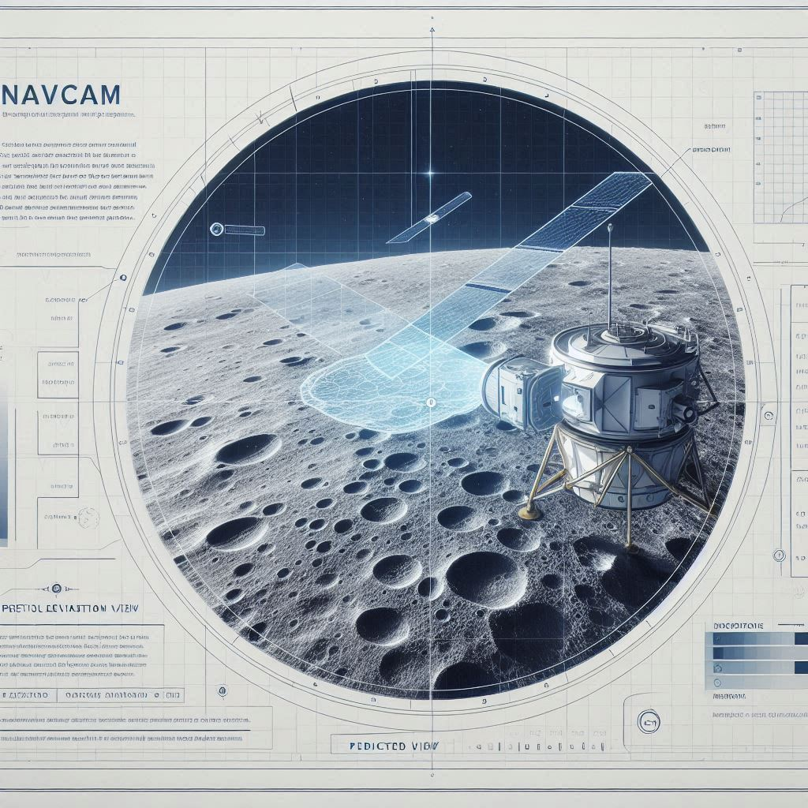

# Using a NavCam for Autonomous Lunar Position Determination: Implementation on Microchip's HPSC Platform


*Image credit: Richard Lourette and DALL-E*

## Author's Note

The motivation for writing this article came from a client request asking how one would perform feature extraction for lunar imagery. Since I have prior experience and insight into this topic, I decided to expand beyond just feature extraction and present the bigger picture, including alternate approaches and a detailed proposal for how a lunar spacecraft could use a navigation camera (NavCam) to determine its position in the lunar frame of reference.

As a spacecraft payload designer with extensive experience in computational systems for space applications, I began thinking about how a lunar spacecraft would solve the critical problem of determining its exact position in lunar orbit. Being partial to Microchip's HPSC radiation-tolerant processing platform, having considered it for previous payload proposals, I decided to explore how this powerful computational resource could enable a truly autonomous navigation solution.

## Executive Summary

As lunar missions expand in complexity, spacecraft must increasingly operate with autonomy. A spacecraft in lunar orbit, equipped with a star tracker, accurate orbital propagation, a high-stability clock, and a navigation camera (NavCam), can use its NavCam imagery to determine its position in the lunar frame of reference without constant ground support.

This white paper outlines a detailed approach for using NavCam imagery combined with known lunar terrain models to estimate orbital position on the Microchip High-Performance Spaceflight Computing (HPSC) platform. It explains the purpose, benefits, and potential drawbacks of this method, proposes an implementation pipeline optimized for HPSC's heterogeneous architecture, and demonstrates why HPSC is the ideal computational platform for this application. References are included so readers can explore technical topics in more depth.

## 1. Background and Motivation

### Why Autonomous Navigation?

- **Limited Earth contact**: During certain orbital phases or deep-space operations, real-time tracking from Earth is unavailable or delayed.
- **Precision requirements**: High-accuracy positioning is critical for lander deployment, instrument pointing, and constellation coordination.
- **Operational resilience**: Reducing reliance on ground stations improves fault tolerance and mission efficiency.

### Subsystems on the Spacecraft

- **Star Tracker**: Provides precise spacecraft attitude (orientation) relative to celestial reference.
- **Orbital Telemetry & Propagator**: Predicts spacecraft state over time based on gravitational models and prior tracking.
- **Stable Clock**: ±10 ms accuracy supports accurate propagation and time-tagging of measurements.
- **NavCam (Navigation Camera)**: Downward-looking imager capturing the lunar surface.

### Why HPSC for Lunar Navigation

The Microchip HPSC processor provides:
- **8-core ARM Cortex-A53 cluster** (1.4 GHz): High-performance computing for complex algorithms
- **Dual-core ARM Cortex-R52**: Real-time, deterministic sensor interfaces
- **Integrated Mali-T760 GPU**: Parallel processing for image operations
- **4GB DDR4 with ECC**: Sufficient memory for DEM storage and processing
- **Radiation tolerance**: Built for the lunar environment with SEU rate < 1e-10 errors/bit/day

## 2. Concept: Terrain-Relative Navigation Using NavCam

The idea is to compare what the camera actually sees to what it should see based on a known digital elevation model (DEM) of the Moon. Any differences translate into position corrections.

### Key Components

- **Lunar DEMs**: High-resolution terrain models from missions like LRO/LOLA provide elevation and albedo data. [NASA LOLA Data](https://lunar.gsfc.nasa.gov/lola.html)
- **Onboard Rendering**: Use current state estimate and Sun angle to render a synthetic view of terrain (ray-traced).
- **Image Registration**: Align the NavCam image with the rendered image using robust techniques (phase correlation, feature matching).

## 3. Technical Approach with HPSC Implementation

### 3.1 Image Capture and Preprocessing

**HPSC Implementation**:
- **R52 Core 0**: Manages NavCam hardware interface via CSI-2, ensures deterministic timing
- **R52 Core 1**: Timestamps images with ±10 ms accuracy, queries star tracker
- **Mali GPU**: Executes preprocessing kernels

NavCam captures an image of the surface. The R52 core triggers the exposure and manages the data transfer via DMA to shared memory. Processing steps:

1. **CLAHE Processing** (GPU kernel, 40ms for 1024×1024):
   - Apply Contrast Limited Adaptive Histogram Equalization to balance brightness
   - [CLAHE explanation](https://en.wikipedia.org/wiki/Adaptive_histogram_equalization#Contrast_Limited_AHE)
   - GPU implementation uses 64 work groups, processing tiles in parallel

2. **Alternative Edge Detection** (GPU kernel, 25ms):
   - Compute Sobel gradient maps to reduce sensitivity to shadows
   - Optimized kernel uses local memory for convolution operations

**Performance on HPSC**: Total preprocessing time < 50ms including memory transfers

### 3.2 Generate Predicted View

**HPSC Implementation**:
- **A53 Cores 0-3**: Parallel ray tracing, each core handles 256×256 tile
- **A53 Core 4**: DEM tile management and caching
- **L2 Cache**: Stores frequently accessed DEM sections

From current position estimate and known Sun vector:
- Perform ray tracing into DEM to create a synthetic image that matches camera intrinsics
- Include reflectance models (Lambertian or Hapke) for realistic shading

**Ray Tracing Algorithm** (distributed across 4 A53 cores):
```
Each A53 core processes image quadrant:
- Load DEM tile into L2 cache (5ms)
- For each pixel, trace ray to surface (150ms)
- Compute illumination using Sun angle (30ms)
- Write to shared frame buffer (5ms)
Total: 190ms with 4-way parallelization
```

This predicted image represents what the camera should see if the position estimate were perfect.

### 3.3 Register Images

**HPSC Implementation**:
- **Mali GPU**: FFT operations and phase correlation
- **A53 Core 5**: Peak detection and sub-pixel refinement
- **A53 Core 6**: Feature extraction and matching (if needed)

Use phase correlation in the frequency domain to find translation between predicted and actual images:
- FFT both images, compute cross-power spectrum, inverse FFT yields shift in pixels
- For large uncertainties, use hierarchical or log-polar methods to also handle rotation/scale
- [Phase Correlation overview](https://en.wikipedia.org/wiki/Phase_correlation)

**GPU Acceleration Details**:
```
Phase Correlation Pipeline (Mali GPU):
- 2D FFT forward (real image): 15ms
- 2D FFT forward (synthetic): 15ms  
- Cross-power spectrum: 5ms
- 2D FFT inverse: 15ms
- Total GPU time: 50ms
```

Alternatively or additionally, extract robust features:
- **ORB** (Oriented FAST and Rotated BRIEF): Efficient, binary descriptors well-suited for embedded systems. [ORB Feature Detector](https://docs.opencv.org/4.x/db/d95/classcv_1_1ORB.html)
- **BRISK** (Binary Robust Invariant Scalable Keypoints): Scale and rotation-invariant, computationally efficient. [BRISK Overview](https://ieeexplore.ieee.org/document/6126544)

**Feature Matching Performance**:
- ORB extraction (A53): 80ms for 500 features
- BRISK extraction (A53): 95ms for 500 features
- Matching with FLANN (A53): 20ms

### 3.4 Convert Image Shift to Ground Offset

**HPSC Implementation**:
- **A53 Core 7**: Coordinate transformations and geometric calculations
- **NEON SIMD**: Accelerates matrix operations

Pixel offsets translate to ground offsets based on altitude and camera intrinsics:

ΔX = (Δu/f) · h,  ΔY = (Δv/f) · h

where f = focal length in pixels, h = altitude.

Transform offset from camera frame to lunar frame using attitude matrix. The A53's NEON SIMD extensions accelerate the 3×3 matrix multiplications required for coordinate transformations.

### 3.5 Fuse with Propagation (EKF)

**HPSC Implementation**:
- **A53 Core 0** (primary): EKF main loop and state propagation
- **A53 Core 1**: Measurement update and covariance computation
- **Double-precision FPU**: Ensures numerical stability

Feed position correction into an Extended Kalman Filter (EKF) alongside orbital dynamics model.
- [Kalman Filter Basics](https://en.wikipedia.org/wiki/Kalman_filter)
- EKF updates the spacecraft state (position and velocity) and uncertainty

**EKF Performance Metrics**:
```
State Propagation (100Hz): 2ms
Measurement Update: 5ms  
Covariance Update: 3ms
Total EKF cycle: 10ms
```

## 4. HPSC Resource Allocation Summary

### Core Assignment Table

| Component | Processing Element | Task | Typical Load |
|-----------|-------------------|------|--------------|
| NavCam Interface | R52 Core 0 | Hardware control, DMA | 10% |
| Timing & Sync | R52 Core 1 | Star tracker, timestamps | 15% |
| Image Preprocessing | Mali GPU | CLAHE, edge detection | 60% |
| Ray Tracing | A53 Cores 0-3 | Synthetic view generation | 80% each |
| DEM Management | A53 Core 4 | Tile loading, caching | 40% |
| Registration | A53 Core 5 + GPU | Phase correlation | 70% |
| Feature Matching | A53 Core 6 | ORB/BRISK (backup) | 50% |
| Navigation Filter | A53 Core 7 | EKF, transformations | 60% |

### Memory Usage

- **DEM Storage**: 500MB (100×100 km at 10m resolution)
- **Image Buffers**: 24MB (3× 1024×1024 double buffers)
- **Working Memory**: 100MB (FFT workspace, feature descriptors)
- **EKF State**: 10MB (state vectors, covariance matrices)
- **Total**: ~650MB (well within 4GB capacity)

### Power Profile

- **Nominal Operations**: 35W (GPU at 50%, 6 A53 cores active)
- **Power Save Mode**: 20W (GPU idle, 2 A53 cores)
- **Peak Processing**: 45W (all cores, GPU at 100%)

## 5. Pros and Cons

### ✅ Benefits

- **Illumination-robust**: By rendering with current Sun angles or using edge-based matching
- **High accuracy**: With high-res DEMs, meter-level positioning is achievable
- **No heavy ground infrastructure**: Independence from Earth-based tracking
- **Reusable**: Same method can support landing, formation flight, or low-orbit operations
- **HPSC advantages**:
  - Real-time performance (2-5 Hz navigation updates)
  - Radiation tolerance for lunar environment
  - Power scaling based on operational needs
  - Heterogeneous architecture matches algorithm requirements

### ⚠️ Drawbacks

- **Compute load**: Real-time rendering and registration require significant processing (addressed by HPSC's GPU and multi-core architecture)
- **Data storage**: Storing DEM tiles and albedo maps needs careful memory management (mitigated by 4GB DDR4 and intelligent caching)
- **DEM accuracy limits**: Position accuracy is bounded by the resolution and accuracy of the terrain model
- **Complex implementation**: Requires careful integration of attitude knowledge, camera calibration, and image processing pipelines

## 6. Recommended Implementation Pipeline

**Complete HPSC Processing Timeline** (400ms total):

1. **Acquire NavCam frame** (R52, 10ms): Hardware trigger and DMA transfer
2. **Preprocess image** (GPU, 50ms): CLAHE or edge detection  
3. **Render synthetic view** (A53 ×4, 190ms): Parallel ray tracing from DEM
4. **Perform registration** (GPU + A53, 50ms): Phase correlation or ORB/BRISK matching
5. **Compute offsets** (A53, 10ms): Pixel to ground transformation
6. **EKF update** (A53, 10ms): Fuse with orbital propagation
7. **Prepare next cycle** (A53, 80ms): Update DEM cache if needed

This achieves 2.5 Hz update rate with margin for additional processing.

## 7. References & Further Reading

- NASA LOLA Data for Lunar DEMs: https://lunar.gsfc.nasa.gov/lola.html
- LROC Imagery Resources: https://lroc.sese.asu.edu/
- Phase Correlation Techniques: https://en.wikipedia.org/wiki/Phase_correlation
- Extended Kalman Filters Overview: https://en.wikipedia.org/wiki/Kalman_filter
- ORB Detector: https://docs.opencv.org/4.x/db/d95/classcv_1_1ORB.html
- BRISK Paper: https://ieeexplore.ieee.org/document/6126544
- HPSC Processor Overview: https://www.microchip.com/en-us/products/fpgas-and-plds/space/high-performance-spaceflight-computing
- ARM Compute Library (Mali optimization): https://developer.arm.com/ip-products/processors/machine-learning/compute-library

## 8. Conclusion

The approach outlined above offers a practical and robust way for a lunar spacecraft to autonomously determine its position in the lunar frame of reference. By leveraging NavCam imagery, high-fidelity lunar terrain models, and well-established image registration techniques like phase correlation or feature-based matching (ORB, BRISK), the spacecraft can achieve high accuracy without reliance on Earth-based navigation aids.

The Microchip HPSC processor proves to be the ideal computational platform for this application. Its heterogeneous architecture allows optimal task distribution: real-time sensor interfaces on the R52 cores, parallel ray tracing across the A53 cluster, and GPU-accelerated image processing on the Mali. The platform's radiation tolerance, ample memory, and power efficiency make it uniquely suited for the challenging lunar environment.

While this method introduces computational and integration challenges, the HPSC's performance headroom and architectural flexibility address these concerns. The benefits in operational autonomy and positioning precision make this a compelling solution for advanced lunar missions.

What began as a client's question about feature extraction from lunar imagery evolved into this comprehensive solution that addresses the fundamental challenge of position determination using the most capable space-rated processor available today.

*Prepared as a technical response to the client's request.*

## About the Author

**Richard W. Lourette** is the founder and principal consultant at **RL Tech Solutions LLC**, where he provides high‑impact engineering leadership to aerospace and embedded systems programs.  

Richard has decades of experience delivering mission‑critical systems for organizations including **Topcon Positioning Systems**, **L3Harris**, and **Panasonic Industrial IoT**. His work spans:
- Advanced spacecraft payload design and integration,
- Embedded C++/Python software architecture for GNSS and navigation,
- AI‑powered test frameworks and systems validation,
- High‑reliability electronics and FPGA‑based payloads aligned with NASA’s Core Flight System (cFS).

Richard’s background includes authoring technical volumes that secured eight‑figure aerospace contracts, leading development teams through the full lifecycle of embedded and payload hardware/software, and contributing to groundbreaking positioning, navigation, and sensing technologies. He holds over **20 U.S. patents** and has been trusted with **DoD Secret** and **SCI** clearances.

If you are seeking an experienced consultant to help architect, implement, or validate **lunar navigation, GNSS systems, embedded avionics, or aerospace payloads**, Richard brings a proven track record and hands‑on expertise to help your mission succeed.

📧 **Contact:** rlourette_at_gmail.com  
🌐 **Location:** Fairport, New York, USA
