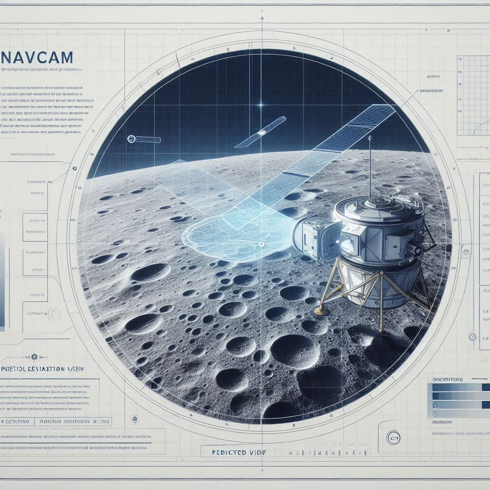
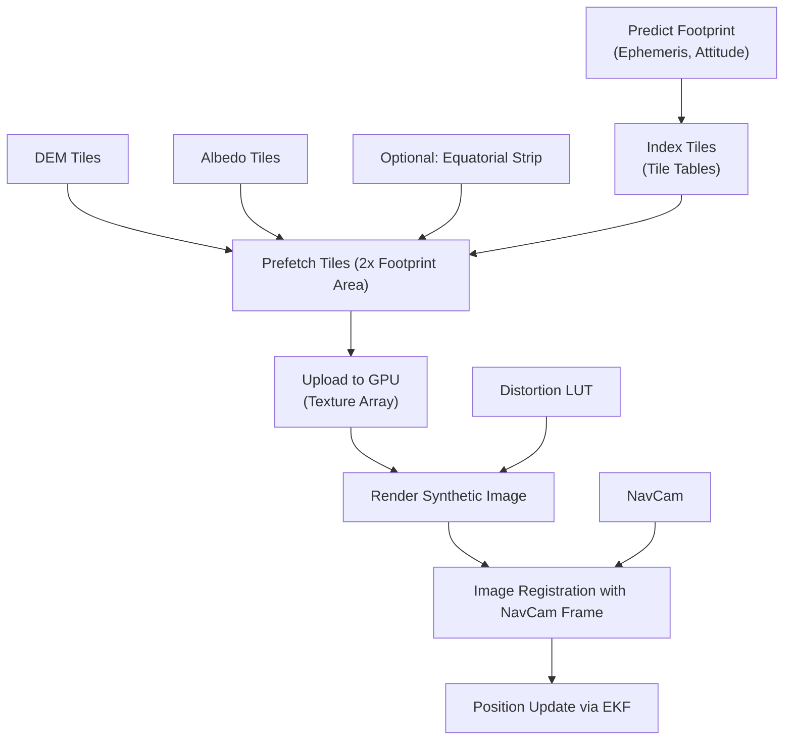

# Using a NavCam for Autonomous Lunar Position Determination

*Image credit: Richard Lourette and DALL-E*

**White Paper**

---

## Author’s Note

The motivation for writing this article came from a client request asking **how one would perform feature extraction for lunar imagery**.  
Since I have prior experience and insight into this topic, I decided to expand beyond just feature extraction and present the **bigger picture**, including alternate approaches and a detailed proposal for how a lunar spacecraft could use a navigation camera (NavCam) to determine its position in the lunar frame of reference.

---

## Executive Summary

As lunar missions expand in complexity, spacecraft must increasingly operate with autonomy. A spacecraft in lunar orbit, equipped with a star tracker, accurate orbital propagation, a high‑stability clock, a laser range finder, and a navigation camera (NavCam), can use its NavCam imagery to determine its position in the lunar frame of reference without constant ground support.

This white paper outlines a detailed approach for using NavCam imagery combined with known lunar terrain models and surface albedo data to estimate orbital position. It explains the purpose, benefits, and potential drawbacks of this method, and proposes an implementation pipeline. References are included so readers can explore technical topics in more depth.

---

## 1. Background and Motivation

### Why Autonomous Navigation?
- **Limited Earth contact:** During certain orbital phases or deep‑space operations, real‑time tracking from Earth is unavailable or delayed.
- **Precision requirements:** High‑accuracy positioning is critical for lander deployment, instrument pointing, and constellation coordination.
- **Operational resilience:** Reducing reliance on ground stations improves fault tolerance and mission efficiency.

### Subsystems on the Spacecraft
- **Star Tracker:** Provides precise spacecraft attitude (orientation) relative to celestial reference.
- **Orbital Telemetry & Propagator:** Predicts spacecraft state over time based on gravitational models and prior tracking.
- **Stable Clock:** ±10 ms accuracy supports accurate propagation and time‑tagging of measurements.
- **Laser Range Finder:** Provides precise slant range to the surface at the time of image capture.
- **NavCam (Navigation Camera):** Downward‑looking imager capturing the lunar surface.
- **Calibrated Camera Model:** Each pixel’s line‑of‑sight vector (including optical distortion) is known relative to the camera boresight, and the camera’s mounting offset and alignment relative to the spacecraft frame are calibrated.

---

## 2. Concept: Terrain‑Relative Navigation Using NavCam

The idea is to compare **what the camera actually sees** to **what it should see** based on a known digital elevation model (DEM) of the Moon. Any differences translate into position corrections.

### Key Components
- **Lunar DEMs:** High‑resolution terrain models from missions like LRO/LOLA provide elevation and albedo data.  
  [NASA LOLA Data](https://lunar.gsfc.nasa.gov/lola.html)
- **Onboard Rendering:** Use current state estimate and Sun angle to render a synthetic view of terrain (ray‑traced).
- **Image Registration:** Align the NavCam image with the rendered image using robust techniques (phase correlation, feature matching).
- **Laser Range Integration:** The known range at the time of capture constrains altitude and reduces ambiguity.
- **Calibrated Camera Model:** Use per‑pixel line‑of‑sight vectors (after distortion compensation) and known mounting offsets to translate image measurements into lunar frame coordinates.

---

## 3. Technical Approach

### 3.1 Image Capture and Preprocessing
- NavCam captures an image of the surface.
- Apply camera model corrections:
  - Compensate for lens distortion so each pixel’s angle relative to boresight is known.
  - Account for the camera’s physical offset and pointing calibration relative to the spacecraft body frame.
- Laser range finder provides the slant range to the surface for the center pixel at capture time.
- Preprocess imagery to normalize illumination:
  - Apply **CLAHE (Contrast Limited Adaptive Histogram Equalization)** to balance brightness.  
    [CLAHE explanation](https://en.wikipedia.org/wiki/Adaptive_histogram_equalization)
  - Alternatively, compute **edge or gradient maps** to reduce sensitivity to shadows.

### 3.2 Generate Predicted View
- From current position estimate, attitude, and known Sun vector:
  - Perform **ray tracing** into DEM to create a synthetic image that matches camera intrinsics and per‑pixel angles.
  - Include reflectance models (Lambertian or Hapke) for realistic shading.
- Use the known laser‑measured range to anchor altitude estimates.

### 3.3 Register Images
- Use **phase correlation** in the frequency domain to find translation between predicted and actual images:
  - FFT both images, compute cross‑power spectrum, inverse FFT → yields shift in pixels.
  - For large uncertainties, use hierarchical or log‑polar methods to also handle rotation/scale.  
    [Phase Correlation overview](https://en.wikipedia.org/wiki/Phase_correlation)

**Alternatively or additionally:**
- Extract robust features from both images and match using descriptors:
  - **ORB (Oriented FAST and Rotated BRIEF):** Efficient, binary descriptors well‑suited for embedded systems.  
    [ORB Feature Detector](https://docs.opencv.org/4.x/db/d95/classcv_1_1ORB.html)
  - **BRISK (Binary Robust Invariant Scalable Keypoints):** Scale‑ and rotation‑invariant, computationally efficient, and illumination‑robust; a strong alternative to SIFT/SURF.  
    [BRISK Overview](https://ieeexplore.ieee.org/document/6126544)

### 3.4 Convert Image Shift to Ground Offset
- Pixel offsets translate to ground offsets using camera geometry and laser range:
\[
\Delta X = (\text{pixel angle vector}) \times \text{measured range}
\]
- Apply per‑pixel angle from the distortion‑corrected camera model.
- Transform from camera frame to spacecraft frame using mounting calibration, then to lunar frame using attitude from star tracker.

### 3.5 Fuse with Propagation (EKF)
- Feed position correction into an **Extended Kalman Filter (EKF)** alongside orbital dynamics model.  
  [Kalman Filter Basics](https://en.wikipedia.org/wiki/Kalman_filter)
- EKF updates the spacecraft state (position and velocity) and uncertainty.

---

## 4. Pros and Cons

### ✅ Benefits
- **Illumination‑robust:** By rendering with current Sun angles or using edge‑based matching.
- **High accuracy:** Laser range data combined with high‑res DEMs allows sub‑meter solutions.
- **No heavy ground infrastructure:** Independence from Earth‑based tracking.
- **Reusable:** Same method can support landing, formation flight, or low‑orbit operations.

### ⚠️ Drawbacks
- **Compute load:** Real‑time rendering and registration require significant onboard processing.
- **Data storage:** Storing DEM tiles and albedo maps needs careful memory management.
- **DEM accuracy limits:** Position accuracy is bounded by the resolution and accuracy of the terrain model.
- **Complex implementation:** Requires careful integration of attitude knowledge, camera calibration, laser data, and image processing pipelines.

---

## 5. Organizing DEM and Albedo Data for Efficient Retrieval

Since this mission profile is focused on **polar operations** with only occasional updates near the equator, the DEM and albedo data can be organized in a way that minimizes storage and maximizes retrieval speed:

- **Region‑focused tiling:** Pre‑tile only the north/south polar caps and an optional narrow equatorial strip.
- **Projection:** Use a **polar stereographic projection** for each pole to reduce distortion and enable uniform tile sizes.
- **Tile indexing:** Precompute tile tables mapping latitude/longitude regions to file offsets.
- **Data separation:** Store DEM and albedo tiles separately but aligned to the same tile grid.
- **GPU‑ready:** Upload tiles into texture arrays; build mipmaps on the GPU for performance (without compromising stored resolution).
- **Retrieval margin:** Always fetch tiles covering ~2× the expected footprint area to handle pointing uncertainty.
- **Caching and prefetch:** Orbit‑based prefetching with LRU caching keeps frequently used tiles ready in RAM.

These steps ensure that when a NavCam capture is about to occur, the correct high‑resolution DEM and albedo data are already staged and ready for the GPU rendering pipeline.

### Data Flow Diagram

Below is a flowchart summarizing the data flow from tile storage to GPU rendering and image registration:

## 6. Recommended Implementation Pipeline

  1. Capture NavCam frame with star‑tracker attitude and laser range measurement.

  1. Apply camera model calibration (per‑pixel angles and boresight offset) and correct for optical distortion.

  1. Preprocess image (edge map or CLAHE) to normalize illumination.

  1. Render synthetic view from DEM and estimated position, integrating calibrated camera geometry, Sun vector, and albedo data.

  1. Perform registration (phase correlation or feature matching with ORB/BRISK) between NavCam image and synthetic view.

  1. Compute pixel offset → ground offset using per‑pixel angle and laser range.

  1. Fuse offset with propagation in EKF to update position.

  1. Repeat at regular intervals or when orbital drift exceeds threshold.

## 7. References & Further Reading

- NASA LOLA Data for Lunar DEMs: [https://lunar.gsfc.nasa.gov/lola.html](https://lunar.gsfc.nasa.gov/lola.html)  
- LROC Imagery Resources: [https://lroc.sese.asu.edu/](https://lroc.sese.asu.edu/)  
- Phase Correlation Techniques: [https://en.wikipedia.org/wiki/Phase_correlation](https://en.wikipedia.org/wiki/Phase_correlation)  
- Extended Kalman Filters Overview: [https://en.wikipedia.org/wiki/Kalman_filter](https://en.wikipedia.org/wiki/Kalman_filter)  
- ORB Detector: [https://docs.opencv.org/4.x/db/d95/classcv_1_1ORB.html](https://docs.opencv.org/4.x/db/d95/classcv_1_1ORB.html)  
- BRISK Paper: [https://ieeexplore.ieee.org/document/6126544](https://ieeexplore.ieee.org/document/6126544)

## 8. Factors Driving Position Determination Accuracy

When using a NavCam and TRN to determine spacecraft position, several interconnected parameters define the achievable accuracy.

### 8.1 Camera Geometry and GSD

\[
\text{GSD} = \frac{\text{Altitude} \times \text{Pixel Size}}{\text{Focal Length}}
\]

Lower altitude, smaller pixels, or longer focal length all improve GSD. With known per‑pixel angles and laser range, each pixel can be projected precisely onto the lunar surface.

**Example:** At 5 km altitude, 5 µm pixels, and 100 mm focal length:
\[
\text{GSD} = 0.25\,\text{m/pixel}
\]

**Position accuracy:** Registration to 0.1–0.3 pixel → 3–8 cm, plus pointing and DEM errors.

---

### 8.2 Boresight and Pointing Knowledge

- Pointing knowledge: **10 arcseconds** (~0.0028°)
- At 5 km altitude: ≈ 0.24 m linear error
- Accurate calibration of camera boresight offset and alignment reduces additional bias.

---

### 8.3 DEM Accuracy

- **LOLA:** 10–30 m resolution, ±1 m vertical accuracy.
- **LROC NAC:** 0.5–2 m resolution, suitable for polar regions.

DEM error directly limits absolute position accuracy.

---

### 8.4 Sensor Size and FOV

\[
\text{FOV} = 2 \times \arctan\!\left(\frac{\text{Sensor Width}/2}{f}\right)
\]

- Wide FOV → more features, coarser resolution
- Narrow FOV → finer resolution, fewer features

---

### 8.5 Example Accuracy Budget at 5 km Altitude

| Source | Typical Value | Contribution |
|--------|---------------|--------------|
| GSD (0.25 m/px × 0.2 px) | – | 0.05 m |
| Attitude knowledge (10 arcsec) | – | 0.24 m |
| DEM horizontal error (LOLA) | – | 1.0 m |
| **Total (RMS)** | – | ~1.0 m dominated by DEM |

With high‑res DEMs, this budget can be driven down to sub‑meter.

---

## About the Author

Richard W. Lourette is the founder and principal consultant at RL Tech Solutions LLC, where he provides high‑impact engineering leadership to aerospace and embedded systems programs.

Richard has decades of experience delivering mission‑critical systems for organizations including Topcon Positioning Systems, L3Harris, and Panasonic Industrial IoT. His work spans:

- Advanced spacecraft payload design and integration,

- Embedded C++/Python software architecture for GNSS and navigation,

- AI‑powered test frameworks and systems validation,

- High‑reliability electronics and FPGA‑based payloads aligned with NASA’s Core Flight System (cFS).

Richard’s background includes authoring technical volumes that secured eight‑figure aerospace contracts, leading development teams through the full lifecycle of embedded and payload hardware/software, and contributing to groundbreaking positioning, navigation, and sensing technologies. He holds 20 U.S. patents and has been trusted with DoD Secret and SCI clearances.

If you are seeking an experienced consultant to help architect, implement, or validate lunar navigation, GNSS systems, embedded avionics, or aerospace payloads, Richard brings a proven track record and hands‑on expertise to help your mission succeed.

📧 Contact: rlourette[at]gmail[dot]com
🌐 Location: Fairport, New York, USA