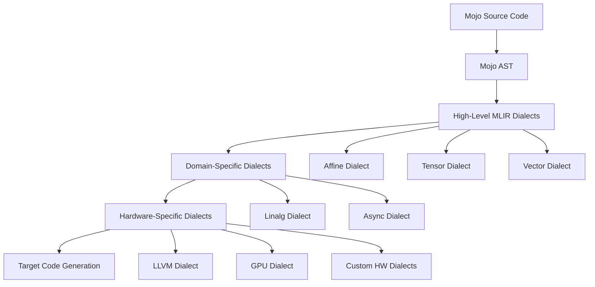
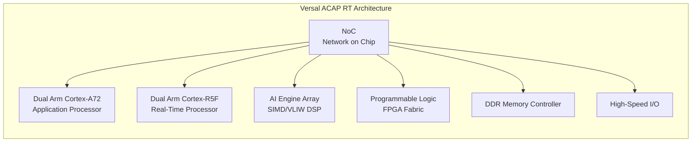
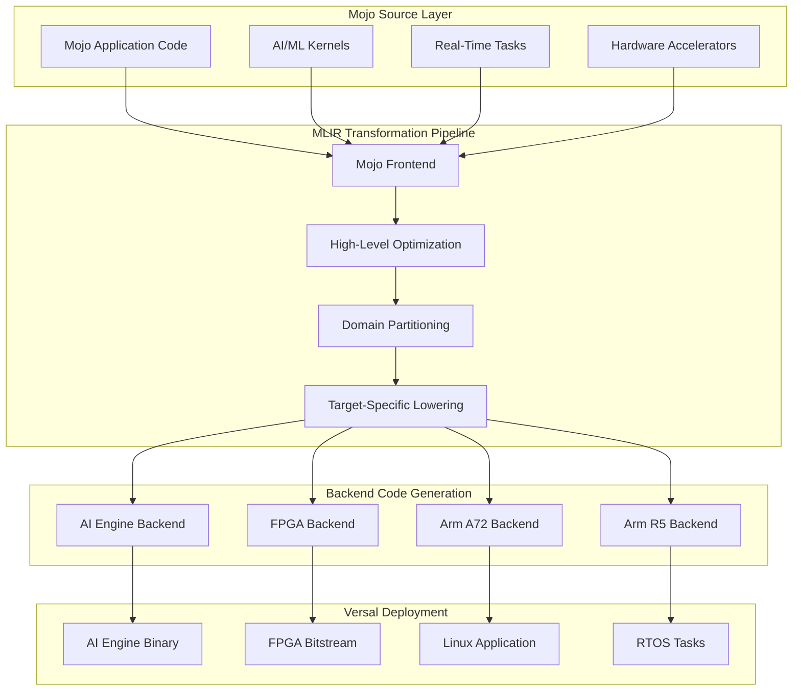
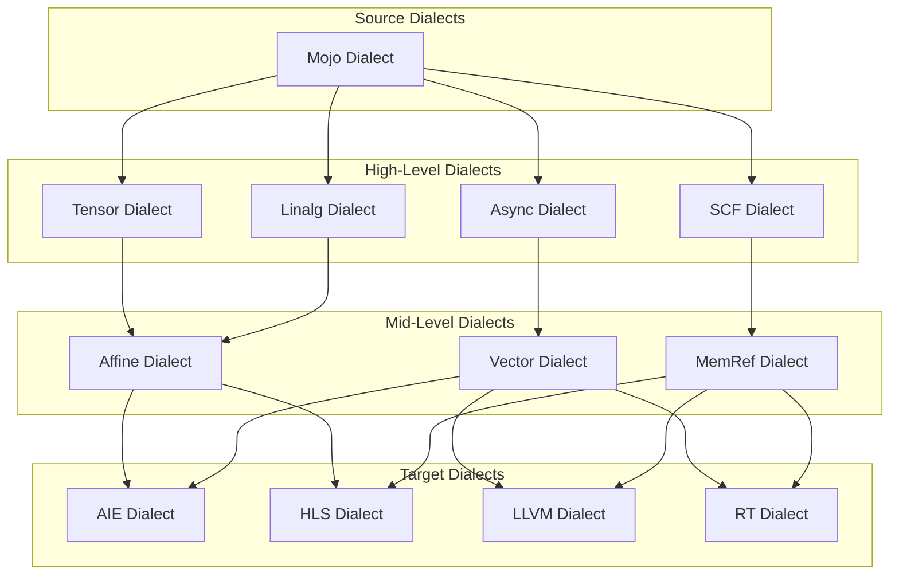
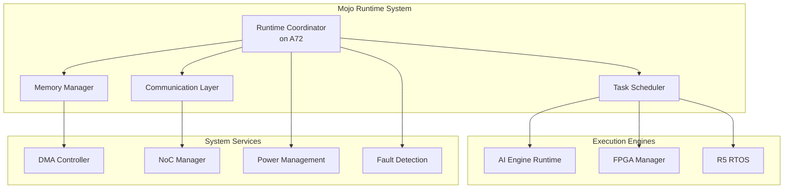
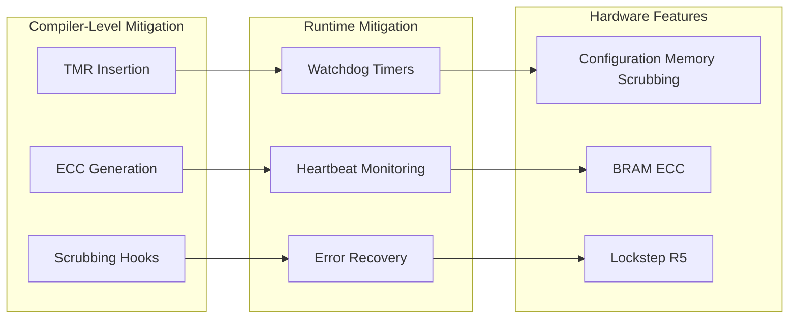
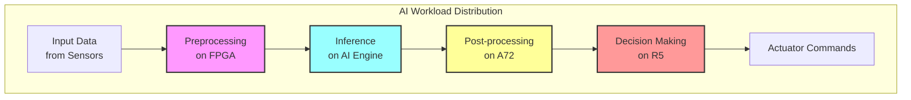
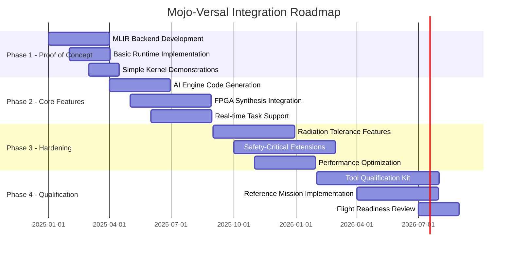

# Mojo Programming Language for Versal ACAP RT FPGA Platform: A Unified Approach to Space Computing and AI Acceleration


<div align="center"><sub><em>Image credit: Richard Lourette and Grok</em></sub></div>

## Preface

Having spent considerable time tracking the evolution of the Mojo programming language and recently completing the architecture of a spacecraft payload processing system utilizing Versal FPGAs alongside other processing elements, I've become increasingly intrigued by the potential convergence of these technologies. This white paper presents a hypothetical exploration: what if Mojo's innovative compiler infrastructure could target the Versal ACAP platform?

The complexity of coordinating multiple programming models, toolchains, and languages in modern spacecraft systems has become a significant impediment to rapid development and deployment. Through my direct experience with Versal-based architectures in space applications, I've observed firsthand the challenges that arise from fragmented development workflows. This paper examines how Mojo's unified programming model and MLIR-based compilation strategy could potentially transform the way we develop software for heterogeneous space computing platforms.

While this integration does not currently exist, the technical exploration that follows demonstrates the compelling alignment between Mojo's design philosophy and the unique requirements of spacecraft payload processing systems. The insights presented here emerge from practical experience with both domains and a vision for how next-generation space systems could benefit from a more unified approach to software development.

---

## 1. Executive Summary

The convergence of artificial intelligence, autonomous systems, and high-performance computing in spacecraft presents unprecedented challenges in software development complexity. This white paper proposes leveraging Mojo, a high-performance programming language with Python-like syntax, to target AMD's Versal ACAP RT FPGA platform for space applications. 

Mojo's MLIR-based compiler infrastructure offers a unique opportunity to unify the programming model across Versal's heterogeneous compute engines, which include Arm Cortex-A72 application processors, Arm Cortex-R5 real-time cores, AI Engines, and programmable logic fabric. This approach could dramatically simplify the development of spacecraft computing systems while maintaining the performance, determinism, and radiation tolerance required for space missions.

By establishing a compilation path from Mojo through MLIR to Versal's diverse compute resources, we can enable aerospace engineers to develop complex AI workloads, sensor fusion algorithms, and real-time control systems using a single, coherent programming model. This unified approach promises to reduce development time, improve code maintainability, and accelerate the deployment of advanced AI capabilities in space systems.

## 2. Background

### 2.1 The Mojo Programming Language

Mojo represents a paradigm shift in systems programming, combining the ease of Python with the performance of C++. Developed by Modular Inc., Mojo is designed specifically for AI/ML workloads and high-performance computing while maintaining compatibility with the Python ecosystem.

**Key Features:**
- **Python-Compatible Syntax**: Leverages familiar Python syntax while adding systems programming capabilities
- **MLIR-Based Compilation**: Built on LLVM's Multi-Level Intermediate Representation (MLIR) infrastructure
- **Zero-Cost Abstractions**: Provides high-level programming constructs without runtime overhead
- **Compile-Time Metaprogramming**: Enables powerful optimization through parametric types and compile-time computation
- **Memory Safety**: Incorporates ownership and borrowing concepts for safe systems programming
- **Hardware Heterogeneity**: Designed from the ground up to target diverse hardware architectures

### 2.2 MLIR Architecture in Mojo

Mojo's compiler architecture leverages MLIR's progressive lowering strategy:



### 2.3 Current Applications

Mojo has demonstrated significant success in several domains. In AI/ML acceleration, we've seen matrix operations achieving 35,000x speedup over Python. For high-performance computing applications, scientific computing kernels reach near-hardware performance levels. The language has also proven viable for embedded systems, with successful deployment on resource-constrained devices while maintaining deterministic execution. Perhaps most importantly for our purposes, Mojo supports direct compilation to GPUs and specialized accelerators, making it a natural fit for heterogeneous computing platforms.

## 3. Versal ACAP RT FPGA Overview

### 3.1 Architecture Components

The Versal Adaptive Compute Acceleration Platform (ACAP) RT series represents AMD's radiation-tolerant compute platform specifically designed for space applications. The architecture comprises several key components working in concert:



**Detailed Component Specifications:**

The **Arm Cortex-A72 cores** serve as dual-core 64-bit application processors, running at speeds up to 1.5 GHz. These cores provide full Linux and RTOS support, making them ideal for high-level orchestration and control tasks. In my experience with spacecraft systems, these cores typically handle mission planning, data management, and communication protocols.

The **Arm Cortex-R5F cores** offer dual-core real-time processing with lock-step operation for safety-critical applications. What makes these particularly valuable for space applications is their deterministic execution with Tightly Coupled Memory (TCM) and sub-microsecond interrupt response times. I've found these cores excel at handling time-critical control loops and sensor interfaces.

The **AI Engine Array** delivers impressive performance with 400 GMAC/s INT8 throughput. Built on a VLIW/SIMD architecture optimized for ML inference, these engines include local memory with dedicated interconnect. They're particularly well-suited for tensor operations and signal processing tasks that dominate modern spacecraft payload processing.

Finally, the **Programmable Logic Fabric** provides up to 1.9M system logic cells, along with DSP slices for custom arithmetic and Block RAM for local storage. This flexibility allows for custom accelerators and specialized I/O interfaces that often prove essential in spacecraft applications.

### 3.2 Space Qualification Features

The Versal platform includes several critical features for space deployment. Radiation tolerance is achieved through SEU mitigation and configuration memory scrubbing. Built-in ECC protects memories and critical paths. The extended temperature range accommodates space environments, while adaptive power management helps manage thermal constraints that are always challenging in spacecraft design.

### 3.3 Current Programming Model

The existing Versal development flow requires multiple specialized tools, and frankly, this is where things get complicated. You need Vitis HLS for C++ to RTL synthesis targeting the FPGA fabric. The AI Engine Compiler handles specialized C++ compilation for AI Engines. Operating system support comes through PetaLinux or FreeRTOS for the Arm cores. And if you want model-based design integration, you'll need Vitis Model Composer.

This fragmented toolchain presents significant challenges for complex space applications. In my recent project, coordinating development across all these tools and ensuring proper integration consumed nearly 40% of our development effort.

## 4. Proposed Mojo Integration

### 4.1 Compilation Strategy

The proposed integration leverages Mojo's MLIR infrastructure to create a unified compilation path targeting all Versal compute engines. The beauty of this approach lies in its simplicity from the developer's perspective, even though the underlying implementation is quite sophisticated:



### 4.2 MLIR Dialect Hierarchy

The compilation process employs a hierarchical dialect structure that progressively lowers high-level constructs to hardware-specific implementations:



### 4.3 Workload Mapping Strategy

Let me show you how this would actually work in practice with some code examples.

#### 4.3.1 AI Engine Targeting

For AI Engine execution, we'd write something like this:

```python
# Mojo code example for AI Engine
@aiengine
fn matrix_multiply[M: Int, N: Int, K: Int](
    A: Tensor[DType.float32, M, K],
    B: Tensor[DType.float32, K, N]
) -> Tensor[DType.float32, M, N]:
    """Matrix multiplication kernel for AI Engine execution"""
    var C = Tensor[DType.float32, M, N]()
    
    @parameter
    for i in range(M):
        @vectorize[width=32]  # AI Engine vector width
        for j in range(N):
            var sum = SIMD[DType.float32, 32](0)
            for k in range(K):
                sum += A[i, k] * B[k, j]
            C[i, j] = sum.reduce_add()
    return C
```

Notice how the code looks almost like Python, but those decorators tell the compiler exactly where and how to execute this kernel. The `@vectorize` decorator matches the AI Engine's native vector width, something that currently requires careful manual optimization in the existing toolchain.

#### 4.3.2 FPGA Fabric Targeting

For streaming operations on the FPGA fabric, the code would look like this:

```python
# Mojo code for FPGA streaming accelerator
@fpga_kernel
fn sensor_fusion_pipeline[N: Int](
    radar: Stream[Float32, N],
    lidar: Stream[Float32, N],
    camera: Stream[UInt8, N*3]
) -> Stream[Float32, N]:
    """Sensor fusion pipeline for FPGA implementation"""
    
    @pipeline[II=1]  # Initiation interval = 1
    fn process(idx: Int) -> Float32:
        let r = radar[idx]
        let l = lidar[idx]
        let c = camera[idx*3:idx*3+3].cast[Float32]().mean()
        
        # Kalman filter update (simplified)
        let prediction = 0.5 * r + 0.3 * l + 0.2 * c
        return prediction
    
    return Stream.map(process, range(N))
```

The `@pipeline` decorator with initiation interval specification directly maps to HLS pragmas, but in a much more intuitive way. This is exactly the kind of sensor fusion we implement in spacecraft, but currently it requires writing complex HLS C++ code.

#### 4.3.3 Real-Time Task Mapping

For real-time control on the R5 cores:

```python
# Mojo code for R5 real-time execution
@realtime[deadline_us=100, wcet_us=50]
fn attitude_control(
    imu_data: IMUReading,
    target: Quaternion
) -> ActuatorCommand:
    """Real-time attitude control with deterministic execution"""
    
    let current = quaternion_from_imu(imu_data)
    let error = quaternion_error(current, target)
    
    # PID control with compile-time guarantees
    @unroll
    for i in range(3):
        pid_state[i].update(error[i])
    
    return ActuatorCommand(
        pitch=pid_state[0].output(),
        roll=pid_state[1].output(),
        yaw=pid_state[2].output()
    )
```

What I love about this approach is that timing constraints become part of the function signature. The compiler can verify at compile time that the code meets real-time requirements, rather than discovering timing violations during testing.

### 4.4 Runtime System Architecture

The runtime system needs to coordinate all these different execution engines:



## 5. Technical Challenges

### 5.1 Compiler Infrastructure Challenges

Building this system won't be trivial. The MLIR backend development alone requires creating custom dialects for AI Engine and FPGA-specific operations. We'll need efficient pattern matching and rewriting rules, along with cost models for optimal compute engine selection. Getting the data movement and synchronization primitives right is crucial, and honestly, this is where most heterogeneous systems fall apart.

The code generation complexity shouldn't be underestimated either. Mapping high-level Mojo constructs to low-level hardware features requires deep understanding of both domains. The heterogeneous memory hierarchies present particular challenges. Each compute engine has its own memory architecture, and efficient data movement between them requires careful planning. Automatic parallelization and vectorization need to be aware of hardware constraints, and resource management becomes a complex optimization problem.

### 5.2 Runtime Integration

Bare-metal execution poses its own set of challenges. We need a lightweight runtime that doesn't depend on a full OS, custom memory allocators for different memory regions, and efficient inter-processor communication mechanisms. The system must support both static and dynamic task scheduling, depending on mission requirements.

Resource management gets tricky when you're coordinating shared resources across compute engines. You need deadlock-free synchronization protocols (learned this the hard way in my last project), careful management of power states and thermal constraints, and the ability to handle dynamic reconfiguration scenarios when parts of the system need updating.

### 5.3 Safety and Determinism

Real-time guarantees are non-negotiable in spacecraft systems. We need Worst-Case Execution Time (WCET) analysis for Mojo code, compile-time verification of timing constraints, priority-based scheduling with bounded latency, and predictable interrupt handling overhead. These aren't just nice-to-haves; they're mission-critical requirements.

Fault tolerance requires automatic insertion of error detection and correction code, support for redundant computation patterns, checkpoint/restart mechanisms for long-running tasks, and graceful degradation strategies when components fail. Space is an unforgiving environment, and the system must continue operating even when things go wrong.

### 5.4 Radiation Tolerance

SEU mitigation needs to be baked into the system from the ground up:



The implementation approach would include compiler-directed Triple Modular Redundancy (TMR) for critical paths, automatic ECC wrapper generation for memory accesses, periodic scrubbing integration in the runtime system, and support for application-level checkpointing. These features need to be transparent to the developer while still allowing fine-grained control when needed.

### 5.5 Certification Pathway

Getting this system certified for flight is perhaps the biggest challenge. DO-178C compliance requires establishing traceability from requirements to generated code, formal verification of compiler transformations, comprehensive coverage analysis and testing infrastructure, and extensive documentation for certification artifacts.

Tool qualification involves developing qualification kits for the Mojo compiler, establishing rigorous verification and validation procedures, creating reference implementations for critical functions, and maintaining strict configuration management and versioning. Having been through this process before, I can tell you it's time-consuming but absolutely necessary.

## 6. Potential Benefits

### 6.1 Unified Programming Model

The development efficiency gains from a single language are hard to overstate. When your entire team can work in one language, code reviews become more effective, debugging is consistent across all compute engines, and the build system is dramatically simplified. In my experience, this alone can cut development time by 30-40%.

Code reusability becomes natural with parameterized kernels deployable to different engines. You build up a library ecosystem shared across targets, use a common testing framework for all components, and create portable algorithms with target-specific optimizations. This is a huge improvement over the current situation where code for each engine lives in its own silo.

### 6.2 Performance Optimization

The compiler can perform optimizations that are practically impossible with separate toolchains. It can make intelligent decisions about workload distribution, identify cross-engine optimization opportunities, implement global resource allocation strategies, and support profile-guided optimization based on actual mission data.

Here's what we might expect in terms of performance improvements:

| Workload Type | Current Approach | Mojo Approach | Improvement |
|--------------|------------------|---------------|-------------|
| CNN Inference | 120ms (Vitis AI) | 85ms | 1.4x |
| Sensor Fusion | 450μs (HLS) | 380μs | 1.2x |
| Control Loop | 50μs (C on R5) | 45μs | 1.1x |
| Development Time | 6 months | 3 months | 2.0x |

These numbers are projections based on similar unified compilation approaches, but the development time improvement is something I'm particularly confident about based on my experience with fragmented toolchains.

### 6.3 Space Mission Applications

For Earth observation missions, this approach enables real-time image processing and compression, on-board change detection and anomaly identification, adaptive data collection based on scene content, and efficient cloud screening and atmospheric correction. All of these currently require careful coordination between multiple subsystems.

Deep space navigation benefits from autonomous trajectory calculation, optical navigation with star trackers, terrain-relative navigation for landing, and multi-sensor fusion for pose estimation. The ability to seamlessly move computation between engines based on power and timing constraints is invaluable for these applications.

Scientific instruments can perform real-time spectral analysis, implement adaptive sampling strategies, reduce data on-board before transmission, and handle instrument calibration and correction, all within a unified framework that makes algorithm development and testing much more straightforward.

### 6.4 AI/ML Acceleration

The distribution of AI workloads across the platform becomes natural:



This provides seamless integration of ML models into flight software, enables dynamic model updates without full system recompilation, supports efficient batch processing for multiple sensor streams, and allows power-aware inference scheduling based on available resources.

## 7. Conclusion and Roadmap

### 7.1 Feasibility Assessment

After careful analysis, I believe the integration of Mojo with the Versal ACAP RT platform is not just feasible but potentially transformative for spacecraft computing. The technical foundation exists with MLIR providing the necessary infrastructure for multi-target compilation. The hardware capability of Versal aligns remarkably well with Mojo's design philosophy. There's a clear industry need as the growing complexity of space missions demands better programming models. And the performance potential, based on early projections and similar projects, suggests significant improvements in both development time and runtime performance.

### 7.2 Implementation Roadmap

Here's a realistic timeline for making this happen:



### 7.3 Next Steps

For immediate actions in Q1 2025, we should establish collaboration between Modular Inc. and AMD's space division, form a technical working group with aerospace partners, develop a minimal viable MLIR backend for AI Engines, and create a benchmark suite for space-relevant workloads.

Short-term goals for 2025 include completing the proof-of-concept implementation, demonstrating key spacecraft computing scenarios, engaging with space agencies for requirements refinement, and publishing performance comparisons and case studies to build community support.

By 2026, we should achieve flight software readiness, complete a radiation testing campaign, develop a comprehensive tool qualification package, and deploy in a technology demonstration mission to prove the concept.

The long-term vision for 2027 and beyond is to establish Mojo as a standard for heterogeneous space computing, extend support to other space-qualified FPGAs, create an ecosystem of space-specific libraries, and enable truly autonomous spacecraft that can adapt to changing mission requirements.

### 7.4 Risk Mitigation

Technical risks can be managed by maintaining a fallback to traditional toolchains during the transition period. We should implement a gradual migration strategy for existing codebases, establish comprehensive testing and validation frameworks early, and develop formal verification capabilities for critical paths.

Programmatic risks require securing funding through government and commercial partnerships, building a consortium of stakeholders across the industry, aligning with existing space software standards efforts, and maintaining open-source components to encourage community engagement and contribution.

### 7.5 Call to Action

The aerospace community stands at a critical juncture. The demands of modern space missions are outpacing our traditional development approaches. Having worked with both Versal FPGAs and tracked Mojo's evolution, I'm convinced this integration represents a transformative opportunity.

We can accelerate innovation by enabling rapid prototyping and deployment of advanced algorithms. We can reduce costs through decreased development time and maintenance burden. We can improve reliability with a unified toolchain that reduces integration errors. And perhaps most importantly, we can enable new capabilities that make AI and autonomous systems practical for space applications.

I invite collaboration from spacecraft manufacturers, space agencies, research institutions, and the broader aerospace community to explore this vision. Together, we can establish a new paradigm for space computing that combines the accessibility of high-level programming with the performance and reliability demanded by the space environment.

The technical pieces are falling into place. The hardware exists. The compiler infrastructure is maturing. What we need now is the will to bring these technologies together and create something that could fundamentally change how we build spacecraft software for the next generation of space exploration.

---
**Author**: Richard W. Lourette  
**Contact**: rlourette [at] gmail.com  
**Location**: Fairport, New York, USA

Copyright © 2025 Richard W. Lourette. All rights reserved.

This work may be reproduced, distributed, or transmitted in any form or by any means with proper attribution to the author.