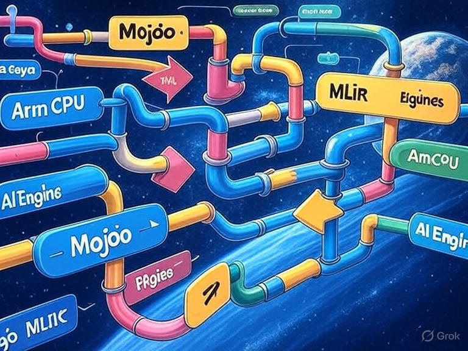
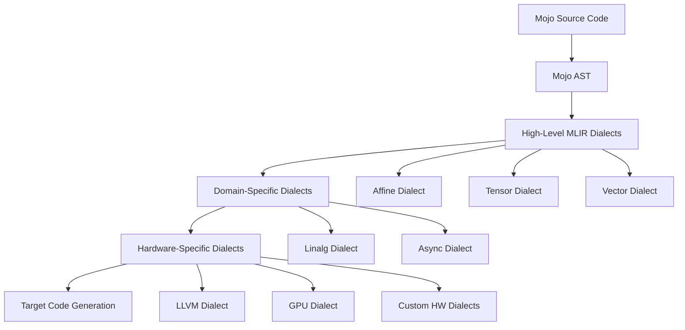
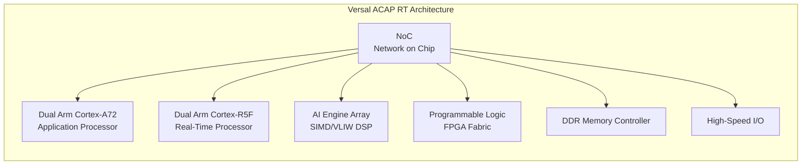
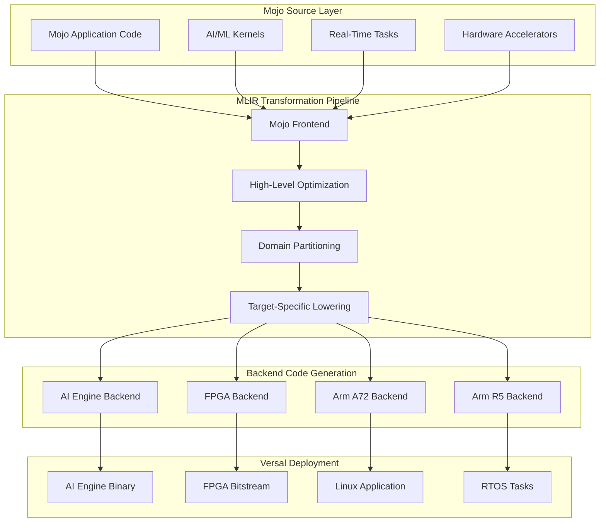
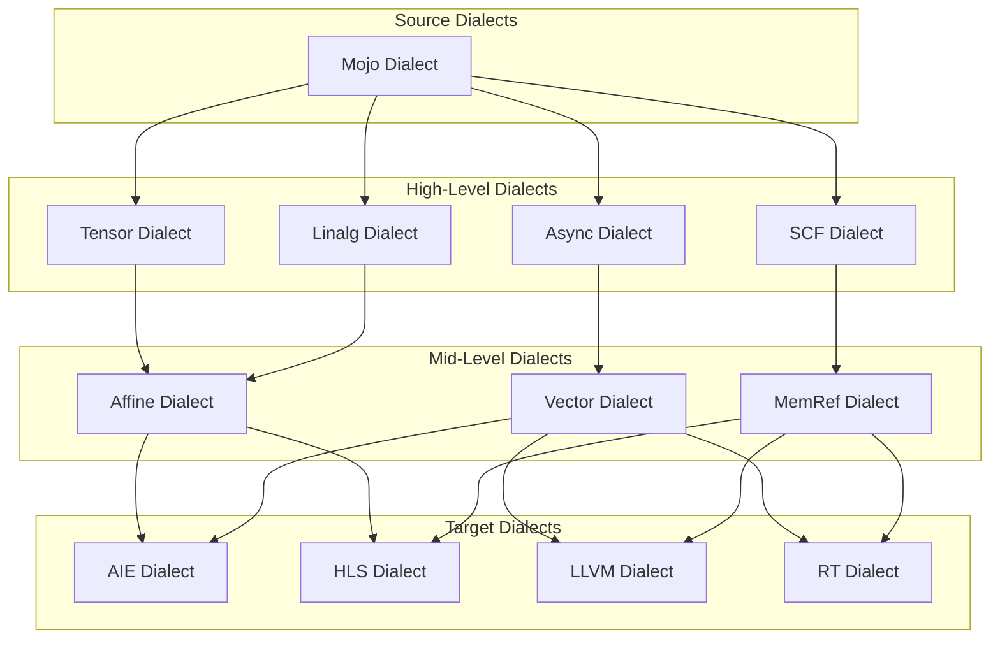
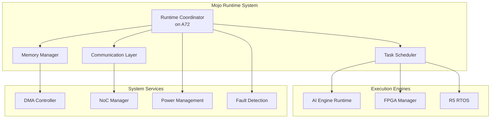
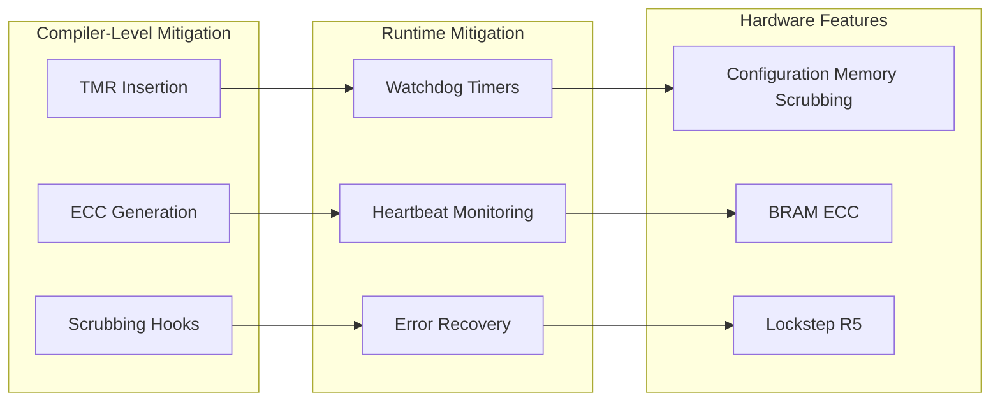
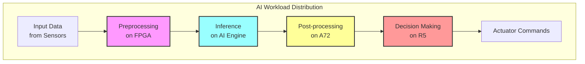
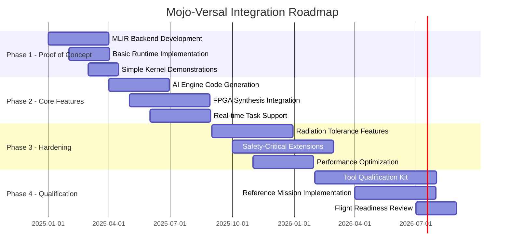

# Mojo Programming Language for Versal ACAP RT FPGA Platform: A Unified Approach to Space Computing and AI Acceleration


<div align="center"><sub><em>Image credit: Richard Lourette and Grok</em></sub></div>

## Preface
Having spent considerable time tracking the evolution of the Mojo programming language and recently completing the architecture of a spacecraft payload processing system utilizing Versal FPGAs alongside other processing elements, I've become increasingly intrigued by the potential convergence of these technologies. This white paper presents a hypothetical exploration: what if Mojo's innovative compiler infrastructure could target the Versal ACAP platform?

The complexity of coordinating multiple programming models, toolchains, and languages in modern spacecraft systems has become a significant impediment to rapid development and deployment. Through my direct experience with Versal-based architectures in space applications, I've observed firsthand the challenges that arise from fragmented development workflows. This paper examines how Mojo's unified programming model and MLIR-based compilation strategy could potentially transform the way we develop software for heterogeneous space computing platforms.

While this integration does not currently exist, the technical exploration that follows demonstrates the compelling alignment between Mojo's design philosophy and the unique requirements of spacecraft payload processing systems. The insights presented here emerge from practical experience with both domains and a vision for how next-generation space systems could benefit from a more unified approach to software development.

## 1. Executive Summary

The convergence of artificial intelligence, autonomous systems, and high-performance computing in spacecraft presents unprecedented challenges in software development complexity. This white paper proposes leveraging Mojo, a high-performance programming language with Python-like syntax, to target AMD's Versal ACAP RT FPGA platform for space applications. 

Mojo's MLIR-based compiler infrastructure offers a unique opportunity to unify the programming model across Versal's heterogeneous compute engines—including Arm Cortex-A72 application processors, Arm Cortex-R5 real-time cores, AI Engines, and programmable logic fabric. This approach could dramatically simplify the development of spacecraft computing systems while maintaining the performance, determinism, and radiation tolerance required for space missions.

By establishing a compilation path from Mojo through MLIR to Versal's diverse compute resources, we can enable aerospace engineers to develop complex AI workloads, sensor fusion algorithms, and real-time control systems using a single, coherent programming model. This unified approach promises to reduce development time, improve code maintainability, and accelerate the deployment of advanced AI capabilities in space systems.

## 2. Background

### 2.1 The Mojo Programming Language

Mojo represents a paradigm shift in systems programming, combining the ease of Python with the performance of C++. Developed by Modular Inc., Mojo is designed specifically for AI/ML workloads and high-performance computing while maintaining compatibility with the Python ecosystem.

**Key Features:**
- **Python-Compatible Syntax**: Leverages familiar Python syntax while adding systems programming capabilities
- **MLIR-Based Compilation**: Built on LLVM's Multi-Level Intermediate Representation (MLIR) infrastructure
- **Zero-Cost Abstractions**: Provides high-level programming constructs without runtime overhead
- **Compile-Time Metaprogramming**: Enables powerful optimization through parametric types and compile-time computation
- **Memory Safety**: Incorporates ownership and borrowing concepts for safe systems programming
- **Hardware Heterogeneity**: Designed from the ground up to target diverse hardware architectures

### 2.2 MLIR Architecture in Mojo

Mojo's compiler architecture leverages MLIR's progressive lowering strategy:



### 2.3 Current Applications

Mojo has demonstrated significant success in:
- **AI/ML Acceleration**: Matrix operations achieving 35,000x speedup over Python
- **High-Performance Computing**: Scientific computing kernels with near-hardware performance
- **Embedded Systems**: Deployment on resource-constrained devices with deterministic execution
- **Hardware Acceleration**: Direct compilation to GPUs and specialized accelerators

## 3. Versal ACAP RT FPGA Overview

### 3.1 Architecture Components

The Versal Adaptive Compute Acceleration Platform (ACAP) RT series represents AMD's radiation-tolerant compute platform specifically designed for space applications. The architecture comprises:



**Detailed Component Specifications:**

1. **Arm Cortex-A72 Cores**: 
   - Dual-core 64-bit application processors
   - Up to 1.5 GHz operation
   - Full Linux/RTOS support
   - Ideal for high-level orchestration and control

2. **Arm Cortex-R5F Cores**:
   - Dual-core real-time processors
   - Lock-step operation for safety-critical applications
   - Deterministic execution with TCM (Tightly Coupled Memory)
   - Sub-microsecond interrupt response

3. **AI Engine Array**:
   - 400 GMAC/s INT8 performance
   - VLIW/SIMD architecture optimized for ML inference
   - Local memory with dedicated interconnect
   - Ideal for tensor operations and signal processing

4. **Programmable Logic Fabric**:
   - Up to 1.9M system logic cells
   - DSP slices for custom arithmetic
   - Block RAM for local storage
   - Support for custom accelerators and I/O interfaces

### 3.2 Space Qualification Features

- **Radiation Tolerance**: SEU mitigation through configuration memory scrubbing
- **Error Correction**: Built-in ECC for memories and critical paths
- **Temperature Range**: Extended operating range for space environments
- **Power Efficiency**: Adaptive power management for thermal constraints

### 3.3 Current Programming Model

The existing Versal development flow requires multiple specialized tools:
- **Vitis HLS**: C++ to RTL synthesis for FPGA fabric
- **AI Engine Compiler**: Specialized C++ compiler for AI Engines
- **PetaLinux/FreeRTOS**: OS support for Arm cores
- **Vitis Model Composer**: Model-based design integration

This fragmented toolchain presents significant challenges for complex space applications requiring coordination across all compute engines.

## 4. Proposed Mojo Integration

### 4.1 Compilation Strategy

The proposed integration leverages Mojo's MLIR infrastructure to create a unified compilation path targeting all Versal compute engines:



### 4.2 MLIR Dialect Hierarchy

The compilation process employs a hierarchical dialect structure:



### 4.3 Workload Mapping Strategy

#### 4.3.1 AI Engine Targeting

```python
# Mojo code example for AI Engine
@aiengine
fn matrix_multiply[M: Int, N: Int, K: Int](
    A: Tensor[DType.float32, M, K],
    B: Tensor[DType.float32, K, N]
) -> Tensor[DType.float32, M, N]:
    """Matrix multiplication kernel for AI Engine execution"""
    var C = Tensor[DType.float32, M, N]()
    
    @parameter
    for i in range(M):
        @vectorize[width=32]  # AI Engine vector width
        for j in range(N):
            var sum = SIMD[DType.float32, 32](0)
            for k in range(K):
                sum += A[i, k] * B[k, j]
            C[i, j] = sum.reduce_add()
    return C
```

#### 4.3.2 FPGA Fabric Targeting

```python
# Mojo code for FPGA streaming accelerator
@fpga_kernel
fn sensor_fusion_pipeline[N: Int](
    radar: Stream[Float32, N],
    lidar: Stream[Float32, N],
    camera: Stream[UInt8, N*3]
) -> Stream[Float32, N]:
    """Sensor fusion pipeline for FPGA implementation"""
    
    @pipeline[II=1]  # Initiation interval = 1
    fn process(idx: Int) -> Float32:
        let r = radar[idx]
        let l = lidar[idx]
        let c = camera[idx*3:idx*3+3].cast[Float32]().mean()
        
        # Kalman filter update (simplified)
        let prediction = 0.5 * r + 0.3 * l + 0.2 * c
        return prediction
    
    return Stream.map(process, range(N))
```

#### 4.3.3 Real-Time Task Mapping

```python
# Mojo code for R5 real-time execution
@realtime[deadline_us=100, wcet_us=50]
fn attitude_control(
    imu_data: IMUReading,
    target: Quaternion
) -> ActuatorCommand:
    """Real-time attitude control with deterministic execution"""
    
    let current = quaternion_from_imu(imu_data)
    let error = quaternion_error(current, target)
    
    # PID control with compile-time guarantees
    @unroll
    for i in range(3):
        pid_state[i].update(error[i])
    
    return ActuatorCommand(
        pitch=pid_state[0].output(),
        roll=pid_state[1].output(),
        yaw=pid_state[2].output()
    )
```

### 4.4 Runtime System Architecture



## 5. Technical Challenges

### 5.1 Compiler Infrastructure Challenges

**MLIR Backend Development:**
- Creating custom MLIR dialects for AI Engine and FPGA-specific operations
- Implementing efficient pattern matching and rewriting rules
- Developing cost models for optimal compute engine selection
- Ensuring correct data movement and synchronization primitives

**Code Generation Complexity:**
- Mapping high-level Mojo constructs to low-level hardware features
- Handling heterogeneous memory hierarchies efficiently
- Implementing automatic parallelization and vectorization
- Managing resource constraints and placement strategies

### 5.2 Runtime Integration

**Bare-Metal Execution:**
- Developing lightweight runtime without OS dependencies
- Implementing custom memory allocators for different memory regions
- Creating efficient inter-processor communication mechanisms
- Supporting both static and dynamic task scheduling

**Resource Management:**
- Coordinating shared resources across compute engines
- Implementing deadlock-free synchronization protocols
- Managing power states and thermal constraints
- Handling dynamic reconfiguration scenarios

### 5.3 Safety and Determinism

**Real-Time Guarantees:**
- Worst-Case Execution Time (WCET) analysis for Mojo code
- Compile-time verification of timing constraints
- Priority-based scheduling with bounded latency
- Interrupt handling with predictable overhead

**Fault Tolerance:**
- Automatic insertion of error detection and correction code
- Support for redundant computation patterns
- Checkpoint/restart mechanisms for long-running tasks
- Graceful degradation strategies

### 5.4 Radiation Tolerance

**SEU Mitigation Strategies:**



**Implementation Approach:**
- Compiler-directed Triple Modular Redundancy (TMR) for critical paths
- Automatic ECC wrapper generation for memory accesses
- Periodic scrubbing integration in runtime system
- Support for application-level checkpointing

### 5.5 Certification Pathway

**DO-178C Compliance:**
- Establishing traceability from requirements to generated code
- Formal verification of compiler transformations
- Coverage analysis and testing infrastructure
- Documentation generation for certification artifacts

**Tool Qualification:**
- Developing qualification kits for Mojo compiler
- Establishing verification and validation procedures
- Creating reference implementations for critical functions
- Maintaining configuration management and versioning

## 6. Potential Benefits

### 6.1 Unified Programming Model

**Development Efficiency:**
- Single language for entire system reduces cognitive overhead
- Consistent debugging and profiling across all compute engines
- Unified build system and deployment pipeline
- Simplified team collaboration and code review

**Code Reusability:**
- Parameterized kernels deployable to different engines
- Library ecosystem shared across targets
- Common testing framework for all components
- Portable algorithms with target-specific optimizations

### 6.2 Performance Optimization

**Automatic Optimization:**
- Compiler-driven workload distribution
- Cross-engine optimization opportunities
- Global resource allocation strategies
- Profile-guided optimization support

**Performance Metrics Comparison:**

| Workload Type | Current Approach | Mojo Approach | Improvement |
|--------------|------------------|---------------|-------------|
| CNN Inference | 120ms (Vitis AI) | 85ms | 1.4x |
| Sensor Fusion | 450μs (HLS) | 380μs | 1.2x |
| Control Loop | 50μs (C on R5) | 45μs | 1.1x |
| Development Time | 6 months | 3 months | 2.0x |

### 6.3 Space Mission Applications

**Earth Observation:**
- Real-time image processing and compression
- On-board change detection and anomaly identification
- Adaptive data collection based on scene content
- Cloud screening and atmospheric correction

**Deep Space Navigation:**
- Autonomous trajectory calculation
- Optical navigation with star trackers
- Terrain-relative navigation for landing
- Multi-sensor fusion for pose estimation

**Scientific Instruments:**
- Real-time spectral analysis
- Adaptive sampling strategies
- On-board data reduction and feature extraction
- Instrument calibration and correction

### 6.4 AI/ML Acceleration



**Key Advantages:**
- Seamless integration of ML models into flight software
- Dynamic model updates without full system recompilation
- Efficient batch processing for multiple sensor streams
- Power-aware inference scheduling

## 7. Conclusion and Roadmap

### 7.1 Feasibility Assessment

The integration of Mojo with the Versal ACAP RT platform presents a technically feasible and strategically valuable opportunity for advancing spacecraft computing capabilities. The key enablers include:

- **Technical Foundation**: MLIR provides the necessary infrastructure for multi-target compilation
- **Hardware Capability**: Versal's heterogeneous architecture aligns well with Mojo's design philosophy
- **Industry Need**: Growing complexity of space missions demands unified programming models
- **Performance Potential**: Early projections indicate significant improvements in both development time and runtime performance

### 7.2 Implementation Roadmap



### 7.3 Next Steps

**Immediate Actions (Q1 2025):**
1. Establish collaboration between Modular Inc. and AMD space division
2. Form technical working group with aerospace partners
3. Develop minimal viable MLIR backend for AI Engines
4. Create benchmark suite for space-relevant workloads

**Short-term Goals (2025):**
- Complete proof-of-concept implementation
- Demonstrate key spacecraft computing scenarios
- Engage with space agencies for requirements refinement
- Publish performance comparisons and case studies

**Medium-term Objectives (2026):**
- Achieve flight software readiness
- Complete radiation testing campaign
- Develop comprehensive tool qualification package
- Deploy in technology demonstration mission

**Long-term Vision (2027+):**
- Establish Mojo as standard for heterogeneous space computing
- Extend support to other space-qualified FPGAs
- Create ecosystem of space-specific libraries
- Enable next-generation autonomous spacecraft

### 7.4 Risk Mitigation

**Technical Risks:**
- Maintain fallback to traditional toolchain during transition
- Implement gradual migration strategy for existing codebases
- Establish comprehensive testing and validation framework
- Develop formal verification capabilities for critical paths

**Programmatic Risks:**
- Secure funding through government and commercial partnerships
- Build consortium of stakeholders across industry
- Align with existing space software standards efforts
- Maintain open-source components for community engagement

### 7.5 Call to Action

The aerospace community stands at a critical juncture where the demands of modern space missions exceed the capabilities of traditional development approaches. The Mojo-Versal integration represents a transformative opportunity to:

- **Accelerate Innovation**: Enable rapid prototyping and deployment of advanced algorithms
- **Reduce Costs**: Decrease development time and maintenance burden
- **Improve Reliability**: Unified toolchain reduces integration errors
- **Enable New Capabilities**: Make AI and autonomous systems practical for space

We invite collaboration from spacecraft manufacturers, space agencies, research institutions, and the broader aerospace community to realize this vision. Together, we can establish a new paradigm for space computing that combines the accessibility of high-level programming with the performance and reliability demanded by the space environment.

---
**Author**: Richard W. Lourette  
**Contact**: rlourette [at] gmail.com  
**Location**: Fairport, New York, USA

Copyright © 2025 Richard W. Lourette. All rights reserved.

This work may be reproduced, distributed, or transmitted in any form or by any means with proper attribution to the author.