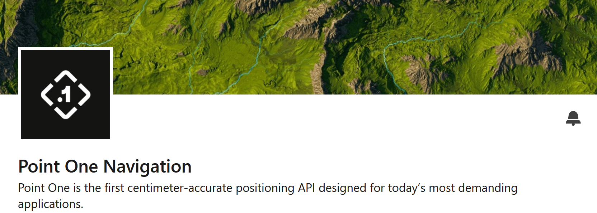
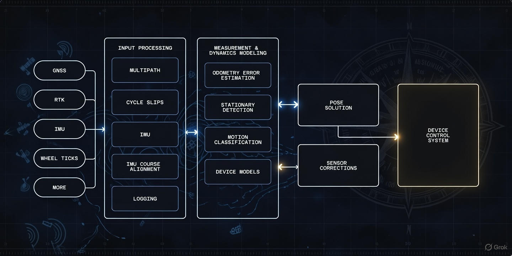
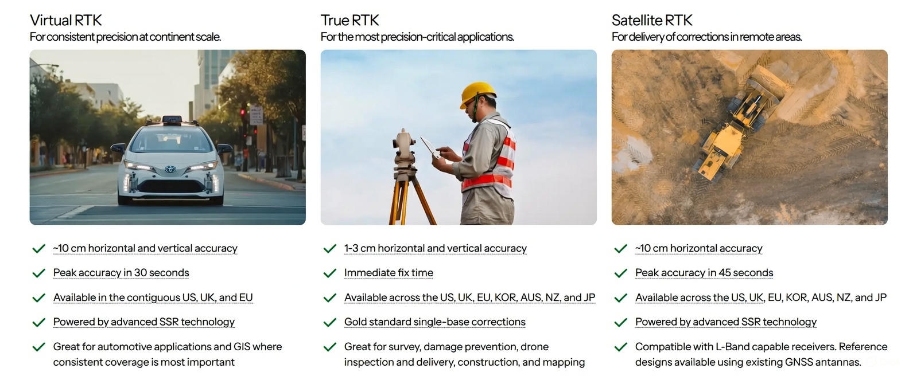

## I am excited to announce that I've accepted a full-time position as Staff Embedded Engineer with Point One Navigation!

	

This opportunity perfectly aligns with the technical passions I've been exploring through my recent writings. Whether it's [achieving meter-level positioning on the Moon without GNSS](https://www.linkedin.com/pulse/using-navigation-camera-achieve-meter-level-position-moon-lourette-2zr2e), diving deep into [the magic of GPS RTK technology](https://www.linkedin.com/pulse/how-my-morning-coffee-reveals-magic-gps-rtk-richard-lourette-3wjqe), or advocating for [heap-free embedded C++ in high-reliability systems](https://www.linkedin.com/pulse/why-i-dont-want-heap-my-embedded-c-high-reliability-richard-lourette-dxqgc), these topics have been more than just intellectual exercises; they've been preparation for this next chapter.

What excites me most about joining Point One Navigation is the opportunity to draw upon my entire technical background:
- **Embedded Systems**: Contributing to their C/C++ Positioning Engine that runs Kalman filters and sensor fusion in real-time, from lightweight MCUs to high-performance processors

	

- **GNSS Expertise**: Leveraging my decade-long GPS-III satellite program experience and recent advanced GPS receiver development to help advance their Polaris RTK network (1900+ global base stations) and new Virtual RTK technology

	

- **Imaging & Remote Sensing**: Applying vision-based navigation experience to their multi-sensor fusion algorithms that excel in challenging environments and contributing my indoor positioning expertise.

- **High-Reliability Software**: Working on ASIL-rated positioning solutions for autonomous vehicles, exactly the kind of safety-critical, deterministic systems I've championed

Point One Navigation's mission to enable "Physical AI" by delivering centimeter-accurate positioning everywhere resonates deeply with my belief that precision navigation should be accessible, reliable, and transformative. Their recent $35M Series C led by Khosla Ventures signals the industry's confidence in their unified platform approach, from satellite to software. I'm looking forward to contributing to their Positioning Engine and helping push the boundaries of what's possible when robots, autonomous vehicles, and precision equipment know exactly where they are.

### I want to give credit to my wonderful network here on LinkedIn.
When you saw my **_"open to work"_** emblem, you steered a recruiter my way, and that made all the difference. Thank you!

### Follow me to stay updated on Point One Navigation's growth and hiring opportunities.
I'll be sharing insights as we expand our team and technology!

#NewPosition #GNSS #RTK #EmbeddedSystems #Navigation #PointOneNavigation #AutonomousSystems #PhysicalAI #SensorFusion