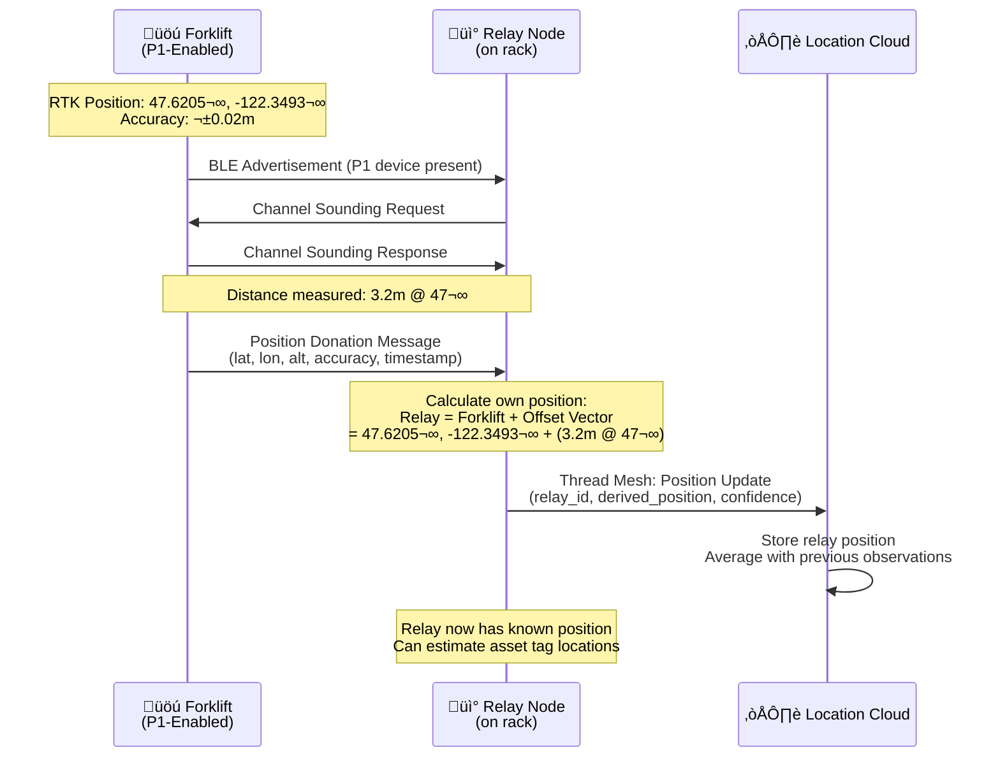
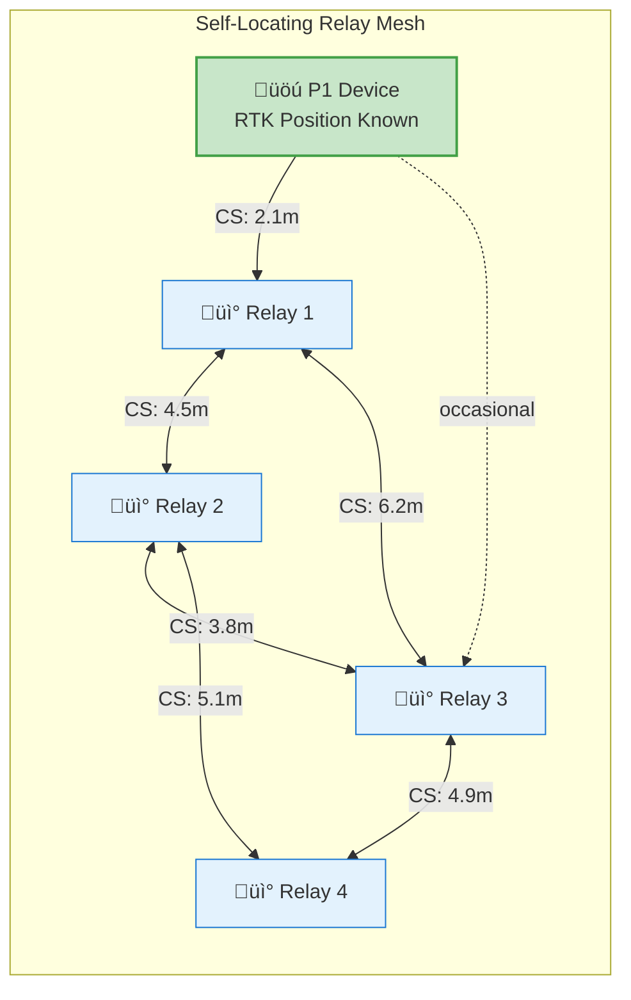
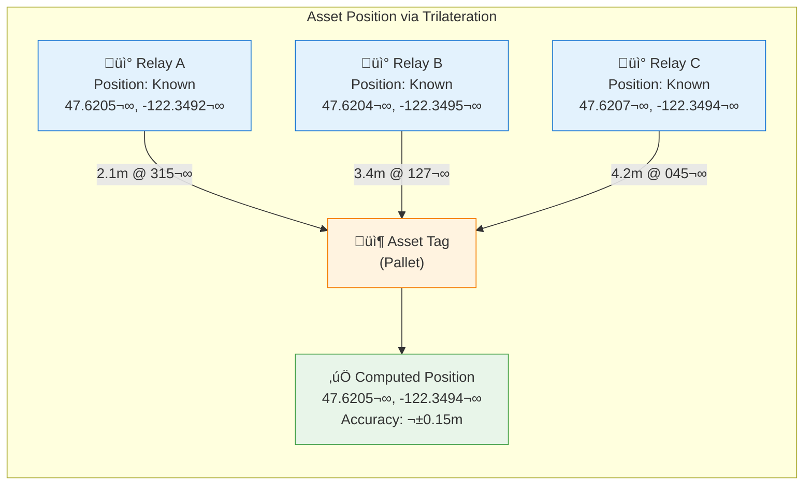

# Ubiquitous Location: Extending P1's Platform from Outdoor GNSS to Indoor and Asset-Level Visibility

<p align="center">
  
  <br>
  <em>Image credit: Richard Lourette and Grok</em>
</p>

**Version 2.5 | December 2025**

**Author:** Richard W. Lourette  
**Contact:** rlourette_at_gmail.com  
**Location:** Fairport, New York, USA

---

## A Note on Terminology

This paper proposes extending Point One Navigation's platform with physical asset tracking devices (BLE beacons attached to pallets, boxes, and containers). These should not be confused with P1's existing **Tags feature**, which is a powerful API capability for attaching customer metadata to P1 devices and querying them via GraphQL.

Throughout this document:
- **P1 Tags** refers to the existing metadata/device management feature
- **Asset Beacons** refers to the proposed physical BLE tracking devices
- **Relay Nodes** refers to battery-powered gateways that bridge asset beacons to P1's network

This distinction matters: the P1 Tags feature becomes even more valuable when extended to manage tens of thousands of asset beacons alongside GNSS-enabled devices.

---

## Executive Summary

Point One Navigation has built the world's most accessible centimeter-accurate positioning platform. With the Polaris RTK Network, Location Cloud API, and Positioning Engine, P1 delivers precise outdoor location for vehicles, robots, and connected devices. The recent \$35M Series C and stated goal to "solve ubiquitous location...eventually indoors and all domains" signals the next phase of growth.

This white paper proposes a practical path to indoor and asset-level tracking by integrating hybrid BLE-Thread mesh networks with P1's existing infrastructure. The architecture enables:

- **Seamless outdoor-to-indoor handoff** using P1 gateways as mesh coordinators
- **Passive asset tracking** for pallets, boxes, and containers without per-item GNSS hardware
- **Self-locating relay mesh** that automatically derives anchor positions from nearby P1-enabled vehicles, eliminating manual surveying and enabling rapid deployment
- **Scalable deployment** supporting 100,000+ tracked assets per facility
- **New revenue streams** through per-device-under-management pricing for non-GNSS assets

**Key Innovation:** The self-locating mesh architecture transforms every P1-enabled vehicle (forklift, tractor, AGV) into a mobile positioning anchor. Using Bluetooth 6.0 Channel Sounding and Kalman filtering, relay nodes automatically derive their positions from passing P1 equipment, then use trilateration to locate asset tags. This eliminates the deployment friction that plagues traditional RTLS systems: no surveying, no per-anchor GNSS hardware, no recalibration when equipment moves.

This approach complements P1's roadmap rather than competing with it, providing near-term indoor coverage while P1 develops more sophisticated positioning technologies.

---

## 1. The Ubiquitous Location Opportunity

### 1.1 P1's Current Strength

Point One has solved outdoor precision location at scale:

- 2,000+ professionally managed RTK base stations across North America, Europe, and Asia
- Centimeter-level accuracy through the Polaris network
- Single GraphQL API unifying corrections, telemetry, and device management
- 10x growth in OEM adoption over the past year
- Proven deployments: 150,000+ vehicles from one EV manufacturer, 300,000 last-mile delivery vehicles

### 1.2 The Indoor Gap

As P1 CEO Aaron Nathan stated in the November 2025 TechCrunch interview: *"What we're building next—and that's part of what this fundraising is for—is, how do we do long-term indoor navigation as well. When you look at the evolution of the business, we want to solve ubiquitous location, so eventually it will be indoors and all domains."*

Currently, P1's indoor capability is limited to short-term continuity: vehicles entering parking structures maintain position through dead reckoning and sensor fusion. This works for powered vehicles with IMUs and compute resources, but doesn't address:

- Warehouse robots that "spend the bulk of their life inside"
- Pallets and containers moving through distribution centers
- Assets transitioning between outdoor transport and indoor storage
- Temporary or rapidly deployed facilities

### 1.3 The Asset Tracking Dimension

Beyond indoor positioning, there's a parallel opportunity in **passive asset tracking**. P1's current customers (fleet operators, logistics companies, agricultural equipment manufacturers) don't just need to know where their vehicles are. They need to track what those vehicles carry:

- Which pallets are on which trailer?
- Where is a specific container in the warehouse?
- Has this shipment moved from dock to storage to outbound staging?

This visibility requires tracking assets that can't carry GNSS receivers: coin-cell-powered beacons on pallets, boxes, and containers.

### 1.4 The Deployment Friction Problem

Traditional Real-Time Location Systems (RTLS) suffer from a fundamental deployment barrier: every anchor point must have a precisely known position. This means either:

- **Expensive per-anchor GNSS hardware** (\$500-2000 per anchor), or
- **Time-consuming manual surveying** that must be repeated whenever equipment moves

This friction limits RTLS adoption to permanent, high-value installations. Temporary facilities, seasonal overflow, and rapidly reconfigured spaces are impractical to serve.

**P1's Unique Opportunity**

P1 customers already operate fleets of equipment with centimeter-accurate RTK positioning: forklifts, tractors, AGVs, yard trucks. These vehicles continuously receive Polaris corrections and know their positions precisely. This paper proposes leveraging that existing infrastructure as a **distributed positioning network**.

The key insight: relay nodes can automatically derive their positions from nearby P1-enabled equipment using Bluetooth 6.0 Channel Sounding and sensor fusion algorithms. As P1 vehicles traverse the facility, they "donate" their positions to stationary relay nodes. The relay nodes then use trilateration to locate passive asset tags.

This **self-locating mesh** architecture eliminates surveying entirely. Deploy relay nodes, let P1 vehicles drive past, and the system self-calibrates. Move a relay node? It automatically re-localizes. Set up a temporary facility? The mesh configures itself as equipment operates.

No other RTLS vendor can offer this capability. It requires the combination of widespread RTK-equipped vehicles and a unified positioning platform that P1 uniquely possesses.

---

## 2. Proposed Architecture

### 2.1 System Components

The hybrid architecture introduces two new device classes that integrate with P1's existing platform:

**Asset Beacons (Coin Cell Powered)**
- BLE 5.x/6.0 devices attached to pallets, boxes, or containers
- Transmit encrypted Eddystone-EID or Channel Sounding signals
- 8-12 month battery life on CR2032
- Zero configuration required: activate and attach
- Cost target: \$5-15 per beacon at scale

**Relay Nodes (Battery or Mains Powered)**
- Dual-radio devices: BLE scanner + Thread mesh networking
- Deployed on warehouse ceilings, pallet racks, or vehicle-mounted
- Forward beacon detections to P1 gateways via Thread mesh
- Battery-powered versions: 12+ month life on 1200mAh cell
- Can incorporate P1's Positioning Engine for precise self-location

**P1 Gateways (Existing + Enhanced)**
- Thread Border Router functionality added to P1 devices
- Bridge between Thread mesh and P1's Location Cloud API
- Provide GNSS-derived position context for all detections
- Existing P1 customers already have gateway hardware deployed

### 2.2 Data Flow

The architecture leverages Polaris-connected gateways as geographic anchors. Every indoor detection inherits real-world coordinates from gateways that know their precise position via Polaris RTK corrections.

```mermaid
flowchart LR
    subgraph Sources["Asset Layer"]
        AB[/"🏷️ Asset Beacon<br/>(BLE)"/]
    end
    
    subgraph Mesh["Mesh Network"]
        RN[["📡 Relay Node<br/>(Thread)"]]
    end
    
    subgraph Infrastructure["P1 Infrastructure"]
        GW[("🛰️ P1 Gateway<br/>(Polaris)")]
        API["☁️ Location Cloud<br/>API"]
    end
    
    subgraph Customer["Customer"]
        DASH["📊 Dashboard"]
    end
    
    AB -->|"Encrypted ID +<br/>Channel Sounding"| RN
    RN -->|"Mesh routing +<br/>EID resolution"| GW
    GW -->|"GNSS-anchored<br/>detections"| API
    API -->|"Real-time<br/>events"| DASH
    
    style AB fill:#e1f5fe,stroke:#0288d1,stroke-width:2px,color:#01579b
    style RN fill:#f3e5f5,stroke:#7b1fa2,stroke-width:2px,color:#4a148c
    style GW fill:#e8f5e9,stroke:#388e3c,stroke-width:2px,color:#1b5e20
    style API fill:#fff3e0,stroke:#f57c00,stroke-width:2px,color:#e65100
    style DASH fill:#fce4ec,stroke:#c2185b,stroke-width:2px,color:#880e4f
    
    style Sources fill:#e3f2fd,stroke:#1976d2,stroke-width:1px
    style Mesh fill:#f3e5f5,stroke:#8e24aa,stroke-width:1px
    style Infrastructure fill:#e8f5e9,stroke:#43a047,stroke-width:1px
    style Customer fill:#fce4ec,stroke:#d81b60,stroke-width:1px
```



**Data Flow Summary:**

| Component | Function | Key Capability |
|-----------|----------|----------------|
| **Asset Beacon** | Transmits identity | Encrypted Eddystone-EID, optional Channel Sounding range |
| **Relay Node** | Bridges BLE→Thread | Mesh routing, local EID resolution, battery-powered |
| **P1 Gateway** | Anchors to Polaris | Centimeter-accurate GNSS position via RTK corrections |
| **Location Cloud** | Aggregates & serves | GraphQL API, real-time subscriptions, device management |

**Detection Event Payload:**
- Asset beacon identifier (resolved from rotating EID)
- Detecting relay node ID
- RSSI or Channel Sounding distance measurement
- Gateway GNSS position and timestamp
- Mesh hop count and latency

### 2.3 Why This Architecture

**Leverages P1's existing infrastructure:** Gateways already deployed for GNSS correction delivery become mesh coordinators. The Location Cloud API already handles device management, telemetry, and customer queries. Asset beacon detections are simply a new event type.

**Separates concerns appropriately:** Ultra-low-power beacons do one thing well (transmit identity). Relay nodes handle the complexity of mesh networking. P1's cloud handles resolution, aggregation, and customer integration.

**Scales efficiently:** Thread mesh provides coverage redundancy and self-healing. Adding relay nodes extends coverage without cloud changes. The system handles 100,000+ assets per facility.

---

## 3. Gateway Deployment Scenarios

P1 gateways become the bridge between GNSS-accurate outdoor positioning and indoor asset visibility. Deployment scenarios include:

### 3.1 Fixed Infrastructure

**Warehouse Ceilings**
- Mains-powered gateways with Thread Border Router capability
- Polaris RTK corrections provide survey-grade self-location (centimeter-accurate facility reference point)
- Aggregate detections from battery-powered relay nodes on rack ends
- Typical density: 1 gateway per 10,000 sq ft, relay nodes every 50 ft

**Distribution Center Docks**
- Track asset handoff between transport and storage
- Capture the moment pallets move from trailer to facility
- Integration with WMS for automated receiving

### 3.2 Mobile Platforms

**Tractor Trailers**
- Vehicle-mounted P1 gateway with integrated relay node
- Tracks which pallets/containers are loaded
- Provides in-transit visibility with GNSS position
- Detects loading/unloading events automatically

**Aircraft Cargo**
- Ruggedized gateway for air transport containers
- Tracks ULD (Unit Load Device) contents
- Enables chain-of-custody documentation

### 3.3 Temporary Deployments

**Disaster Relief Operations**
- Rapidly deployed gateway + relay node kits
- Track medical supplies, equipment, and provisions
- No permanent infrastructure required
- Cellular/Starlink backhaul to P1 cloud

**Pop-up Warehouses / Seasonal Overflow**
- Battery-powered mesh deployed in hours
- Full asset visibility without facility modification
- Recover and redeploy as needs change

### 3.4 Relay Node Position Anchoring via P1-Enabled Devices

A key architectural innovation: relay nodes can obtain their own position from nearby P1-enabled equipment rather than requiring individual GNSS receivers or manual surveying.

**The Challenge**

Traditional RTLS systems require each anchor point to have a precisely surveyed position. This creates deployment friction: either expensive GNSS hardware in every anchor, or time-consuming manual surveying that must be repeated whenever equipment moves.

**The P1 Advantage**

Many P1 customers already operate fleets of P1-enabled equipment: forklifts in warehouses, tractors in agriculture, AGVs in manufacturing, service vehicles in logistics. These devices continuously receive Polaris RTK corrections and maintain centimeter-accurate position. This existing infrastructure becomes a distributed positioning network.

**Position Donation Protocol**



**How It Works:**

1. **P1-enabled device** (forklift, AGV, tractor) operates in the facility with RTK positioning active
2. **Proximity detection:** When the device comes within BLE range of a relay node, both devices recognize each other
3. **Channel Sounding exchange:** The P1 device and relay node perform a Channel Sounding measurement to determine precise distance and (with multiple antennas) direction
4. **Position transfer:** The P1 device shares its current RTK position with the relay node via BLE or Thread
5. **Relay node calculation:** The relay computes its own position using sensor fusion algorithms (see Section 4.4)
6. **Position refinement:** As multiple P1 devices pass by over time, the estimate converges to high accuracy

This approach transforms every P1-enabled vehicle into a mobile positioning anchor, extending RTK-grade accuracy from the vehicle to the assets around it. The technical details of position estimation, including Kalman filtering, trilateration, and self-locating mesh algorithms, are covered in Section 4.4.

---

## 4. Enabling Technologies

### 4.1 Bluetooth 6.0 Channel Sounding

Released September 2024, Bluetooth 6.0 introduces Channel Sounding, a game-changing capability for indoor positioning:

**Phase-Based Ranging (PBR):** Measures phase differences across 72 channels in the 2.4 GHz band to calculate distance with 10-centimeter accuracy using single-antenna hardware.

**Round-Trip Time (RTT):** Provides cryptographically secured timing measurements that cross-verify PBR results and prevent relay attacks.

**Why This Matters for P1:**
- Asset beacons can provide not just presence detection but precise distance to relay nodes
- Zone-level positioning without expensive infrastructure (no Quuppa-style antenna arrays)
- Security features align with P1's emphasis on authenticated, secure positioning
- Silicon shipping now: Nordic nRF54, Silicon Labs xG24, Qualcomm Snapdragon 8 Elite

Channel Sounding means the system can answer "pallet X is 2.3 meters from relay node Y" rather than just "pallet X was detected by relay node Y," enabling true indoor positioning from the asset beacon layer.

### 4.2 Thread / Matter over Thread

Thread provides the mesh backhaul for relay node communication:

**IPv6 Native:** Direct integration with P1's GraphQL API without protocol translation. Thread devices get routable IP addresses.

**Self-Healing Mesh:** No single point of failure. Relay nodes automatically route around failures.

**Low Power:** Thread Sleepy End Devices can achieve multi-year battery life while maintaining mesh connectivity.

**Industry Momentum:** IKEA announced 21 Matter-over-Thread devices (November 2025). Apple, Google, Amazon all shipping Thread Border Routers. Nordic and Silicon Labs have mature OpenThread implementations.

### 4.3 Eddystone-EID for Privacy and Security

Asset beacons transmit rotating encrypted identifiers (Eddystone-EID) rather than static IDs:

- Prevents tracking by unauthorized parties
- Identity resolution happens at P1 cloud with customer-specific keys
- Relay nodes can cache resolutions for offline operation
- Aligns with P1's security-first architecture

### 4.4 Self-Locating Mesh Architecture

This section details the sensor fusion algorithms that enable relay nodes to determine their own positions automatically. This key innovation eliminates manual surveying and enables rapid deployment.

**The Challenge**

A single range measurement from one P1 device provides only a noisy position estimate. Real-world deployments face multipath reflections, NLOS (non-line-of-sight) conditions, and varying measurement quality. The solution is recursive state estimation using Kalman filtering and related techniques.

**Extended Kalman Filter (EKF) for Relay Position Estimation**

Each relay node maintains a state estimate of its own position along with an uncertainty measure. As P1 devices pass by and donate their positions, the EKF fuses these observations to progressively refine the relay's position estimate. The filter automatically weights each observation based on its expected accuracy and rejects outliers that are inconsistent with the current estimate.

The EKF is well-suited for this application because it handles noisy measurements, adapts to varying P1 device accuracy, and converges quickly even when starting with no prior position knowledge. For mathematical details, see Appendix A.

**Convergence Behavior:**

| Observations | Typical Uncertainty | Use Case |
|-------------|---------------------|----------|
| 1 | ±0.5m | Initial estimate |
| 3-5 | ±0.2m | Operational accuracy |
| 10+ | ±0.1m | High confidence |
| 50+ | ±0.05m | Survey-grade |

**Alternative Estimation Approaches**

For scenarios where standard assumptions do not hold, alternative algorithms may be employed:

- **Particle Filter:** Handles non-Gaussian noise distributions common in indoor RF environments by maintaining multiple position hypotheses
- **Factor Graph Optimization:** Solves for globally consistent positions across the entire relay mesh simultaneously
- **Weighted Least Squares:** Batch approach suitable for periodic position recalculation

See Appendix A for detailed descriptions of these algorithms.

**Relay-to-Relay Ranging for Self-Locating Mesh**

The positioning fabric becomes truly self-locating when relay nodes can also range to each other:



**How Relay-to-Relay Ranging Helps:**

1. **Position propagation:** Relay 1 gets position from P1 device. Relay 2 ranges to Relay 1, derives its own position. Relay 4 (never sees P1 device) still gets positioned via the chain.

2. **Redundancy:** Multiple paths to position each relay improves accuracy and detects inconsistencies.

3. **Geometric constraints:** Inter-relay distances constrain the solution space, enabling factor graph optimization across the entire mesh.

4. **Drift detection:** If a relay is accidentally moved, its inter-relay distances change, triggering re-localization.

**Implementation Considerations:**

- **Compute location:** EKF runs on-device for real-time updates; factor graph optimization runs in Location Cloud for global consistency
- **Update frequency:** Position donations occur opportunistically; inter-relay ranging can be scheduled hourly to conserve power
- **Bootstrapping:** New relay nodes start with high uncertainty; system prioritizes routing P1 devices past unlocalized relays
- **Outlier rejection:** Mahalanobis distance gating rejects statistically inconsistent measurements

**Trilateration for Asset Tag Positioning**

Once relay nodes know their own positions, they can estimate the location of passive asset tags using trilateration, which computes position from distance measurements to three or more known reference points:



**Accuracy Scaling:**

| Relay Observations | Typical Accuracy | Use Case |
|-------------------|------------------|----------|
| Single relay | ±0.5m | Zone identification |
| Two relays | ±0.3m | Aisle-level positioning |
| Three+ relays | ±0.15m | Slot-level positioning |

**Deployment Benefits vs. Traditional RTLS:**

| Aspect | Traditional RTLS | P1 Self-Locating Mesh |
|--------|------------------|----------------------|
| **Anchor positioning** | Manual survey or per-anchor GNSS | Automatic via mobile P1 devices |
| **Deployment time** | Days (surveying) | Hours (self-configuring) |
| **Anchor hardware cost** | \$500-2000/anchor | \$50-100/relay node |
| **Position updates** | Static (requires re-survey) | Dynamic (continuous refinement) |
| **Mobile deployments** | Difficult | Native capability |

---

## 5. Integration with P1's Platform

### 5.1 Location Cloud API Extensions

Asset beacons integrate with P1's existing GraphQL API at `graphql.pointonenav.com`. The current API already provides the patterns needed for asset tracking; minimal extensions would support the full use case.

**Current P1 API Patterns (Production Today)**

P1's existing `myDevices` query with tag filtering provides the foundation:

```graphql
# Filter devices by tag (P1's existing capability)
query {
  myDevices(filter: { tag: { key: "Zone", value: { eq: "Receiving" } } }) {
    content {
      id
      label
      lastPosition {
        timestamp
        position { llaDec { lat lon alt } }
      }
    }
  }
}

# Real-time position updates via WebSocket subscription
subscription {
  devices {
    id
    lastPosition {
      timestamp
      position { llaDec { lat lon alt } }
    }
  }
}

# Attach customer metadata to any device
mutation {
  setDeviceTag(input: { 
    ids: ["beacon-a1b2c3"], 
    key: "SKU", 
    value: "PALLET-2024-0847" 
  }) { key value }
}
```

**Proposed Extensions for Asset Beacons**

Asset beacons would become a new device type within the existing schema. The extensions below illustrate how detections from relay nodes could be represented:

```graphql
# Conceptual extension: Query assets by facility/zone
query {
  myDevices(filter: { 
    and: [
      { deviceType: "ASSET_BEACON" },
      { tag: { key: "Facility", value: { eq: "warehouse-east" } } }
    ]
  }) {
    content {
      id
      label
      lastPosition {
        timestamp
        position { llaDec { lat lon alt } }
      }
      # Proposed extension fields
      detectionSource    # "relay_rssi" | "channel_sounding" | "gnss_gateway"
      detectingRelay { id label }
      signalStrength     # dBm or Channel Sounding distance (meters)
    }
  }
}

# Proposed: Subscribe to zone entry/exit events
subscription {
  assetEvents(zoneId: "zone-receiving-dock") {
    eventType    # "entered" | "exited" | "detected"
    device { id label }
    zone { id name }
    timestamp
  }
}
```

The key architectural insight: asset beacons are devices. They use the same provisioning, tagging, and query patterns as GNSS devices. The Location Cloud API already handles device management at scale; asset beacons represent a new device type, not a parallel system.

### 5.2 Leveraging P1 Tags for Asset Management

P1's existing Tags feature provides the customer integration layer for asset beacons. Using the current `setDeviceTag` mutation, customers can attach their own identifiers to beacon IDs:

```graphql
# Associate a beacon with customer's inventory system
mutation {
  setDeviceTag(input: { 
    ids: ["beacon-f7e2a1"], 
    key: "CustomerPO", 
    value: "PO-2025-847291" 
  }) { key value }
}

# Tag multiple beacons with shipment ID
mutation {
  setDeviceTag(input: { 
    ids: ["beacon-a1", "beacon-a2", "beacon-a3"], 
    key: "Shipment", 
    value: "SHIP-EAST-20251207" 
  }) { key value }
}

# Query all assets for a specific shipment
query {
  myDevices(filter: { 
    tag: { key: "Shipment", value: { eq: "SHIP-EAST-20251207" } }
  }) {
    content { id label lastPosition { position { llaDec { lat lon } } } }
  }
}
```

This approach means:

- No separate asset management system required
- Query assets using native customer terminology (PO numbers, SKUs, shipment IDs)
- Real-time synchronization via existing API patterns
- Customers control their own namespace (tag keys and values)

### 5.3 Unified Device Management

The Location Cloud already manages GNSS devices at scale. Asset beacons and relay nodes extend this:

- Provision beacons in bulk via API
- Monitor relay node health and battery status
- Manage Thread network topology
- Single dashboard for vehicles, gateways, relay nodes, and asset beacons

---

## 6. Business Model

### 6.1 Revenue Streams

**Per-Device-Under-Management (Non-GNSS Assets)**
- Monthly fee per active asset beacon
- Tiered pricing: \$0.50-2.00/beacon/month based on volume
- 100,000 beacons at \$1/month = \$1.2M ARR per large customer

**Relay Node Hardware**
- P1-certified relay nodes sold through channel partners
- Margin on hardware + recurring Location Cloud fees
- Reference designs available for OEM integration

**Gateway Enhancement**
- Software upgrade to existing P1 gateways for Thread Border Router
- Included in enterprise tier or separate add-on

**Professional Services**
- Facility planning and deployment
- Custom integration with WMS/ERP systems
- Ongoing optimization and support

### 6.2 Customer Value Proposition

**For Existing P1 Fleet Customers:**
"You already know where your trucks are. Now know what's on them, and where it goes when it leaves the truck."

**For Warehouse/Logistics Operators:**
"Centimeter-accurate outdoor meets comprehensive indoor. One platform, one API, one vendor."

**For Supply Chain Visibility:**
"Track anything, anywhere, anytime, from manufacturer to distribution center to delivery vehicle to final destination."

---

## 7. Competitive Positioning

### 7.1 vs. Pure Indoor Positioning (Quuppa, Zebra, Ubisense)

These vendors require dedicated infrastructure: antenna arrays, specialized anchors, facility-specific calibration. P1's approach:

- Leverages existing GNSS gateway deployments
- Lower infrastructure cost (battery-powered relay nodes vs. wired anchors)
- Unified outdoor/indoor platform vs. separate systems
- Channel Sounding provides competitive accuracy without antenna arrays

### 7.2 vs. BLE Asset Tracking (Kontakt.io, Estimote, Asset Tracker vendors)

Pure BLE solutions lack outdoor integration and precise positioning:

- P1 provides seamless outdoor-to-indoor handoff
- GNSS-derived reference positions for all indoor zones
- Enterprise-grade API and device management
- Path to centimeter accuracy via Positioning Engine

### 7.3 vs. Cellular IoT Trackers (CalAmp, Sierra Wireless)

Cellular trackers have higher per-device cost and power consumption:

- Asset beacons: \$5-15 vs. \$50-150 for cellular
- 12-month battery life vs. weeks/months
- No cellular subscription per asset
- Better indoor coverage (BLE penetrates where cellular doesn't)

---

## 8. Implementation Roadmap

### Phase 1: Reference Design (Q1 2026)
- Thread Border Router firmware for existing P1 gateways
- Reference relay node design (Nordic nRF54L15 + Thread)
- Asset beacon specification (BLE 5.x, Eddystone-EID)
- Location Cloud API extensions for asset events
- Pilot with 2-3 existing P1 fleet customers

### Phase 2: Channel Sounding Integration (Q2-Q3 2026)
- BLE 6.0 Channel Sounding support in relay nodes
- Distance-based positioning algorithms
- Zone definition and geofencing in Location Cloud
- Expanded pilot: warehouse + fleet integration

### Phase 3: General Availability (Q4 2026)
- P1-certified relay node and beacon products
- Partner ecosystem for deployment services
- Full documentation and developer resources
- Enterprise pricing and support tiers

---

## 9. Conclusion

Point One Navigation has stated its ambition clearly: ubiquitous location, indoors and all domains. The hybrid BLE-Thread architecture proposed here provides a practical, near-term path to that goal while generating new revenue from asset tracking.

The key insight is that P1 already has the hard parts solved:

- Polaris RTK Network providing the geographic truth that anchors all positioning
- Enterprise-grade Location Cloud API and device management
- Trusted relationships with fleet and logistics customers
- The P1 Tags feature for customer-native integration

Adding indoor mesh networking and asset beacon support extends these strengths into new markets. Polaris provides the geographic truth; the mesh network extends that truth indoors to every pallet, container, and asset.

The opportunity is significant: every P1 fleet customer is also a potential asset tracking customer. Every pallet on every truck, every container in every warehouse, every package in transit, all manageable through a single platform, all anchored to Polaris-grade positioning.

**P1 provides the location, network, and integration layer. Customers track anything, anywhere, anytime.**

---

## References

### Point One Navigation Sources

1. **TechCrunch** (November 20, 2025). "This Khosla-backed startup can track drones, trucks, and robotaxis, inch by inch." Retrieved from: https://techcrunch.com/2025/11/20/this-khosla-based-startup-can-track-drones-trucks-and-robotaxis-inch-by-inch/
   - Source for: \$35M Series C funding, \$230M valuation, Aaron Nathan quotes on indoor navigation goals, customer deployment numbers (150,000+ EV vehicles, 300,000 delivery vehicles), 10x robotics growth

2. **Point One Navigation GraphQL API Documentation**. Retrieved from: https://docs.pointonenav.com/graphql-api/
   - Source for: API patterns, `myDevices` query, `setDeviceTag` mutation, WebSocket subscriptions, device filtering

3. **Point One Navigation GitHub - Polaris Client**. Retrieved from: https://github.com/PointOneNav/polaris
   - Source for: Polaris RTK corrections service architecture, RTCM 10403 implementation, C/C++ client libraries

4. **Point One Navigation GitHub - FusionEngine Client**. Retrieved from: https://github.com/PointOneNav/fusion-engine-client
   - Source for: Positioning Engine message protocols, sensor fusion architecture

5. **Point One Navigation Developer Resources**. Retrieved from: https://pointonenav.com/resources/
   - Source for: Polaris network coverage, device management capabilities

### Bluetooth Technology Sources

6. **Bluetooth SIG** (September 2024). "Bluetooth Core Specification 6.0." Retrieved from: https://www.bluetooth.com/specifications/specs/core-specification-6-0/
   - Source for: Channel Sounding specification, Phase-Based Ranging (PBR), Round-Trip Time (RTT) security features

7. **Bluetooth SIG** (September 3, 2024). "Bluetooth SIG Introduces True Distance Awareness." Press release. Retrieved from: https://www.bluetooth.com/press/bluetooth-channel-sounding/
   - Source for: 10-centimeter accuracy claims, single-antenna capability, security features, Neville Meijers CEO quote

8. **Nordic Semiconductor**. "nRF54L15 - Ultra-low-power wireless SoC." Product documentation. Retrieved from: https://www.nordicsemi.com/Products/nRF54L15
   - Source for: BLE 6.0 Channel Sounding silicon availability, Thread support

9. **Silicon Labs**. "xG24 Wireless SoC." Product documentation. Retrieved from: https://www.silabs.com/wireless/zigbee/efr32mg24-series-2-socs
   - Source for: Multi-protocol BLE + Thread support, Channel Sounding readiness

### Thread/Matter Sources

10. **Thread Group**. "Thread 1.3 Specification." Retrieved from: https://www.threadgroup.org/
    - Source for: IPv6 mesh networking, Sleepy End Device power characteristics, Border Router functionality

11. **Connectivity Standards Alliance**. "Matter Specification." Retrieved from: https://csa-iot.org/all-solutions/matter/
    - Source for: Matter over Thread interoperability

12. **IKEA** (November 2025). "IKEA launches new smart home range with 21 Matter-compatible products." Press release. Retrieved from: https://www.ikea.com/global/en/newsroom/retail/the-new-smart-home-from-ikea-matter-compatible-251106/
    - Source for: Industry adoption momentum, 21 Matter-over-Thread devices

### Indoor Positioning Context

13. **Quuppa**. "Quuppa Intelligent Locating System." Technical overview. Retrieved from: https://www.quuppa.com/
    - Source for: Competitive comparison, antenna array-based RTLS architecture

14. **Zebra Technologies**. "Real-Time Location Systems (RTLS)." Product documentation. Retrieved from: https://www.zebra.com/us/en/solutions/intelligent-edge-solutions/rtls.html
    - Source for: Competitive comparison, enterprise RTLS market

### Standards

15. **RTCM Special Committee 104**. "RTCM 10403.x - Differential GNSS Services, Version 3." Retrieved from: https://www.rtcm.org/publications
    - Source for: RTK corrections data format used by Polaris network

16. **IEEE 802.15.4** (2020). "IEEE Standard for Low-Rate Wireless Networks." Retrieved from: https://en.wikipedia.org/wiki/IEEE_802.15.4
    - Source for: Thread PHY/MAC layer foundation

---

## Glossary

**AGV (Automated Guided Vehicle):** Self-driving material handling equipment used in warehouses and factories for transporting goods without human operators.

**Channel Sounding:** A Bluetooth 6.0 feature that measures distance between devices by analyzing signal characteristics across multiple frequency channels. Achieves 10-centimeter accuracy using phase-based ranging.

**Covariance Matrix:** A mathematical representation of uncertainty and correlations between estimated variables. In positioning, it quantifies how confident the system is about each coordinate and how errors in one dimension relate to errors in others.

**Dead Reckoning:** Position estimation by integrating velocity and heading measurements from motion sensors. Useful for short-term position continuity but accumulates drift over time without external corrections.

**Eddystone-EID (Ephemeral Identifier):** A Google-developed beacon protocol that transmits encrypted, rotating identifiers. Prevents unauthorized tracking while allowing authorized systems to resolve the beacon's true identity.

**EKF (Extended Kalman Filter):** A recursive algorithm for estimating the state of a system from noisy measurements. Extends the classic Kalman filter to handle nonlinear relationships between measurements and state variables.

**Factor Graph:** A graphical model representing the relationships between variables and constraints. In positioning, nodes represent device positions and edges represent distance measurements, enabling globally consistent solutions.

**IMU (Inertial Measurement Unit):** A sensor package containing accelerometers and gyroscopes that measure acceleration and rotation. Used for dead reckoning and sensor fusion in navigation systems.

**Innovation Gating:** An outlier rejection technique that discards measurements whose difference from the predicted value exceeds a statistical threshold based on expected uncertainty.

**IPv6 (Internet Protocol version 6):** The latest version of the Internet Protocol, providing a vastly expanded address space that allows every device to have a unique, routable address.

**Mahalanobis Distance:** A statistical measure of distance that accounts for correlations and variances in the data. Used to determine whether a measurement is consistent with an expected distribution, enabling outlier detection.

**Multipath:** A radio propagation phenomenon where signals reflect off surfaces and arrive at the receiver via multiple paths. Causes range measurement errors in indoor environments.

**NLOS (Non-Line-of-Sight):** A condition where the direct path between transmitter and receiver is obstructed, forcing signals to travel via reflections or diffraction. Degrades ranging accuracy.

**Particle Filter:** A Sequential Monte Carlo method that represents probability distributions using weighted samples (particles). Handles non-Gaussian noise and multimodal hypotheses better than Kalman filters.

**Phase-Based Ranging (PBR):** A distance measurement technique that calculates range from the phase difference of signals transmitted across multiple frequencies.

**RSSI (Received Signal Strength Indicator):** A measurement of received signal power, commonly used for rough proximity estimation. Less accurate than Channel Sounding but simpler to implement.

**RTK (Real-Time Kinematic):** A satellite navigation technique that achieves centimeter-level accuracy by using carrier phase measurements and real-time corrections from a reference station or network.

**RTLS (Real-Time Location System):** Infrastructure for automatically tracking the location of assets or personnel within a defined area, typically using radio frequency technologies.

**Thread:** An IPv6-based mesh networking protocol designed for low-power IoT devices. Provides self-healing connectivity and supports devices that sleep most of the time to conserve battery.

**Thread Border Router:** A device that bridges a Thread mesh network to external IP networks such as Wi-Fi or Ethernet, enabling Thread devices to communicate with the broader internet.

**Trilateration:** A positioning technique that determines location by measuring distances from three or more reference points with known positions. The intersection of the resulting spheres (or circles in 2D) yields the target position.

**ULD (Unit Load Device):** A standardized container or pallet used for air cargo transport, designed to fit aircraft cargo holds efficiently.

**WMS (Warehouse Management System):** Software that controls and optimizes warehouse operations including inventory tracking, order fulfillment, and storage optimization.

---

## Appendix A: Mathematical Details

This appendix provides the mathematical foundations for the sensor fusion algorithms described in Section 4.4.

### A.1 Extended Kalman Filter Equations

The EKF maintains a state vector and covariance matrix:

```
State Vector: x = [lat, lon, alt]ᵀ
Covariance Matrix: P (3×3 uncertainty estimate)
```

**Predict Step**

For static relay nodes, the prediction step simply propagates the previous estimate with added process noise to account for potential drift:

```
x̂ₖ|ₖ₋₁ = x̂ₖ₋₁           (position unchanged for static relay)
Pₖ|ₖ₋₁ = Pₖ₋₁ + Q        (add process noise covariance)
```

Where Q is typically near-zero for fixed relays but may be increased if relay movement is suspected.

**Update Step**

When a position donation arrives from a P1 device:

```
Measurement:      z = P1_position + channel_sounding_offset
Innovation:       y = z - x̂ₖ|ₖ₋₁
Innovation Cov:   S = Pₖ|ₖ₋₁ + R
Kalman Gain:      K = Pₖ|ₖ₋₁ S⁻¹
Updated State:    x̂ₖ = x̂ₖ|ₖ₋₁ + K·y
Updated Cov:      Pₖ = (I - K)Pₖ|ₖ₋₁
```

Where R is the measurement noise covariance, derived from the combined uncertainty of the P1 device's RTK position and the Channel Sounding range measurement.

**Measurement Noise Covariance**

The R matrix combines uncertainties from multiple sources:

```
R = R_rtk + R_cs + R_multipath

Where:
  R_rtk      = RTK position uncertainty (typically ±0.02m, from P1 device)
  R_cs       = Channel Sounding ranging uncertainty (typically ±0.1m)
  R_multipath = Environment-dependent multipath error (0.1-0.5m indoor)
```

### A.2 Why EKF is Ideal for Relay Position Estimation

| Challenge | EKF Solution |
|-----------|--------------|
| Noisy range measurements | Measurement noise covariance (R) weights observations appropriately |
| Varying P1 device accuracy | R adapts based on reported RTK accuracy (±2cm vs ±10cm) |
| Multipath/NLOS outliers | Innovation gating rejects measurements where \|y\| > 3√S |
| Unknown initial position | Large initial P (e.g., 1000m²) allows rapid convergence |
| Static relay assumption | Q ≈ 0 for fixed relays; increase Q if movement detected |

### A.3 Particle Filter

The Particle Filter represents the position probability distribution using N weighted samples:

```
Particles: {x⁽ⁱ⁾, w⁽ⁱ⁾} for i = 1...N

For each measurement z:
1. PREDICT: x⁽ⁱ⁾ₖ|ₖ₋₁ = f(x⁽ⁱ⁾ₖ₋₁) + noise
2. UPDATE:  w⁽ⁱ⁾ ∝ p(z | x⁽ⁱ⁾ₖ|ₖ₋₁)
3. RESAMPLE: Draw N particles proportional to weights

Estimate: x̂ = Σᵢ w⁽ⁱ⁾ x⁽ⁱ⁾
```

**Advantages over EKF:**
- Handles non-Gaussian noise (common in indoor RF)
- Represents multimodal distributions (relay could be in multiple possible locations)
- No linearization required

**Disadvantages:**
- Computationally expensive (N = 100-1000 particles typical)
- May require more memory than available on low-power relay MCUs

### A.4 Factor Graph Optimization

Models the relay mesh as a graph:
- **Variable nodes:** Relay positions (x₁, x₂, ... xₙ)
- **Factor nodes:** Constraints from measurements

```
Minimize: Σᵢⱼ ||d_measured(i,j) - ||xᵢ - xⱼ|| ||² / σᵢⱼ²

Subject to: Anchor constraints from P1 device observations
```

Solved iteratively using Gauss-Newton or Levenberg-Marquardt optimization.

**Advantages:**
- Globally consistent solution across entire mesh
- Naturally incorporates relay-to-relay ranging
- Can detect and correct for moved relays

**Implementation:**
- Typically runs in Location Cloud (not on relay MCU)
- Executed periodically (e.g., hourly) or when topology changes
- Results pushed back to relay nodes

### A.5 Mahalanobis Distance for Outlier Rejection

The Mahalanobis distance measures how far a measurement is from the expected value, normalized by uncertainty:

```
d_M = √(yᵀ S⁻¹ y)

Where:
  y = innovation (measurement - prediction)
  S = innovation covariance
```

Measurements with d_M > threshold (typically 3.0) are rejected as outliers. This approach automatically adapts to the current uncertainty: when position is poorly known, more measurements are accepted; as confidence increases, outliers are more readily rejected.

### A.6 Trilateration Mathematics

Given distances d₁, d₂, d₃ from relay nodes at known positions (x₁,y₁), (x₂,y₂), (x₃,y₃):

```
(x - x₁)² + (y - y₁)² = d₁²
(x - x₂)² + (y - y₂)² = d₂²
(x - x₃)² + (y - y₃)² = d₃²
```

Subtracting equations to linearize:

```
2(x₂-x₁)x + 2(y₂-y₁)y = d₁² - d₂² + x₂² - x₁² + y₂² - y₁²
2(x₃-x₁)x + 2(y₃-y₁)y = d₁² - d₃² + x₃² - x₁² + y₃² - y₁²
```

Solve the resulting 2×2 linear system for (x, y).

With more than three relays, use weighted least squares to find the position that minimizes total squared error, with weights inversely proportional to measurement uncertainty.

---

## About the Author

**Richard W. Lourette** is the founder and principal consultant at RL Tech Solutions LLC, bringing 30+ years of experience in embedded systems architecture across aerospace, defense, and industrial IoT.

**Relevant Experience:**

**Panasonic Industrial IoT Division (Engineering Group Manager, 2021-2022)**
- Managed cross-functional teams spanning RF engineering, mesh networking, antenna development, and embedded firmware
- Directed R&D for industrial IoT devices with RESTful API integration
- Resolved critical RF protocol issues for 2,000+ device deployments
- Evaluated indoor positioning technologies including Quuppa-based RTLS systems

**Topcon Positioning Systems (Senior Embedded Software Consultant, 2023-2025)**
- Architected Linux C++ subsystems for next-generation GNSS receivers
- Deep understanding of RTK positioning, carrier phase measurements, and precision navigation
- Delivered 150,000+ lines of production embedded, unit test, and system test code

**L3Harris Aerospace (Chief Engineer Consultant, 2022-2023)**
- Spacecraft payload systems integrating radiation-hardened MCUs via SpaceWire
- NASA Core Flight System (cFS) architecture on RTEMs RTOS

Richard is a named inventor on 20 U.S. patents and has held DoD Top Secret/SCI clearances. His background uniquely combines GNSS/positioning expertise with industrial IoT system architecture, directly applicable to extending P1's platform into indoor and asset tracking domains.

---

**Document Version:** 2.5  
**Date:** December 2025

© 2025 Richard W. Lourette. All rights reserved.