# Ubiquitous Location: Extending P1's Platform from Outdoor GNSS to Indoor and Asset-Level Visibility

<p align="center">
  
  <br>
  <em>Image credit: Richard Lourette and Grok</em>
</p>

**Version 2.2 | December 2025**

**Author:** Richard W. Lourette  
**Contact:** rlourette_at_gmail.com  
**Location:** Fairport, New York, USA

---

## A Note on Terminology

This paper proposes extending Point One Navigation's platform with physical asset tracking devices (BLE beacons attached to pallets, boxes, and containers). These should not be confused with P1's existing **Tags feature**, which is a powerful API capability for attaching customer metadata to P1 devices and querying them via GraphQL.

Throughout this document:
- **P1 Tags** refers to the existing metadata/device management feature
- **Asset Beacons** refers to the proposed physical BLE tracking devices
- **Relay Nodes** refers to battery-powered gateways that bridge asset beacons to P1's network

This distinction matters: the P1 Tags feature becomes even more valuable when extended to manage tens of thousands of asset beacons alongside GNSS-enabled devices.

---

## Executive Summary

Point One Navigation has built the world's most accessible centimeter-accurate positioning platform. With the Polaris RTK Network, Location Cloud API, and Positioning Engine, P1 delivers precise outdoor location for vehicles, robots, and connected devices. The recent \$35M Series C and stated goal to "solve ubiquitous location...eventually indoors and all domains" signals the next phase of growth.

This white paper proposes a practical path to indoor and asset-level tracking by integrating hybrid BLE-Thread mesh networks with P1's existing infrastructure. The architecture enables:

- **Seamless outdoor-to-indoor handoff** using P1 gateways as mesh coordinators
- **Passive asset tracking** for pallets, boxes, and containers without per-item GNSS hardware
- **Scalable deployment** supporting 100,000+ tracked assets per facility
- **New revenue streams** through per-device-under-management pricing for non-GNSS assets

This approach complements P1's roadmap rather than competing with it, providing near-term indoor coverage while P1 develops more sophisticated positioning technologies.

---

## 1. The Ubiquitous Location Opportunity

### 1.1 P1's Current Strength

Point One has solved outdoor precision location at scale:

- 2,000+ professionally managed RTK base stations across North America, Europe, and Asia
- Centimeter-level accuracy through the Polaris network
- Single GraphQL API unifying corrections, telemetry, and device management
- 10x growth in OEM adoption over the past year
- Proven deployments: 150,000+ vehicles from one EV manufacturer, 300,000 last-mile delivery vehicles

### 1.2 The Indoor Gap

As P1 CEO Aaron Nathan stated in the November 2025 TechCrunch interview: *"What we're building next—and that's part of what this fundraising is for—is, how do we do long-term indoor navigation as well. When you look at the evolution of the business, we want to solve ubiquitous location, so eventually it will be indoors and all domains."*

Currently, P1's indoor capability is limited to short-term continuity: vehicles entering parking structures maintain position through dead reckoning and sensor fusion. This works for powered vehicles with IMUs and compute resources, but doesn't address:

- Warehouse robots that "spend the bulk of their life inside"
- Pallets and containers moving through distribution centers
- Assets transitioning between outdoor transport and indoor storage
- Temporary or rapidly deployed facilities

### 1.3 The Asset Tracking Dimension

Beyond indoor positioning, there's a parallel opportunity in **passive asset tracking**. P1's current customers (fleet operators, logistics companies, agricultural equipment manufacturers) don't just need to know where their vehicles are. They need to track what those vehicles carry:

- Which pallets are on which trailer?
- Where is a specific container in the warehouse?
- Has this shipment moved from dock to storage to outbound staging?

This visibility requires tracking assets that can't carry GNSS receivers: coin-cell-powered beacons on pallets, boxes, and containers.

---

## 2. Proposed Architecture

### 2.1 System Components

The hybrid architecture introduces two new device classes that integrate with P1's existing platform:

**Asset Beacons (Coin Cell Powered)**
- BLE 5.x/6.0 devices attached to pallets, boxes, or containers
- Transmit encrypted Eddystone-EID or Channel Sounding signals
- 8-12 month battery life on CR2032
- Zero configuration required: activate and attach
- Cost target: \$5-15 per beacon at scale

**Relay Nodes (Battery or Mains Powered)**
- Dual-radio devices: BLE scanner + Thread mesh networking
- Deployed on warehouse ceilings, pallet racks, or vehicle-mounted
- Forward beacon detections to P1 gateways via Thread mesh
- Battery-powered versions: 12+ month life on 1200mAh cell
- Can incorporate P1's Positioning Engine for precise self-location

**P1 Gateways (Existing + Enhanced)**
- Thread Border Router functionality added to P1 devices
- Bridge between Thread mesh and P1's Location Cloud API
- Provide GNSS-derived position context for all detections
- Existing P1 customers already have gateway hardware deployed

### 2.2 Data Flow

The architecture leverages Polaris-connected gateways as geographic anchors. Every indoor detection inherits real-world coordinates from gateways that know their precise position via Polaris RTK corrections.

```mermaid
flowchart LR
    subgraph Sources["Asset Layer"]
        AB[/"🏷️ Asset Beacon<br/>(BLE)"/]
    end
    
    subgraph Mesh["Mesh Network"]
        RN[["📡 Relay Node<br/>(Thread)"]]
    end
    
    subgraph Infrastructure["P1 Infrastructure"]
        GW[("🛰️ P1 Gateway<br/>(Polaris)")]
        API["☁️ Location Cloud<br/>API"]
    end
    
    subgraph Customer["Customer"]
        DASH["📊 Dashboard"]
    end
    
    AB -->|"Encrypted ID +<br/>Channel Sounding"| RN
    RN -->|"Mesh routing +<br/>EID resolution"| GW
    GW -->|"GNSS-anchored<br/>detections"| API
    API -->|"Real-time<br/>events"| DASH
    
    style AB fill:#e1f5fe,stroke:#0288d1,stroke-width:2px,color:#01579b
    style RN fill:#f3e5f5,stroke:#7b1fa2,stroke-width:2px,color:#4a148c
    style GW fill:#e8f5e9,stroke:#388e3c,stroke-width:2px,color:#1b5e20
    style API fill:#fff3e0,stroke:#f57c00,stroke-width:2px,color:#e65100
    style DASH fill:#fce4ec,stroke:#c2185b,stroke-width:2px,color:#880e4f
    
    style Sources fill:#e3f2fd,stroke:#1976d2,stroke-width:1px
    style Mesh fill:#f3e5f5,stroke:#8e24aa,stroke-width:1px
    style Infrastructure fill:#e8f5e9,stroke:#43a047,stroke-width:1px
    style Customer fill:#fce4ec,stroke:#d81b60,stroke-width:1px
```



**Data Flow Summary:**

| Component | Function | Key Capability |
|-----------|----------|----------------|
| **Asset Beacon** | Transmits identity | Encrypted Eddystone-EID, optional Channel Sounding range |
| **Relay Node** | Bridges BLE→Thread | Mesh routing, local EID resolution, battery-powered |
| **P1 Gateway** | Anchors to Polaris | Centimeter-accurate GNSS position via RTK corrections |
| **Location Cloud** | Aggregates & serves | GraphQL API, real-time subscriptions, device management |

**Detection Event Payload:**
- Asset beacon identifier (resolved from rotating EID)
- Detecting relay node ID
- RSSI or Channel Sounding distance measurement
- Gateway GNSS position and timestamp
- Mesh hop count and latency

### 2.3 Why This Architecture

**Leverages P1's existing infrastructure:** Gateways already deployed for GNSS correction delivery become mesh coordinators. The Location Cloud API already handles device management, telemetry, and customer queries. Asset beacon detections are simply a new event type.

**Separates concerns appropriately:** Ultra-low-power beacons do one thing well (transmit identity). Relay nodes handle the complexity of mesh networking. P1's cloud handles resolution, aggregation, and customer integration.

**Scales efficiently:** Thread mesh provides coverage redundancy and self-healing. Adding relay nodes extends coverage without cloud changes. The system handles 100,000+ assets per facility.

---

## 3. Gateway Deployment Scenarios

P1 gateways become the bridge between GNSS-accurate outdoor positioning and indoor asset visibility. Deployment scenarios include:

### 3.1 Fixed Infrastructure

**Warehouse Ceilings**
- Mains-powered gateways with Thread Border Router capability
- Polaris RTK corrections provide survey-grade self-location (centimeter-accurate facility reference point)
- Aggregate detections from battery-powered relay nodes on rack ends
- Typical density: 1 gateway per 10,000 sq ft, relay nodes every 50 ft

**Distribution Center Docks**
- Track asset handoff between transport and storage
- Capture the moment pallets move from trailer to facility
- Integration with WMS for automated receiving

### 3.2 Mobile Platforms

**Tractor Trailers**
- Vehicle-mounted P1 gateway with integrated relay node
- Tracks which pallets/containers are loaded
- Provides in-transit visibility with GNSS position
- Detects loading/unloading events automatically

**Aircraft Cargo**
- Ruggedized gateway for air transport containers
- Tracks ULD (Unit Load Device) contents
- Enables chain-of-custody documentation

### 3.3 Temporary Deployments

**Disaster Relief Operations**
- Rapidly deployed gateway + relay node kits
- Track medical supplies, equipment, and provisions
- No permanent infrastructure required
- Cellular/Starlink backhaul to P1 cloud

**Pop-up Warehouses / Seasonal Overflow**
- Battery-powered mesh deployed in hours
- Full asset visibility without facility modification
- Recover and redeploy as needs change

---

## 4. Enabling Technologies

### 4.1 Bluetooth 6.0 Channel Sounding

Released September 2024, Bluetooth 6.0 introduces Channel Sounding, a game-changing capability for indoor positioning:

**Phase-Based Ranging (PBR):** Measures phase differences across 72 channels in the 2.4 GHz band to calculate distance with 10-centimeter accuracy using single-antenna hardware.

**Round-Trip Time (RTT):** Provides cryptographically secured timing measurements that cross-verify PBR results and prevent relay attacks.

**Why This Matters for P1:**
- Asset beacons can provide not just presence detection but precise distance to relay nodes
- Zone-level positioning without expensive infrastructure (no Quuppa-style antenna arrays)
- Security features align with P1's emphasis on authenticated, secure positioning
- Silicon shipping now: Nordic nRF54, Silicon Labs xG24, Qualcomm Snapdragon 8 Elite

Channel Sounding means the system can answer "pallet X is 2.3 meters from relay node Y" rather than just "pallet X was detected by relay node Y," enabling true indoor positioning from the asset beacon layer.

### 4.2 Thread / Matter over Thread

Thread provides the mesh backhaul for relay node communication:

**IPv6 Native:** Direct integration with P1's GraphQL API without protocol translation. Thread devices get routable IP addresses.

**Self-Healing Mesh:** No single point of failure. Relay nodes automatically route around failures.

**Low Power:** Thread Sleepy End Devices can achieve multi-year battery life while maintaining mesh connectivity.

**Industry Momentum:** IKEA announced 20 Matter-over-Thread devices (July 2025). Apple, Google, Amazon all shipping Thread Border Routers. Nordic and Silicon Labs have mature OpenThread implementations.

### 4.3 Eddystone-EID for Privacy and Security

Asset beacons transmit rotating encrypted identifiers (Eddystone-EID) rather than static IDs:

- Prevents tracking by unauthorized parties
- Identity resolution happens at P1 cloud with customer-specific keys
- Relay nodes can cache resolutions for offline operation
- Aligns with P1's security-first architecture

---

## 5. Integration with P1's Platform

### 5.1 Location Cloud API Extensions

Asset beacons integrate with P1's existing GraphQL API at `graphql.pointonenav.com`. The current API already provides the patterns needed for asset tracking; minimal extensions would support the full use case.

**Current P1 API Patterns (Production Today)**

P1's existing `myDevices` query with tag filtering provides the foundation:

```graphql
# Filter devices by tag (P1's existing capability)
query {
  myDevices(filter: { tag: { key: "Zone", value: { eq: "Receiving" } } }) {
    content {
      id
      label
      lastPosition {
        timestamp
        position { llaDec { lat lon alt } }
      }
    }
  }
}

# Real-time position updates via WebSocket subscription
subscription {
  devices {
    id
    lastPosition {
      timestamp
      position { llaDec { lat lon alt } }
    }
  }
}

# Attach customer metadata to any device
mutation {
  setDeviceTag(input: { 
    ids: ["beacon-a1b2c3"], 
    key: "SKU", 
    value: "PALLET-2024-0847" 
  }) { key value }
}
```

**Proposed Extensions for Asset Beacons**

Asset beacons would become a new device type within the existing schema. The extensions below illustrate how detections from relay nodes could be represented:

```graphql
# Conceptual extension: Query assets by facility/zone
query {
  myDevices(filter: { 
    and: [
      { deviceType: "ASSET_BEACON" },
      { tag: { key: "Facility", value: { eq: "warehouse-east" } } }
    ]
  }) {
    content {
      id
      label
      lastPosition {
        timestamp
        position { llaDec { lat lon alt } }
      }
      # Proposed extension fields
      detectionSource    # "relay_rssi" | "channel_sounding" | "gnss_gateway"
      detectingRelay { id label }
      signalStrength     # dBm or Channel Sounding distance (meters)
    }
  }
}

# Proposed: Subscribe to zone entry/exit events
subscription {
  assetEvents(zoneId: "zone-receiving-dock") {
    eventType    # "entered" | "exited" | "detected"
    device { id label }
    zone { id name }
    timestamp
  }
}
```

The key architectural insight: asset beacons are devices. They use the same provisioning, tagging, and query patterns as GNSS devices. The Location Cloud API already handles device management at scale; asset beacons represent a new device type, not a parallel system.

### 5.2 Leveraging P1 Tags for Asset Management

P1's existing Tags feature provides the customer integration layer for asset beacons. Using the current `setDeviceTag` mutation, customers can attach their own identifiers to beacon IDs:

```graphql
# Associate a beacon with customer's inventory system
mutation {
  setDeviceTag(input: { 
    ids: ["beacon-f7e2a1"], 
    key: "CustomerPO", 
    value: "PO-2025-847291" 
  }) { key value }
}

# Tag multiple beacons with shipment ID
mutation {
  setDeviceTag(input: { 
    ids: ["beacon-a1", "beacon-a2", "beacon-a3"], 
    key: "Shipment", 
    value: "SHIP-EAST-20251207" 
  }) { key value }
}

# Query all assets for a specific shipment
query {
  myDevices(filter: { 
    tag: { key: "Shipment", value: { eq: "SHIP-EAST-20251207" } }
  }) {
    content { id label lastPosition { position { llaDec { lat lon } } } }
  }
}
```

This approach means:

- No separate asset management system required
- Query assets using native customer terminology (PO numbers, SKUs, shipment IDs)
- Real-time synchronization via existing API patterns
- Customers control their own namespace (tag keys and values)

### 5.3 Unified Device Management

The Location Cloud already manages GNSS devices at scale. Asset beacons and relay nodes extend this:

- Provision beacons in bulk via API
- Monitor relay node health and battery status
- Manage Thread network topology
- Single dashboard for vehicles, gateways, relay nodes, and asset beacons

---

## 6. Business Model

### 6.1 Revenue Streams

**Per-Device-Under-Management (Non-GNSS Assets)**
- Monthly fee per active asset beacon
- Tiered pricing: \$0.50-2.00/beacon/month based on volume
- 100,000 beacons at \$1/month = \$1.2M ARR per large customer

**Relay Node Hardware**
- P1-certified relay nodes sold through channel partners
- Margin on hardware + recurring Location Cloud fees
- Reference designs available for OEM integration

**Gateway Enhancement**
- Software upgrade to existing P1 gateways for Thread Border Router
- Included in enterprise tier or separate add-on

**Professional Services**
- Facility planning and deployment
- Custom integration with WMS/ERP systems
- Ongoing optimization and support

### 6.2 Customer Value Proposition

**For Existing P1 Fleet Customers:**
"You already know where your trucks are. Now know what's on them, and where it goes when it leaves the truck."

**For Warehouse/Logistics Operators:**
"Centimeter-accurate outdoor meets comprehensive indoor. One platform, one API, one vendor."

**For Supply Chain Visibility:**
"Track anything, anywhere, anytime, from manufacturer to distribution center to delivery vehicle to final destination."

---

## 7. Competitive Positioning

### 7.1 vs. Pure Indoor Positioning (Quuppa, Zebra, Ubisense)

These vendors require dedicated infrastructure: antenna arrays, specialized anchors, facility-specific calibration. P1's approach:

- Leverages existing GNSS gateway deployments
- Lower infrastructure cost (battery-powered relay nodes vs. wired anchors)
- Unified outdoor/indoor platform vs. separate systems
- Channel Sounding provides competitive accuracy without antenna arrays

### 7.2 vs. BLE Asset Tracking (Kontakt.io, Estimote, Asset Tracker vendors)

Pure BLE solutions lack outdoor integration and precise positioning:

- P1 provides seamless outdoor-to-indoor handoff
- GNSS-derived reference positions for all indoor zones
- Enterprise-grade API and device management
- Path to centimeter accuracy via Positioning Engine

### 7.3 vs. Cellular IoT Trackers (CalAmp, Sierra Wireless)

Cellular trackers have higher per-device cost and power consumption:

- Asset beacons: \$5-15 vs. \$50-150 for cellular
- 12-month battery life vs. weeks/months
- No cellular subscription per asset
- Better indoor coverage (BLE penetrates where cellular doesn't)

---

## 8. Implementation Roadmap

### Phase 1: Reference Design (Q1 2026)
- Thread Border Router firmware for existing P1 gateways
- Reference relay node design (Nordic nRF54L15 + Thread)
- Asset beacon specification (BLE 5.x, Eddystone-EID)
- Location Cloud API extensions for asset events
- Pilot with 2-3 existing P1 fleet customers

### Phase 2: Channel Sounding Integration (Q2-Q3 2026)
- BLE 6.0 Channel Sounding support in relay nodes
- Distance-based positioning algorithms
- Zone definition and geofencing in Location Cloud
- Expanded pilot: warehouse + fleet integration

### Phase 3: General Availability (Q4 2026)
- P1-certified relay node and beacon products
- Partner ecosystem for deployment services
- Full documentation and developer resources
- Enterprise pricing and support tiers

---

## 9. Conclusion

Point One Navigation has stated its ambition clearly: ubiquitous location, indoors and all domains. The hybrid BLE-Thread architecture proposed here provides a practical, near-term path to that goal while generating new revenue from asset tracking.

The key insight is that P1 already has the hard parts solved:

- Polaris RTK Network providing the geographic truth that anchors all positioning
- Enterprise-grade Location Cloud API and device management
- Trusted relationships with fleet and logistics customers
- The P1 Tags feature for customer-native integration

Adding indoor mesh networking and asset beacon support extends these strengths into new markets. Polaris provides the geographic truth; the mesh network extends that truth indoors to every pallet, container, and asset.

The opportunity is significant: every P1 fleet customer is also a potential asset tracking customer. Every pallet on every truck, every container in every warehouse, every package in transit, all manageable through a single platform, all anchored to Polaris-grade positioning.

**P1 provides the location, network, and integration layer. Customers track anything, anywhere, anytime.**

---

## About the Author

**Richard W. Lourette** is the founder and principal consultant at RL Tech Solutions LLC, bringing 30+ years of experience in embedded systems architecture across aerospace, defense, and industrial IoT.

**Relevant Experience:**

**Panasonic Industrial IoT Division (Engineering Group Manager, 2021-2022)**
- Managed cross-functional teams spanning RF engineering, mesh networking, antenna development, and embedded firmware
- Directed R&D for industrial IoT devices with RESTful API integration
- Resolved critical RF protocol issues for 2,000+ device deployments
- Evaluated indoor positioning technologies including Quuppa-based RTLS systems

**Topcon Positioning Systems (Senior Embedded Software Consultant, 2023-2025)**
- Architected Linux C++ subsystems for next-generation GNSS receivers
- Deep understanding of RTK positioning, carrier phase measurements, and precision navigation
- Delivered 150,000+ lines of production embedded, unit test, and system test code

**L3Harris Aerospace (Chief Engineer Consultant, 2022-2023)**
- Spacecraft payload systems integrating radiation-hardened MCUs via SpaceWire
- NASA Core Flight System (cFS) architecture on RTEMs RTOS

Richard is a named inventor on 20 U.S. patents and has held DoD Top Secret/SCI clearances. His background uniquely combines GNSS/positioning expertise with industrial IoT system architecture, directly applicable to extending P1's platform into indoor and asset tracking domains.

---

**Document Version:** 2.2  
**Date:** December 2025

© 2025 Richard W. Lourette. All rights reserved.