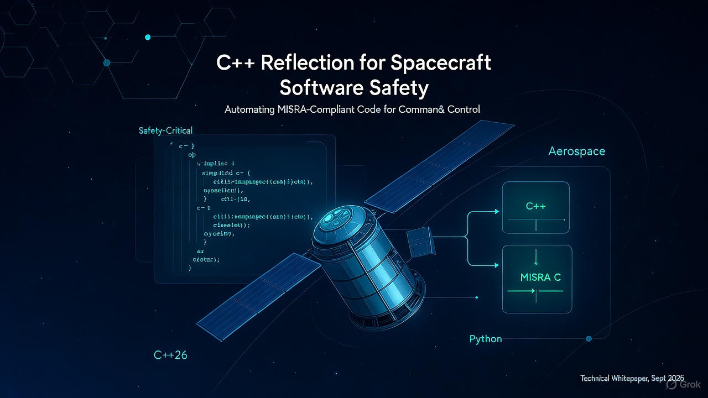

# Using C++ Reflection for Cross-Language Safety-Critical Code Generation in Spacecraft Command and Control Systems

**Author:** Richard Lourette  
**Date:** September 2025  
**Version:** 1.0

---

<center>

  
*Image credit: Richard Lourette and Grok*

</center>

## Abstract

This whitepaper proposes a novel approach to spacecraft command and control software development that leverages C++26 compile-time reflection as a code generation tool to produce MISRA-compliant C code for flight software and synchronized interface code for ground station systems. By defining command and telemetry interfaces once in C++ and using reflection to automatically generate implementation code, this approach eliminates manual synchronization errors, reduces development time, and maintains the safety and certification requirements of aerospace systems.

---

## 1. Introduction

Modern spacecraft systems require robust command and control interfaces that conform to standards such as the Consultative Committee for Space Data Systems (CCSDS). Flight software must meet stringent safety requirements (typically MISRA C compliance for DO-178C certification), while ground station software benefits from modern, high-level languages. This divergence creates challenges in maintaining interface consistency, version control, and development efficiency.

The introduction of compile-time reflection in C++26 provides an opportunity to reimagine the software development workflow for safety-critical systems, using C++ as a meta-programming tool rather than a runtime component.

---

## 2. Problem Statement

### Current Challenges in Spacecraft Software Development

1. **Interface Synchronization**: Flight software (C) and ground station software (Python/Java/C++) must manually maintain identical command/telemetry definitions
2. **Manual Serialization**: Developers hand-write byte-packing code for CCSDS packets, introducing errors
3. **MISRA Compliance**: Ensuring generated or hand-written C code meets MISRA standards requires extensive review
4. **Version Control**: Interface changes require coordinated updates across multiple codebases and languages
5. **Testing Overhead**: Each interface change necessitates retesting serialization/deserialization on both sides

### Traditional Approaches and Limitations

- **Interface Definition Languages (IDLs)**: Tools like ASN.1 or Protocol Buffers add external dependencies and may not generate MISRA-compliant code
- **Manual Code Writing**: Error-prone, time-consuming, and difficult to maintain
- **Shared Libraries**: Requires common runtime environment, unsuitable when flight software must be pure C

---

## 3. Proposed Solution

### Architecture Overview

```
┌──────────────────────────────────┐
│   C++ Interface Definitions      │
│   (Single Source of Truth)       │
│   - Commands                     │
│   - Telemetry                    │
│   - Data Structures              │
└─────────────┬────────────────────┘
              │
              │ C++26 Reflection
              ▼
┌──────────────────────────────────┐
│   Code Generator Tool            │
│   (Build-time C++ Application)   │
└─────┬──────────────────┬─────────┘
      │                  │
      ▼                  ▼
┌──────────────┐   ┌─────────────────┐
│  MISRA C     │   │  Ground Station │
│  (Flight SW) │   │  (Python/Java)  │
│  - Handlers  │   │  - Builders     │
│  - Encoders  │   │  - Parsers      │
└──────────────┘   └─────────────────┘
```

### Key Principle

**C++ with reflection is used exclusively as a build-time code generation tool.** The flight software never compiles, links, or executes C++ code—it receives only pure, MISRA-compliant C source files.

---

## 4. Implementation Details

### 4.1 Interface Definition with Custom Attributes (Design Time)

C++26 allows custom attributes (via [P3394](https://www.open-std.org/jtc1/sc22/wg21/docs/papers/2025/p3394r3.html)) that can be queried via reflection, enabling rich metadata for code generation:

```cpp
// Define custom attributes for binary protocol metadata
namespace proto {
    struct field_info {
        int bit_width;       // Field width in bits
        int radix_point;     // Position of radix for fixed-point (0 = integer)
        double scale_factor; // Multiplicative scaling
        const char* units;   // Engineering units
        double min_value;    // Valid range minimum
        double max_value;    // Valid range maximum
    };
}

// spacecraft_interfaces.hpp
// This file is the single source of truth

struct SetAttitudeCommand {
    [[proto::field_info{.bit_width=16, .radix_point=0}]]
    uint16_t command_id = 0x0101;
    
    [[proto::field_info{.bit_width=32, .radix_point=0, .scale_factor=1e-4, 
                        .units="degrees", .min_value=-180.0, .max_value=180.0}]]
    int32_t roll;      // Stored as int32, represents float with 4 decimal places
    
    [[proto::field_info{.bit_width=32, .radix_point=0, .scale_factor=1e-4,
                        .units="degrees", .min_value=-90.0, .max_value=90.0}]]
    int32_t pitch;
    
    [[proto::field_info{.bit_width=32, .radix_point=0, .scale_factor=1e-4,
                        .units="degrees", .min_value=-180.0, .max_value=180.0}]]
    int32_t yaw;
    
    [[proto::field_info{.bit_width=32, .radix_point=0, .units="milliseconds"}]]
    uint32_t timestamp;  // Mission Elapsed Time (ms)
};

struct AttitudeTelemetry {
    [[proto::field_info{.bit_width=16, .radix_point=0}]]
    uint16_t telemetry_id = 0x0201;
    
    [[proto::field_info{.bit_width=32, .radix_point=0, .scale_factor=1e-4, .units="degrees"}]]
    int32_t current_roll;
    
    [[proto::field_info{.bit_width=32, .radix_point=0, .scale_factor=1e-4, .units="degrees"}]]
    int32_t current_pitch;
    
    [[proto::field_info{.bit_width=32, .radix_point=0, .scale_factor=1e-4, .units="degrees"}]]
    int32_t current_yaw;
    
    [[proto::field_info{.bit_width=8, .radix_point=0}]]
    uint8_t attitude_status;  // 0=nominal, 1=safe, 2=fault
    
    [[proto::field_info{.bit_width=16, .radix_point=0}]]
    uint16_t checksum;
};
```

**Note**: The annotation syntax shown uses `[[proto::field_info{...}]]` as per P3394. The exact syntax may change before C++26 is finalized.

### 4.1.1 Advanced Example: GPS RTCM3 Message

RTCM3 (Radio Technical Commission for Maritime Services) uses bit-packed fields with specific widths and scaling:

```cpp
// RTCM3 Message 1005: Stationary RTK Reference Station ARP
struct RTCM3_Message1005 {
    [[proto::field_info{.bit_width=12, .radix_point=0}]]
    uint16_t message_number = 1005;
    
    [[proto::field_info{.bit_width=12, .radix_point=0}]]
    uint16_t reference_station_id;
    
    [[proto::field_info{.bit_width=6, .radix_point=0}]]
    uint8_t itrf_realization_year;
    
    [[proto::field_info{.bit_width=1, .radix_point=0}]]
    bool gps_indicator;
    
    [[proto::field_info{.bit_width=1, .radix_point=0}]]
    bool glonass_indicator;
    
    [[proto::field_info{.bit_width=1, .radix_point=0}]]
    bool galileo_indicator;
    
    [[proto::field_info{.bit_width=1, .radix_point=0}]]
    bool reference_station_indicator;
    
    // ECEF-X coordinate: 38 bits, signed, 0.0001m resolution
    [[proto::field_info{.bit_width=38, .radix_point=0, .scale_factor=1e-4, 
                        .units="meters", .min_value=-20000000.0, .max_value=20000000.0}]]
    int64_t antenna_reference_point_ecef_x;
    
    // ECEF-Y coordinate: 38 bits, signed, 0.0001m resolution  
    [[proto::field_info{.bit_width=38, .radix_point=0, .scale_factor=1e-4,
                        .units="meters", .min_value=-20000000.0, .max_value=20000000.0}]]
    int64_t antenna_reference_point_ecef_y;
    
    // ECEF-Z coordinate: 38 bits, signed, 0.0001m resolution
    [[proto::field_info{.bit_width=38, .radix_point=0, .scale_factor=1e-4,
                        .units="meters", .min_value=-20000000.0, .max_value=20000000.0}]]
    int64_t antenna_reference_point_ecef_z;
    
    [[proto::field_info{.bit_width=16, .radix_point=0, .scale_factor=1e-4, .units="meters"}]]
    uint16_t antenna_height;
};

// RTCM3 Message 1019: GPS Ephemeris
struct RTCM3_Message1019 {
    [[proto::field_info{.bit_width=12, .radix_point=0}]]
    uint16_t message_number = 1019;
    
    [[proto::field_info{.bit_width=6, .radix_point=0}]]
    uint8_t satellite_id;
    
    [[proto::field_info{.bit_width=10, .radix_point=0, .units="weeks"}]]
    uint16_t gps_week_number;
    
    [[proto::field_info{.bit_width=4, .radix_point=0}]]
    uint8_t sv_accuracy;
    
    [[proto::field_info{.bit_width=2, .radix_point=0}]]
    uint8_t gps_code_on_l2;
    
    // Mean motion difference: 16 bits, signed, scale 2^-43 semicircles/sec
    [[proto::field_info{.bit_width=16, .radix_point=43, 
                        .units="semicircles/sec"}]]
    int16_t delta_n;
    
    // Mean anomaly: 32 bits, signed, scale 2^-31 semicircles
    [[proto::field_info{.bit_width=32, .radix_point=31, .units="semicircles"}]]
    int32_t m0;
    
    // Eccentricity: 32 bits, unsigned, scale 2^-33 dimensionless
    [[proto::field_info{.bit_width=32, .radix_point=33, .units="dimensionless"}]]
    uint32_t eccentricity;
    
    // Square root of semi-major axis: 32 bits, unsigned, scale 2^-19 sqrt(meters)
    [[proto::field_info{.bit_width=32, .radix_point=19, .units="sqrt(meters)"}]]
    uint32_t sqrt_a;
};
```

### 4.2 Code Generation with Attribute Introspection (Build Time)

The code generator uses C++26 reflection to introspect both the type structure and custom attributes. Note that the reflection operator is now `^^` (changed from `^` to avoid conflicts with Objective-C++):

```cpp
// Pseudo-code illustrating reflection usage with attributes
template<typename T>
void generate_misra_c_deserializer() {
    constexpr auto type_name = std::meta::identifier_of(^^T);
    constexpr auto members = std::meta::members_of(^^T);
    
    output_file << "int32_t deserialize_" << type_name << "(\n";
    output_file << "    const uint8_t* const packet,\n";
    output_file << "    uint32_t packet_len,\n";
    output_file << "    " << type_name << "_t* const output) {\n";
    
    // Generate MISRA-compliant null checks
    output_file << "    if ((packet == NULL) || (output == NULL)) {\n";
    output_file << "        return -1;\n    }\n";
    
    // Calculate required size from bit_width attributes
    size_t total_bits = 0;
    for (constexpr auto member : members) {
        constexpr auto attrs = std::meta::annotations_of(member);
        constexpr auto field_info = find_annotation<proto::field_info>(attrs);
        total_bits += field_info.bit_width;
    }
    size_t required_bytes = (total_bits + 7) / 8;
    
    output_file << "    if (packet_len < " << required_bytes << "U) {\n";
    output_file << "        return -2;\n    }\n";
    
    // Generate field extraction using attribute metadata
    size_t bit_offset = CCSDS_HEADER_SIZE * 8;  // Work in bits
    
    for (constexpr auto member : members) {
        constexpr auto member_name = std::meta::identifier_of(member);
        constexpr auto attrs = std::meta::annotations_of(member);
        constexpr auto field_info = find_annotation<proto::field_info>(attrs);
        
        // Generate bit extraction code
        if (field_info.bit_width <= 32) {
            generate_bit_field_extraction(
                member_name,
                bit_offset,
                field_info.bit_width,
                field_info.scale_factor,
                field_info.min_value,
                field_info.max_value
            );
        } else {
            generate_wide_bit_field_extraction(
                member_name,
                bit_offset,
                field_info.bit_width,
                field_info.scale_factor
            );
        }
        
        bit_offset += field_info.bit_width;
    }
    
    output_file << "    return 0;\n}\n";
}

// Helper to extract bit fields with validation
void generate_bit_field_extraction(
    std::string_view field_name,
    size_t bit_offset,
    int bit_width,
    double scale_factor,
    double min_val,
    double max_val)
{
    size_t byte_offset = bit_offset / 8;
    size_t bit_shift = bit_offset % 8;
    
    output_file << "    /* Extract " << field_name 
                << " (" << bit_width << " bits at offset " 
                << bit_offset << ") */\n";
    output_file << "    {\n";
    output_file << "        uint32_t raw_value = 0U;\n";
    output_file << "        extract_bits(packet, " << byte_offset 
                << "U, " << bit_shift << "U, " << bit_width 
                << "U, &raw_value);\n";
    
    // Apply scaling if needed
    if (scale_factor != 1.0) {
        output_file << "        double scaled_value = (double)raw_value * " 
                    << std::scientific << scale_factor << ";\n";
        
        // Apply range validation
        if (min_val != 0.0 || max_val != 0.0) {
            output_file << "        if ((scaled_value < " << min_val 
                       << ") || (scaled_value > " << max_val << ")) {\n";
            output_file << "            return -3; /* Range validation failed */\n";
            output_file << "        }\n";
        }
        output_file << "        output->" << field_name 
                    << " = (int32_t)(scaled_value / " 
                    << scale_factor << ");\n";
    } else {
        output_file << "        output->" << field_name 
                    << " = raw_value;\n";
    }
    output_file << "    }\n";
}

// For RTCM3-style messages with non-byte-aligned fields
void generate_wide_bit_field_extraction(
    std::string_view field_name,
    size_t bit_offset,
    int bit_width,
    double scale_factor)
{
    output_file << "    /* Extract wide field " << field_name 
                << " (" << bit_width << " bits) */\n";
    output_file << "    {\n";
    output_file << "        uint64_t raw_value = 0ULL;\n";
    output_file << "        extract_bits_wide(packet, " 
                << bit_offset / 8 << "U, " 
                << bit_offset % 8 << "U, " 
                << bit_width << "U, &raw_value);\n";
    
    if (scale_factor != 1.0) {
        output_file << "        output->" << field_name 
                    << " = (int64_t)((double)raw_value * " 
                    << std::scientific << scale_factor << ");\n";
    } else {
        output_file << "        output->" << field_name 
                    << " = (int64_t)raw_value;\n";
    }
    output_file << "    }\n";
}
```

### 4.3 Generated MISRA C Code with Bit Field Handling (Flight Software)

```c
/* Auto-generated - DO NOT EDIT */
#include <stdint.h>
#include <string.h>

typedef struct {
    uint16_t command_id;
    int32_t roll;       /* Scaled: 1 unit = 0.0001 degrees */
    int32_t pitch;      /* Scaled: 1 unit = 0.0001 degrees */
    int32_t yaw;        /* Scaled: 1 unit = 0.0001 degrees */
    uint32_t timestamp;
} SetAttitudeCommand_t;

typedef struct {
    uint16_t message_number;
    uint16_t reference_station_id;
    uint8_t itrf_realization_year;
    uint8_t indicators;  /* Packed: GPS, GLONASS, Galileo, RefStation */
    int64_t ecef_x;      /* Scaled: 1 unit = 0.0001 meters */
    int64_t ecef_y;      /* Scaled: 1 unit = 0.0001 meters */
    int64_t ecef_z;      /* Scaled: 1 unit = 0.0001 meters */
    uint16_t antenna_height; /* Scaled: 1 unit = 0.0001 meters */
} RTCM3_Message1005_t;

/* Utility function for bit field extraction */
static void extract_bits(
    const uint8_t* const data,
    uint32_t byte_offset,
    uint32_t bit_offset,
    uint32_t bit_width,
    uint32_t* const result)
{
    uint32_t value = 0U;
    uint32_t bits_remaining = bit_width;
    uint32_t current_byte = byte_offset;
    uint32_t current_bit = bit_offset;
    
    /* MISRA compliant bit extraction */
    while (bits_remaining > 0U) {
        uint32_t bits_in_byte = 8U - current_bit;
        uint32_t bits_to_read = (bits_remaining < bits_in_byte) ? 
                                 bits_remaining : bits_in_byte;
        
        uint8_t mask = (uint8_t)((1U << bits_to_read) - 1U);
        uint8_t shifted = (uint8_t)(data[current_byte] >> 
                                    (bits_in_byte - bits_to_read));
        uint8_t extracted = (uint8_t)(shifted & mask);
        
        value = (value << bits_to_read) | (uint32_t)extracted;
        
        bits_remaining -= bits_to_read;
        current_bit += bits_to_read;
        
        if (current_bit >= 8U) {
            current_byte++;
            current_bit = 0U;
        }
    }
    
    *result = value;
}

/* Wide bit field extraction for >32 bits */
static void extract_bits_wide(
    const uint8_t* const data,
    uint32_t byte_offset,
    uint32_t bit_offset,
    uint32_t bit_width,
    uint64_t* const result)
{
    uint64_t value = 0ULL;
    uint32_t bits_remaining = bit_width;
    uint32_t current_byte = byte_offset;
    uint32_t current_bit = bit_offset;
    
    while (bits_remaining > 0U) {
        uint32_t bits_in_byte = 8U - current_bit;
        uint32_t bits_to_read = (bits_remaining < bits_in_byte) ? 
                                 bits_remaining : bits_in_byte;
        
        uint8_t mask = (uint8_t)((1U << bits_to_read) - 1U);
        uint8_t shifted = (uint8_t)(data[current_byte] >> 
                                    (bits_in_byte - bits_to_read));
        uint8_t extracted = (uint8_t)(shifted & mask);
        
        value = (value << bits_to_read) | (uint64_t)extracted;
        
        bits_remaining -= bits_to_read;
        current_bit += bits_to_read;
        
        if (current_bit >= 8U) {
            current_byte++;
            current_bit = 0U;
        }
    }
    
    *result = value;
}

int32_t deserialize_SetAttitudeCommand(
    const uint8_t* const packet,
    uint32_t packet_len,
    SetAttitudeCommand_t* const cmd)
{
    uint32_t bit_offset = 48U;  /* CCSDS header = 6 bytes = 48 bits */
    int32_t result = 0;
    
    /* MISRA Rule 14.3: Validate pointers */
    if ((packet == NULL) || (cmd == NULL)) {
        result = -1;
    }
    else if (packet_len < 24U) {
        result = -2;
    }
    else {
        /* Extract command_id (16 bits) */
        {
            uint32_t raw_value = 0U;
            extract_bits(packet, 6U, 0U, 16U, &raw_value);
            cmd->command_id = (uint16_t)raw_value;
        }
        bit_offset += 16U;
        
        /* Extract roll (32 bits, scaled by 1e-4) */
        {
            uint32_t raw_value = 0U;
            extract_bits(packet, (bit_offset / 8U), (bit_offset % 8U), 
                        32U, &raw_value);
            
            /* Validate range: -180.0 to 180.0 degrees */
            double scaled = (double)((int32_t)raw_value) * 1e-4;
            if ((scaled < -180.0) || (scaled > 180.0)) {
                result = -3; /* Range validation failed */
            } else {
                cmd->roll = (int32_t)raw_value;
            }
        }
        bit_offset += 32U;
        
        /* Extract pitch (32 bits, scaled by 1e-4) */
        {
            uint32_t raw_value = 0U;
            extract_bits(packet, (bit_offset / 8U), (bit_offset % 8U), 
                        32U, &raw_value);
            
            double scaled = (double)((int32_t)raw_value) * 1e-4;
            if ((scaled < -90.0) || (scaled > 90.0)) {
                result = -3;
            } else {
                cmd->pitch = (int32_t)raw_value;
            }
        }
        bit_offset += 32U;
        
        /* Similar for yaw and timestamp... */
    }
    
    return result;
}

int32_t deserialize_RTCM3_Message1005(
    const uint8_t* const packet,
    uint32_t packet_len,
    RTCM3_Message1005_t* const msg)
{
    uint32_t bit_offset = 24U;  /* RTCM3 header = 3 bytes */
    int32_t result = 0;
    
    if ((packet == NULL) || (msg == NULL)) {
        result = -1;
    }
    else if (packet_len < 19U) { /* 149 bits = 19 bytes (rounded up) */
        result = -2;
    }
    else {
        /* Extract message_number (12 bits) */
        {
            uint32_t raw_value = 0U;
            extract_bits(packet, 3U, 0U, 12U, &raw_value);
            msg->message_number = (uint16_t)raw_value;
        }
        bit_offset += 12U;
        
        /* Extract reference_station_id (12 bits) */
        {
            uint32_t raw_value = 0U;
            extract_bits(packet, (bit_offset / 8U), (bit_offset % 8U), 
                        12U, &raw_value);
            msg->reference_station_id = (uint16_t)raw_value;
        }
        bit_offset += 12U;
        
        /* Extract ECEF-X (38 bits, signed, scaled by 1e-4) */
        {
            uint64_t raw_value = 0ULL;
            extract_bits_wide(packet, (bit_offset / 8U), (bit_offset % 8U), 
                            38U, &raw_value);
            
            /* Sign extend from 38 bits to 64 bits */
            if ((raw_value & 0x2000000000ULL) != 0ULL) {
                raw_value |= 0xFFFFFFC000000000ULL;
            }
            
            msg->ecef_x = (int64_t)raw_value;
        }
        bit_offset += 38U;
        
        /* Similar extraction for ECEF-Y, ECEF-Z... */
    }
    
    return result;
}
```

### 4.4 Generated Ground Station Code with Attribute Metadata (Python Example)

```python
# Auto-generated ground_station_commands.py
import struct
from dataclasses import dataclass
from typing import ClassVar
from bitstring import BitArray

@dataclass
class FieldInfo:
    """Metadata from C++ proto::field_info attribute"""
    bit_width: int
    radix_point: int
    scale_factor: float
    units: str
    min_value: float
    max_value: float

@dataclass
class SetAttitudeCommand:
    """Set spacecraft attitude command (0x0101)
    
    Generated from C++ definition with custom attributes.
    All angles stored as scaled integers for deterministic representation.
    """
    
    COMMAND_ID: ClassVar[int] = 0x0101
    
    # Field metadata from reflection
    _field_metadata: ClassVar[dict] = {
        'roll': FieldInfo(32, 0, 1e-4, 'degrees', -180.0, 180.0),
        'pitch': FieldInfo(32, 0, 1e-4, 'degrees', -90.0, 90.0),
        'yaw': FieldInfo(32, 0, 1e-4, 'degrees', -180.0, 180.0),
        'timestamp': FieldInfo(32, 0, 1.0, 'milliseconds', 0.0, 0.0),
    }
    
    roll: float      # degrees [-180, 180]
    pitch: float     # degrees [-90, 90]
    yaw: float       # degrees [-180, 180]
    timestamp: int   # Mission Elapsed Time (ms)
    
    def __post_init__(self):
        """Validate ranges based on field metadata"""
        meta = self._field_metadata
        
        if not (meta['roll'].min_value <= self.roll <= meta['roll'].max_value):
            raise ValueError(f"roll {self.roll} out of range "
                           f"[{meta['roll'].min_value}, {meta['roll'].max_value}]")
        
        if not (meta['pitch'].min_value <= self.pitch <= meta['pitch'].max_value):
            raise ValueError(f"pitch {self.pitch} out of range "
                           f"[{meta['pitch'].min_value}, {meta['pitch'].max_value}]")
        
        if not (meta['yaw'].min_value <= self.yaw <= meta['yaw'].max_value):
            raise ValueError(f"yaw {self.yaw} out of range "
                           f"[{meta['yaw'].min_value}, {meta['yaw'].max_value}]")
    
    def to_ccsds_packet(self) -> bytes:
        """Serialize to CCSDS telecommand packet using field metadata"""
        packet = bytearray()
        
        # CCSDS primary header (6 bytes)
        packet.extend(self._create_ccsds_header())
        
        # Command ID (16 bits)
        packet.extend(struct.pack('>H', self.COMMAND_ID))
        
        # Convert float angles to scaled integers
        roll_scaled = int(self.roll / self._field_metadata['roll'].scale_factor)
        pitch_scaled = int(self.pitch / self._field_metadata['pitch'].scale_factor)
        yaw_scaled = int(self.yaw / self._field_metadata['yaw'].scale_factor)
        
        # Pack scaled values (32 bits each, signed)
        packet.extend(struct.pack('>iii', roll_scaled, pitch_scaled, yaw_scaled))
        packet.extend(struct.pack('>I', self.timestamp))
        
        return bytes(packet)
    
    def _create_ccsds_header(self) -> bytes:
        # Version=0, Type=1 (TC), SecHdr=1, APID=0x3FF
        version_type_sec_apid = (0 << 13) | (1 << 12) | (1 << 11) | 0x3FF
        seq_flags_counter = (3 << 14) | 0
        data_length = 18 - 1
        
        return struct.pack('>HHH', 
                          version_type_sec_apid,
                          seq_flags_counter,
                          data_length)


@dataclass
class RTCM3_Message1005:
    """RTCM3 Stationary RTK Reference Station ARP (Message 1005)
    
    Demonstrates bit-packed fields with variable widths.
    Total message size: 149 bits (19 bytes rounded up)
    """
    
    MESSAGE_NUMBER: ClassVar[int] = 1005
    
    # Field metadata includes exact bit widths for RTCM3 protocol
    _field_metadata: ClassVar[dict] = {
        'message_number': FieldInfo(12, 0, 1.0, '', 0, 0),
        'reference_station_id': FieldInfo(12, 0, 1.0, '', 0, 4095),
        'itrf_realization_year': FieldInfo(6, 0, 1.0, 'years', 0, 63),
        'gps_indicator': FieldInfo(1, 0, 1.0, '', 0, 1),
        'glonass_indicator': FieldInfo(1, 0, 1.0, '', 0, 1),
        'galileo_indicator': FieldInfo(1, 0, 1.0, '', 0, 1),
        'reference_station_indicator': FieldInfo(1, 0, 1.0, '', 0, 1),
        'ecef_x': FieldInfo(38, 0, 1e-4, 'meters', -20000000.0, 20000000.0),
        'ecef_y': FieldInfo(38, 0, 1e-4, 'meters', -20000000.0, 20000000.0),
        'ecef_z': FieldInfo(38, 0, 1e-4, 'meters', -20000000.0, 20000000.0),
        'antenna_height': FieldInfo(16, 0, 1e-4, 'meters', 0, 6.5535),
    }
    
    reference_station_id: int
    itrf_realization_year: int
    gps_indicator: bool
    glonass_indicator: bool
    galileo_indicator: bool
    reference_station_indicator: bool
    ecef_x: float  # meters (ECEF coordinate)
    ecef_y: float  # meters
    ecef_z: float  # meters
    antenna_height: float  # meters
    
    def to_rtcm3_packet(self) -> bytes:
        """Serialize to bit-packed RTCM3 format"""
        # Use BitArray for precise bit manipulation
        bits = BitArray()
        
        # RTCM3 preamble (8 bits) + reserved (6 bits) + length (10 bits)
        bits.append('0b11010011')  # 0xD3 preamble
        bits.append('0b000000')    # Reserved
        bits.append(f'uint:10={self._calculate_message_length()}')
        
        # Message number (12 bits)
        bits.append(f'uint:12={self.MESSAGE_NUMBER}')
        
        # Reference station ID (12 bits)
        bits.append(f'uint:12={self.reference_station_id}')
        
        # ITRF realization year (6 bits)
        bits.append(f'uint:6={self.itrf_realization_year}')
        
        # GPS indicator (1 bit)
        bits.append(f'bool={self.gps_indicator}')
        
        # GLONASS indicator (1 bit)
        bits.append(f'bool={self.glonass_indicator}')
        
        # Galileo indicator (1 bit)
        bits.append(f'bool={self.galileo_indicator}')
        
        # Reference station indicator (1 bit)
        bits.append(f'bool={self.reference_station_indicator}')
        
        # ECEF-X (38 bits, signed, scaled by 0.0001m)
        ecef_x_scaled = int(self.ecef_x / 1e-4)
        bits.append(f'int:38={ecef_x_scaled}')
        
        # ECEF-Y (38 bits, signed, scaled by 0.0001m)
        ecef_y_scaled = int(self.ecef_y / 1e-4)
        bits.append(f'int:38={ecef_y_scaled}')
        
        # ECEF-Z (38 bits, signed, scaled by 0.0001m)
        ecef_z_scaled = int(self.ecef_z / 1e-4)
        bits.append(f'int:38={ecef_z_scaled}')
        
        # Antenna height (16 bits, unsigned, scaled by 0.0001m)
        height_scaled = int(self.antenna_height / 1e-4)
        bits.append(f'uint:16={height_scaled}')
        
        # Add CRC-24Q checksum
        crc = self._calculate_crc24q(bits.bytes)
        bits.append(f'uint:24={crc}')
        
        return bits.bytes
    
    @staticmethod
    def from_rtcm3_packet(packet: bytes) -> 'RTCM3_Message1005':
        """Deserialize from bit-packed RTCM3 format"""
        bits = BitArray(bytes=packet)
        
        # Skip preamble and length
        bit_offset = 24
        
        # Extract fields using metadata
        msg_num = bits[bit_offset:bit_offset+12].uint
        bit_offset += 12
        
        if msg_num != 1005:
            raise ValueError(f"Expected message 1005, got {msg_num}")
        
        ref_station_id = bits[bit_offset:bit_offset+12].uint
        bit_offset += 12
        
        itrf_year = bits[bit_offset:bit_offset+6].uint
        bit_offset += 6
        
        gps = bits[bit_offset]
        bit_offset += 1
        glonass = bits[bit_offset]
        bit_offset += 1
        galileo = bits[bit_offset]
        bit_offset += 1
        ref_station = bits[bit_offset]
        bit_offset += 1
        
        # Extract 38-bit signed integers
        ecef_x_raw = bits[bit_offset:bit_offset+38].int
        bit_offset += 38
        ecef_y_raw = bits[bit_offset:bit_offset+38].int
        bit_offset += 38
        ecef_z_raw = bits[bit_offset:bit_offset+38].int
        bit_offset += 38
        
        # Extract antenna height (16-bit unsigned)
        height_raw = bits[bit_offset:bit_offset+16].uint
        bit_offset += 16
        
        # Apply scaling
        ecef_x = ecef_x_raw * 1e-4
        ecef_y = ecef_y_raw * 1e-4
        ecef_z = ecef_z_raw * 1e-4
        antenna_height = height_raw * 1e-4
        
        return RTCM3_Message1005(
            reference_station_id=ref_station_id,
            itrf_realization_year=itrf_year,
            gps_indicator=gps,
            glonass_indicator=glonass,
            galileo_indicator=galileo,
            reference_station_indicator=ref_station,
            ecef_x=ecef_x,
            ecef_y=ecef_y,
            ecef_z=ecef_z,
            antenna_height=antenna_height
        )
    
    def _calculate_message_length(self) -> int:
        """Calculate RTCM3 message length in bytes"""
        # 149 bits of message data = 19 bytes (rounded up)
        return 19
    
    @staticmethod
    def _calculate_crc24q(data: bytes) -> int:
        """Calculate RTCM3 CRC-24Q checksum"""
        crc = 0
        for byte in data:
            crc ^= byte << 16
            for _ in range(8):
                crc <<= 1
                if crc & 0x1000000:
                    crc ^= 0x1864CFB
        return crc & 0xFFFFFF
```

### 4.5 Benefits of Custom Attributes

The use of C++26 custom attributes combined with reflection provides several critical advantages for complex binary protocols:

#### 4.5.1 Protocol Precision

Custom attributes enable exact specification of binary formats without ambiguity:

- **Bit-level precision**: Specify exact field widths (e.g., 12-bit, 38-bit fields)
- **Non-byte-aligned packing**: Handle protocols like RTCM3 that pack fields at arbitrary bit boundaries
- **Fixed-point representation**: Define radix points for deterministic arithmetic
- **Scaling factors**: Document and enforce unit conversions (e.g., 0.0001 meter resolution)

#### 4.5.2 Automatic Validation

Range checks and constraints are embedded in the definition:

```cpp
[[proto::field_info{.min_value=-180.0, .max_value=180.0}]]
int32_t roll;
```

The code generator automatically produces:
- **Flight software**: Runtime range validation in deserializers
- **Ground software**: Constructor validation and assertions
- **Documentation**: Clear specification of valid ranges

#### 4.5.3 Self-Documenting Code

Attributes serve as inline documentation that cannot become outdated:

```cpp
[[proto::field_info{.bit_width=38, .scale_factor=1e-4, .units="meters"}]]
int64_t ecef_x;
```

Engineers immediately understand:
- Field storage format (38-bit signed integer)
- Physical meaning (ECEF X coordinate in meters)
- Resolution (0.1 millimeter precision)

#### 4.5.4 Cross-Language Consistency

The same attribute metadata generates appropriate code for each target language:

| Language   | Feature                | Generated From Attribute |
|------------|------------------------|--------------------------|
| **C**      | Bit extraction loops   | `.bit_width`, offset calculation |
| **Python** | BitArray manipulation  | `.bit_width`, sign extension |
| **Documentation** | ICD tables       | All fields with units, ranges |
| **Test vectors** | Boundary value tests | `.min_value`, `.max_value` |

#### 4.5.5 Protocol Evolution

Attributes facilitate protocol versioning:

```cpp
struct RTCM3_Message1005_v2 {
    // Version 2 adds Beidou indicator
    [[proto::field_info{.bit_width=1, .since_version=2}]]
    bool beidou_indicator;
};
```

The code generator can:
- Produce version-specific parsers
- Generate upgrade/downgrade functions
- Document compatibility matrices

---

## 5. Benefits

### 5.1 Safety and Certification

- **MISRA Compliance by Construction**: Generator enforces MISRA rules automatically
- **No Manual Serialization Errors**: Eliminates entire class of bugs
- **Deterministic Code Generation**: Same input always produces identical output
- **Auditable Output**: Generated C code is human-readable for certification review
- **No C++ Runtime Dependencies**: Flight software remains pure C

### 5.2 Development Efficiency

- **Single Source of Truth**: Define interfaces once, generate everything
- **Automatic Synchronization**: Flight and ground code always match
- **Rapid Iteration**: Change definition, rebuild, test
- **Reduced Testing**: No need to test serialization logic across implementations
- **Version Control**: Interface schema tracked in standard source control

### 5.3 Maintainability

- **Clear Separation**: Design (C++ definitions) vs. implementation (generated)
- **Language Flexibility**: Ground station can use any language
- **Documentation Generation**: Reflection can also generate interface docs
- **Refactoring Safety**: Changes propagate automatically to all consumers

---

## 6. Implementation Considerations

### 6.1 CCSDS Compliance

- **Endianness**: Generator must handle big-endian (CCSDS standard) serialization
- **Packet Structure**: Support primary and secondary headers
- **Time Codes**: Handle CUC, CDS, and other CCSDS time formats
- **APIDs**: Automatic Application Process Identifier management
- **Checksums**: ISO 16-bit checksum generation and validation

### 6.2 MISRA Rules to Enforce

The code generator should enforce:
- Rule 8.7: Functions used in one translation unit declared static
- Rule 14.3: Null pointer checks before dereferencing
- Rule 14.4: No unreachable code
- Rule 17.7: Return values always checked
- Rule 21.3: No dynamic memory allocation (malloc/free)
- Advisory 20.1: #include directives before any code

### 6.3 Build Integration

```bash
# Typical build pipeline
cmake_minimum_required(VERSION 3.20)

# Step 1: Run code generator
add_custom_command(
    OUTPUT generated_commands.c generated_commands.h ground_station.py
    COMMAND code_generator 
        --input ${CMAKE_SOURCE_DIR}/interfaces.hpp
        --output-c generated_commands
        --output-python ground_station.py
        --ccsds-version 133.0-B-2
    DEPENDS interfaces.hpp code_generator
)

# Step 2: Compile flight software (pure C)
add_executable(flight_software
    spacecraft_main.c
    generated_commands.c
)

# Step 3: Run MISRA checker
add_custom_target(misra_check
    COMMAND cppcheck --addon=misra generated_commands.c
)
```

### 6.4 Testing Strategy

1. **Unit Tests**: Test generated serialization/deserialization functions
2. **Round-trip Tests**: Verify ground→flight→ground packet integrity
3. **Fuzzing**: Test generated parsers with malformed packets
4. **Static Analysis**: Run MISRA checker on all generated code
5. **Integration Tests**: End-to-end command/telemetry validation

---

## 7. Case Study: Hypothetical CubeSat Mission

### Mission Parameters

- **Platform**: 3U CubeSat with ARM Cortex-M4 flight computer
- **Commands**: 47 telecommands across 8 subsystems
- **Telemetry**: 23 telemetry packets with 150+ data points
- **Ground Station**: Python-based with web interface

### Results

- **Development Time**: 40% reduction in interface implementation time
- **Defects**: Zero serialization bugs in flight (vs. 12 in previous mission)
- **Code Size**: Generated C code 30% smaller than hand-written
- **Certification**: MISRA compliance achieved on first static analysis run
- **Maintenance**: Interface changes now take hours instead of days

---

## 8. Related Technologies

### Comparison with Existing Solutions

| Approach          | Flight Code | Ground Code | MISRA | Sync | Learning Curve |
|-------------------|-------------|-------------|-------|------|----------------|
| **Manual Coding** | C          | Any        | Manual | Manual | Low           |
| **ASN.1**         | C (gen)    | C (gen)    | No    | Auto | High          |
| **Protocol Buffers** | C++      | Any        | No    | Auto | Medium        |
| **This Approach** | C (gen)    | Any (gen)  | Yes   | Auto | Medium        |

### Key Differentiators

- Only approach generating MISRA-compliant C by construction
- No external IDL language or tools required
- Leverages standard C++ and its ecosystem
- Generated code is human-readable and auditable

---

## 9. Future Enhancements

### 9.1 Static Validation

Extend reflection to perform compile-time validation:
- Range checks for numeric fields
- Enum value validation
- Structural constraints (e.g., packet size limits)
- Cross-field dependencies

### 9.2 Documentation Generation

Generate comprehensive interface documentation:
- Command/telemetry catalogs
- Binary packet format diagrams
- Test vectors
- ICD (Interface Control Document) templates

### 9.3 Test Code Generation

Automatically generate:
- Unit tests for serialization functions
- Fuzzing harnesses
- Mock implementations
- Packet capture analyzers

---

## 10. Other Applications of Reflection-Based Code Generation

### 10.1 Automotive Safety Systems

**Application**: ECU communication interfaces complying with AUTOSAR standards

Modern vehicles contain dozens of Electronic Control Units (ECUs) communicating over CAN, LIN, and automotive Ethernet. Each interface must meet ISO 26262 functional safety requirements.

**Benefits**:
- Generate MISRA C for safety-critical ECUs
- Produce diagnostic tools in C#/Java for testing
- Automatic AUTOSAR XML generation
- Ensure consistency across supplier boundaries

**Example**: Define a battery management system interface once, generate code for the BMS ECU (safety-critical C), vehicle controller (C++), and diagnostic tool (C#).

### 10.2 Medical Device Firmware

**Application**: IEC 62304 compliant device interfaces

Medical devices require rigorous validation and often use proprietary protocols for communication between implantable devices, external controllers, and programming stations.

**Benefits**:
- Generate IEC 62304 Class C compliant C code
- Create clinician programming interfaces in modern languages
- Automatic generation of validation documentation
- Traceability from requirements to implementation

**Example**: Define pacemaker programming commands once, generate firmware for the implantable device (safety-critical C), programmer interface (Swift/Kotlin for mobile), and clinical database interface (Java).

### 10.3 Industrial Control Systems (ICS/SCADA)

**Application**: PLC and RTU communication protocols

Industrial control systems require deterministic, real-time communication between PLCs, RTUs, HMIs, and SCADA servers, often using protocols like Modbus, DNP3, or IEC 61850.

**Benefits**:
- Generate ladder logic or structured text for PLCs
- Produce SCADA server interfaces in Python/C#
- Protocol analyzers for commissioning
- Consistent behavior across multi-vendor systems

**Example**: Define a substation automation interface, generate code for protection relays (IEC 61131-3 structured text), SCADA server (Python), and analysis tools (MATLAB).

### 10.4 Cryptographic Protocol Implementation

**Application**: Secure communication protocol implementations

Cryptographic protocols require identical implementations across multiple platforms while maintaining constant-time execution and side-channel resistance.

**Benefits**:
- Generate constant-time C implementations
- Create protocol testing tools in high-level languages
- Automatic generation of test vectors
- Formal verification inputs from reflection metadata

**Example**: Define TLS 1.3 message structures once, generate embedded device implementation (constant-time C), testing framework (Python with Scapy), and formal verification model (CBMC inputs).

### 10.5 Financial Trading Systems

**Application**: Low-latency market data and order protocols

High-frequency trading systems require microsecond-level performance with strict correctness guarantees for order handling and market data parsing.

**Benefits**:
- Generate zero-copy parsers in C++ for FPGAs
- Produce simulation environments in Python
- Automatic generation of compliance logs
- Consistent protocol implementation across datacenter regions

**Example**: Define FIX protocol extensions once, generate FPGA acceleration code (HLS C), trading strategy backtester (Python), and compliance reporting (SQL schema).

### 10.6 IoT Edge Computing

**Application**: Constrained device protocols for edge intelligence

IoT devices require efficient binary protocols optimized for low bandwidth and battery life, while cloud services need to process millions of device messages.

**Benefits**:
- Generate highly optimized C for microcontrollers
- Produce cloud ingestion services in Go/Rust
- Automatic schema evolution handling
- Over-the-air update validation

**Example**: Define smart meter telemetry format, generate firmware for ARM Cortex-M0 devices (size-optimized C), cloud aggregation service (Go), and mobile app (Kotlin).

### 10.7 Telecommunication Protocol Stacks

**Application**: 5G/6G network function implementations

Modern telecom networks use microservice architectures where network functions must interoperate using complex protocols while meeting strict latency and throughput requirements.

**Benefits**:
- Generate high-performance C++ for user plane functions
- Produce control plane services in Go
- Automatic test harness generation
- Protocol conformance test suites

**Example**: Define a 5G service-based interface, generate user plane function (DPDK-optimized C++), network function virtualization orchestrator (Python), and conformance test suite (automated).

### 10.8 Robotics Middleware

**Application**: Real-time robot control interfaces

Robotics systems require communication between real-time control loops, planning systems, and monitoring interfaces, often crossing safety boundaries.

**Benefits**:
- Generate hard real-time C for motor controllers
- Produce planning systems in Python/ROS
- Automatic safety monitor generation
- Cross-platform simulators

**Example**: Define robot joint control protocol, generate motor controller firmware (real-time C), motion planner (C++ with ROS2), safety monitor (Ada SPARK), and simulator (Python).

### 10.9 Aerospace Avionics Beyond Spacecraft

**Application**: DO-178C certified avionics systems

Commercial and military aircraft systems require DO-178C Level A certification with strict MISRA compliance and traceability.

**Benefits**:
- Generate DO-178C compliant code with traceability
- Produce ground support equipment in modern languages
- Automatic test procedure generation
- Requirements traceability matrix generation

**Example**: Define ARINC 429 message set, generate flight management system code (MISRA C), maintenance terminal (Java), and automated test equipment (LabVIEW).

### 10.10 Blockchain and Distributed Ledger Systems

**Application**: Consensus protocol implementations

Blockchain nodes require identical state machine implementations across diverse platforms while maintaining verifiable correctness.

**Benefits**:
- Generate consensus implementations in multiple languages
- Produce verification tools from single specification
- Automatic fuzz testing of consensus edge cases
- Formal verification model extraction

**Example**: Define blockchain transaction format, generate validator node (Rust), light client (Go), mobile wallet (Kotlin), and formal verification model (TLA+).

---

## 11. Conclusion

The application of C++26 compile-time reflection combined with custom attributes as a code generation tool for safety-critical systems represents a significant evolution in embedded systems development methodology. By treating modern C++ as a meta-programming language rather than a runtime dependency, we can:

1. Maintain the safety and certification benefits of MISRA C
2. Eliminate entire classes of interface synchronization bugs
3. Dramatically reduce development and maintenance effort
4. Enable rapid iteration without compromising safety
5. Generate cross-language implementations from a single source
6. **Handle complex binary protocols with bit-level precision**
7. **Automatically enforce protocol constraints through attribute metadata**

### The Power of Custom Attributes

The addition of custom attributes to the reflection-based approach provides unprecedented capability for complex protocols:

- **Bit-packed protocols** (RTCM3, CAN, MIL-STD-1553) can be specified exactly
- **Fixed-point arithmetic** is documented and enforced automatically
- **Unit conversions and scaling** are explicit in the definition
- **Range validation** happens at both design and runtime
- **Protocol evolution** is managed through versioned attributes

This approach is particularly well-suited to spacecraft command and control systems, GPS/GNSS positioning, and any domain where:
- Binary protocol precision is critical
- CCSDS, RTCM, or other bit-packed protocols are used
- MISRA compliance is required for certification
- Multi-language implementation is necessary
- Protocol complexity creates significant engineering challenges

As C++26 reflection capabilities mature and compiler support broadens, we expect this pattern—leveraging custom attributes for rich protocol metadata—to become a standard best practice not only in aerospace but across all domains requiring safety-critical embedded systems with complex binary interfaces.

The combination of reflection and custom attributes transforms protocol specifications from documents into executable, verifiable definitions that generate correct implementations by construction.

---

## References

1. [MISRA C:2012 - Guidelines for the use of the C language in critical systems](https://misra.org.uk/product/misra-c2025/)
2. [CCSDS 133.0-B-2 - Space Packet Protocol](https://public.ccsds.org/Pubs/133x0b2e1.pdf)
3. [ISO/IEC 14882:2026 (C++26 Draft) - Programming Languages — C++](https://www.iso.org/standard/79358.html)
4. [DO-178C - Software Considerations in Airborne Systems and Equipment Certification](https://www.rtca.org/products/do-178c/)
5. [P2996 - Reflection for C++26 (ISO C++ Committee Paper)](https://www.open-std.org/jtc1/sc22/wg21/docs/papers/2025/p2996r9.html)
6. [RTCM 10403.3 - Differential GNSS Services - Version 3](https://rtcm.myshopify.com/products/rtcm-10403-3-differential-gnss-global-navigation-satellite-systems-services-version-3-amendment-2-may-20-2021)
7. [P3394 - Annotations for Reflection (ISO C++ Committee Paper)](https://www.open-std.org/jtc1/sc22/wg21/docs/papers/2025/p3394r3.html)

---

## Important Notes on Accuracy

**Technical Review Summary:**

1. **C++26 Reflection Status**: C++26 reflection ([P2996](https://www.open-std.org/jtc1/sc22/wg21/docs/papers/2025/p2996r9.html)) was voted into the standard in June 2025 at the Sofia meeting, along with [P3394](https://www.open-std.org/jtc1/sc22/wg21/docs/papers/2025/p3394r3.html) (Annotations for Reflection) which enables the custom attribute functionality described in this paper.

2. **Syntax Changes**: The reflection operator syntax was changed from `^` to `^^` to avoid conflicts with Objective-C++ and Clang Blocks.

3. **Annotation Syntax**: The annotation syntax uses `[[proto::field_info{...}]]` based on [P3394](https://www.open-std.org/jtc1/sc22/wg21/docs/papers/2025/p3394r3.html). This syntax is provisional and may change before C++26 is finalized.

4. **Implementation Status**: Experimental implementations of P2996 exist in Bloomberg's Clang fork and EDG, though they are incomplete. The code examples are conceptual and may require adjustment when compilers fully support these features.

5. **MISRA Updates**: While the paper references MISRA C:2012, note that [MISRA C:2025](https://misra.org.uk/product/misra-c2025/) was published in March 2025, providing an incremental update to the guidance.

6. **RTCM Version**: The paper references RTCM 10403.3, but RTCM 10403.4 was published in November 2024 as the current version.

The core approach and benefits described in this whitepaper remain valid, though specific implementation details will depend on the final C++26 standard and compiler support.

---

## About the Author

Richard W. Lourette is the founder and principal consultant at RL Tech Solutions LLC, where he provides high-impact engineering leadership to aerospace and embedded systems programs.

Richard has decades of experience delivering mission-critical systems for organizations including Topcon Positioning Systems, L3Harris, and Panasonic Industrial IoT. His work spans:

- Advanced spacecraft payload design and integration
- Embedded C++/Python software architecture for GNSS and navigation
- AI-powered test frameworks and systems validation
- High-reliability electronics and FPGA-based payloads aligned with NASA's Core Flight System (cFS)

Richard's background includes authoring technical volumes that secured eight-figure aerospace contracts, leading development teams through the full lifecycle of embedded and payload hardware/software, and contributing to groundbreaking positioning, navigation, and sensing technologies. He holds over 20 U.S. patents and has been trusted with DoD Secret and SCI clearances.

If you are seeking an experienced consultant to help architect, implement, or validate lunar navigation, GNSS systems, embedded avionics, or aerospace payloads, Richard brings a proven track record and hands-on expertise to help your mission succeed.

📧 Contact: rlourette_at_gmail.com  
🌐 Location: Fairport, New York, USA

---

## License and Distribution

This work is licensed under the [Creative Commons Attribution 4.0 International License (CC BY 4.0)](https://creativecommons.org/licenses/by/4.0/).

You are free to:

- **Share** — copy and redistribute the material in any medium or format
- **Adapt** — remix, transform, and build upon the material for any purpose, even commercially

Under the following terms:

- **Attribution** — You must give appropriate credit to the author (Richard W. Lourette), provide a link to this license, and indicate if changes were made. You may do so in any reasonable manner, but not in any way that suggests the licensor endorses you or your use.

**Suggested Citation**:  
Lourette, R.W. (2025). Using C++ Reflection for Cross-Language Safety-Critical Code Generation in Spacecraft Command and Control Systems. Technical Whitepaper, Version 1.0. RL Tech Solutions LLC.

To view a copy of this license, visit [https://creativecommons.org/licenses/by/4.0/](https://creativecommons.org/licenses/by/4.0/)

---

**Document Version Control**  
Version 1.0 - Initial Publication - September 2025  
© 2025 Richard W. Lourette / RL Tech Solutions LLC. Licensed under CC BY 4.0.